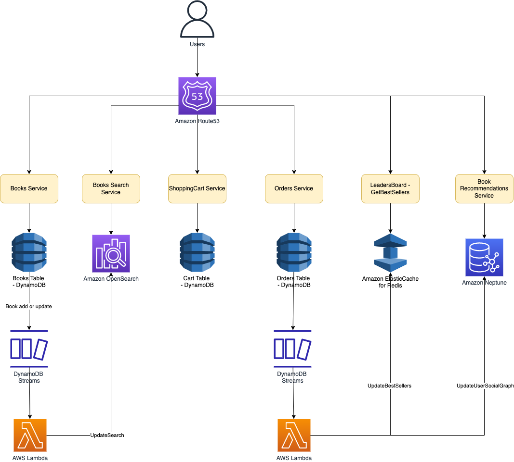

# AWS BookStore Sample App

# Tech Stack

| Service                                                                                                | Remarks                                                                                      |
|--------------------------------------------------------------------------------------------------------|----------------------------------------------------------------------------------------------|
| [Amazon DynamoDB](../../2_AWSServices/6_DatabaseServices/AmazonDynamoDB/Readme.md)                   | It stores all of the data for books, orders, and the checkout cart.                          |
| [Amazon OpenSearch](../../2_AWSServices/6_DatabaseServices/AmazonOpenSearch.md)                      | It powers search functionality for books.                                                    |
| [Amazon Neptune](../../2_AWSServices/6_DatabaseServices/AmazonNeptune.md)                            | It stores information on a user's social graph and book purchases to power recommendations.  |
| [Amazon ElasticCache for Redis](../../2_AWSServices/6_DatabaseServices/AmazonElasticCache/Readme.md) | It powers the books leaderboard.                                                             |
| [AWS Lambda](../../2_AWSServices/3_ComputeServices/AWSLambda/Readme.md)                              | It updates derived data in different services like Amazon Elasticsearch, Amazon Neptune etc. |

# Read more
- [AWS bookstore sample app](https://github.com/aws-samples/aws-bookstore-demo-app)