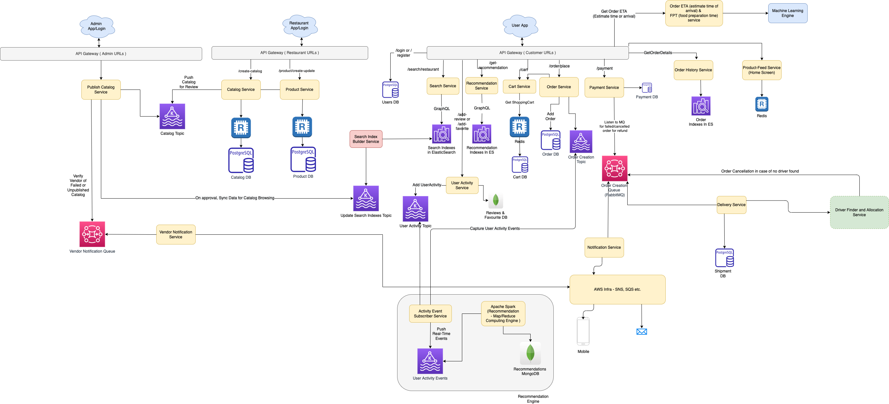

# Basic Requirements
- Food ordering systems
- User would have name & phoneNumber
- User can search for the restaurants
- User can search for the keywords and get list of restaurants
- Place an order
- Track the order
- Delivery of the order
- Order fulfilment
- User can track the status
- User can track the live location of the delivery
- Location of the restaurant
- Accounting of the restaurant
    - User would pay Zomato
    - Zomato would pay to delivery, restaurant

# System Design

# Real-world Systems

|        | Remarks                                                                 |
|--------|-------------------------------------------------------------------------|
| Zomato | [Swiggy - Tech Stack](../../1_TechStacks/ZomatoTechStack.md)    |
| Swiggy | [Swiggy - Tech Stack](../../1_TechStacks/SwiggyTechStack.md)    |
| Grab   | [Grab - Tech Stack](../../1_TechStacks/Grab/Readme.md) |

# Tech Decisions

| Use Case                                                                      | Service                                                                                                                                                                                                                                                                                                                                    | Remarks                                                                                                                                                                                                                                                                                                                                                                                                                                                                                                                                                                                                                                          |
|-------------------------------------------------------------------------------|--------------------------------------------------------------------------------------------------------------------------------------------------------------------------------------------------------------------------------------------------------------------------------------------------------------------------------------------|--------------------------------------------------------------------------------------------------------------------------------------------------------------------------------------------------------------------------------------------------------------------------------------------------------------------------------------------------------------------------------------------------------------------------------------------------------------------------------------------------------------------------------------------------------------------------------------------------------------------------------------------------|
| Cloud platform                                                                | [AWS](../../2_AWSServices/Readme.md)                                                                                                                                                                                                                                                                                                     | AWS and native cloud (kubernetes) with direct connect between AWS and on-prim Data Centre.  - Cloud services used from AWS cloud are SQS, SNS, AWS Lambda, AWS ADM, VPC, etc. to support the notification system.                                                                                                                                                                                                                                                                                                                                                                                                                            |
| Container Orchestration                                                       | [Kubernates with Docker](../../9_ContainerOrchestrationServices/Readme.md)                                                                                                                                                                                                                                           |                                                                                                                                                                                                                                                                                                                                                                                                                                                                                                                                                                                                                                                  |
| Message Broker - Pub/Sub                                                      | [Apache Kafka](../../4_MessageBrokersEDA/Kafka/Readme.md)                                                                                                                                                                                                                                                               | Message brokers are used to achieve high throughput in streaming events between read and write repositories of order management, sending real time or batch events to recommendation engine and publishing approved catalog and products(menu and foods) to search indexes DB.                                                                                                                                                                                                                                                                                                                                                                   |
| Message Broker - Point-2-Point                                                | RabbitMQ                                                                                                                                                                                                                                                                                                                                   | Since we have order work flow, we should use a [RabbitMQ](../../4_MessageBrokersEDA/RabbitMQ.md) to update the transaction status quickly ( like order status etc. ).                                                                                                                                                                                                                                                                                                                                                                                                                                                         |
| Socket Connection                                                             | Web Sockets                                                                                                                                                                                                                                                                                                                                | Will be used to deliver the continuous update of driver location who had picked the delivery, to the customer.                                                                                                                                                                                                                                                                                                                                                                                                                                                                                                                                   |
| OLTP-DB (like orders, shipment, restaurants, delivery, shipment etc.)         | PostgresDB                                                                                                                                                                                                                                                                                                                                 | To store all transactional data (like orders, shipment, restaurants, delivery, shipment etc.), we have chosen [SQL DB](../../3_DatabaseServices/SQL-Databases/Readme.md) to support native cloud approach but other options like public cloud managed storages can also be considered to achieve high scalability. - Data sharding/segmentation can be done based on different params like region etc.                                                                                                                                                                                                               |
| Document-DB (unstructured data like review, ratings and surveys related data) | [MongoDB](../../3_DatabaseServices/NoSQL-Databases/DocumentDB/MongoDB/Readme.md)                                                                                                                                                                                                                                              |                                                                                                                                                                                                                                                                                                                                                                                                                                                                                                                                                                                                                                                  |
| Key-Value-DB (high throughput/read/writes)                                    | [Redis or Aerospike](../../3_DatabaseServices/In-Memory-Databases/AeroSpike.md)                                                                                                                                                                                                                                           | Features a Hybrid Memory Architecture (`In-Memory` + `No-SQL database`), which makes it unique.- When using a persistent SSD, the index is kept in memory while the data is stored on the disc and then retrieved from the drive, as opposed to when using a non-persistent SSD. - To support high throughput in read and write in real time.                                                                                                                                                                                                                                                                                                |
| Search-DB                                                                     | [Apache Solr](../../3_DatabaseServices/Search-Databases/ApacheSolr.md) - [Read more](https://blog.zomato.com/explained-how-zomato-handles-100-million-daily-search-queries-p1) - Other Option - [ElasticSearch](../../3_DatabaseServices/Search-Databases/ElasticSearch/Readme.md) | Search DBs are used to store all published catalogs and products along with recommended items and placed order queries `to achieve the targeted SLA for search and browse requests`. - It can also be used for indexing customer calls records and metadata for the transcription.                                                                                                                                                                                                                                                                                                                                                           |
| Search-DB - API Tech                                                          | GraphQL                                                                                                                                                                                                                                                                                                                                    | To decrease the load and send only relevant data to UI, we have used [GraphQL query language](../../8_APIProtocols/GraphQL.md) to query selective data from the tree instead of complete data. Same goes for recommendation engine as well.- To achieve the targeted SLA, we have designed the system to support different repository for read and write, and have made write repository more aligned towards domain data and read repository towards data that will be requested from UI.- To do so, we have bundled all the product and order related data into their respective documents inside the elastic indexes. |
| InMemory-Cache                                                                | [Redis cache](../../3_DatabaseServices/In-Memory-Databases/Redis/Readme.md)                                                                                                                                                                                                                                               | It can be used, to store the location and segments information of all the restaurants in the city.- As this is very frequently read and non-changing data, we had chosen to setup this in Redis to avoid multiple DB calls.- For cart also, we will be storing all the selected items in Redis.                                                                                                                                                                                                                                                                                                                                                  |
| Map-Reduce Jobs (like select driver, generate recommendations etc.)           | [Apache Spark](../../6_BigDataServices/ETLServices/ApacheSpark.md)                                                                                                                                                                                                                                                 | For running map-reduce jobs to `select driver for efficient delivery` and generate recommendations based on continuous streams of user activity, order activity, pricing and promo changes, etc. It will select the distributed data, create a map and then reduce the values to give proper data.                                                                                                                                                                                                                                                                                                                                               |

# Related designs problems
- [Uber Driver Allocation](../DriverAllocationUberGoJek/Readme.md)

# Reference
- [System Design of food delivery app (Zomato/Swiggy)](https://www.linkedin.com/pulse/system-design-food-delivery-app-zomatoswiggy-saral-saxena/)
- HLD System Design Interview question asked in Blackbuck, 2ndJune2022