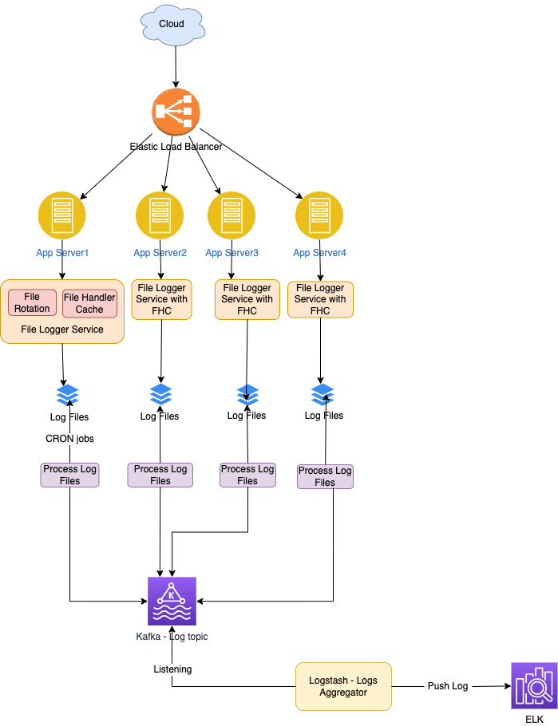

# Distributed Logging Solution - Requirements
- Lets consider an API `http://some/api/$filename/$multibytedata`
  - API Inputs - $filename, $multibytedata.
  - Check if a file is present
  - If not create a file
  - Append data to file
- Users can call this api concurrently
- Ensure [durability](../../../3_DatabaseServices/ACIDTransactions/Durability.md) - file must be saved, before return true to the API.

# Possible Design Options
- Delayed/Eventual Aggregation, using [FileBeat & ELK Stack](../../../12_ObservabilityLogsServices/ELK.md).

# Design Steps
- Recently opened file handles should be stored in the local app server cache.
- [Kafka topic name](../../../5_MessageBrokersEDA/Kafka/Readme.md) can be log file name.
- We would keep [rotating the log files at 10KB file size](https://www.mezmo.com/learn-log-management/what-is-log-rotation-how-does-it-work). (for best memory optimization)

# What is the purpose of log rotation?
- Large file issues - If a log file is already a terabyte at the end of the day, allowing it to grow another terabyte can create several issues.
- It would take a lot of disk space (terabytes of data) in few days itself.
- Opening the big file would be impossible if the local device doesn't have enough memory resources.
 
# Read more
- [ELK Stack + Kafka End to End Practice](https://elastic-stack.readthedocs.io/en/latest/e2e_kafkapractices.html)
- Interview Question@FluxOn, 6thJune2022