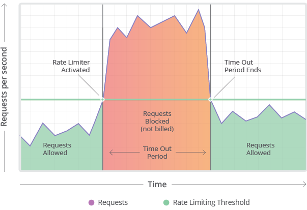

# Rate Limiting in Distributed Systems

[Rate limiting](https://medium.com/geekculture/system-design-basics-rate-limiter-351c09a57d14) refers to preventing the frequency of an operation from exceeding a defined limit. 
- In large-scale systems, rate limiting is commonly used to protect underlying services and resources. 
- Rate limiting is generally used as a defensive mechanism in distributed systems, so that shared resources can maintain availability.
- [AWS WAF](../../2_AWSServices/2c_SecurityServices/2_InfraProtectionServices/AWSWAF.md) can be used to rate limit the APIs in AWS.



Imagine we have a service which is receiving a huge number of requests, but it can only serve a limited number of requests per second.
- To handle this problem we would need some kind of throttling or rate limiting mechanism that would allow only a certain number of requests so our service can respond to all of them.
- A rate limiter, at a high-level, limits the number of events an entity (user, device, IP, etc.) can perform in a particular time window.

For example:
- A user can send only one message per second.
- A user is allowed only three failed credit card transactions per day.
- A single IP can only create twenty accounts per day.

In general, a rate limiter caps how many requests a sender can issue in a specific time window. It then blocks requests once the cap is reached.

# Why do we need Rate Limiting?
- Misbehaving clients/scripts
- Security: By limiting the number of the second-factor attempts (in 2-factor auth) that the users are allowed to perform, for example, the number of times they’re allowed to try with a wrong password.
- To prevent abusive behavior and bad design practices: Without API limits, developers of client applications would use sloppy development tactics, for example, requesting the same information over and over again.
- To keep costs and resource usage under control: Services are generally designed for normal input behavior, for example, a user writing a single post in a minute. Computers could easily push thousands/second through an API. Rate limiter enables controls on service APIs.
- Revenue: Certain services might want to limit operations based on the tier of their customer’s service and thus create a revenue model based on rate limiting. There could be default limits for all the APIs a service offers. To go beyond that, the user has to buy higher limits
- To eliminate spikiness in traffic: Make sure the service stays up for everyone else.

# Functional Requirements
- Limit the number of requests an entity can send to an API within a time window, e.g., 15 requests per second.
- The APIs are accessible through a cluster, so the rate limit should be considered across different servers. 
- The user should get an error message whenever the defined threshold is crossed within a single server or across a combination of servers.

# Non-functional requirements:
- The system should be highly available. The rate limiter should always work since it protects our service from external attacks.
- Our rate limiter should not introduce substantial latencies affecting the user experience.

# Types of Throttling

## Hard Throttling
- The number of API requests cannot exceed the throttle limit.

## Soft Throttling
- In this type, we can set the API request limit to exceed a certain percentage.

For example
- If we have rate-limit of 100 messages a minute and 10% exceed-limit, our rate limiter will allow up to 110 messages per minute.

## Elastic or Dynamic Throttling
- Under Elastic throttling, the number of requests can go beyond the threshold if the system has some resources available.

For example
- If a user is allowed only 100 messages a minute, we can let the user send more than 100 messages a minute when there are free resources available in the system.

# What are different types of algorithms used for Rate Limiting?

## Fixed Window Algorithm
- In this algorithm, the time window is considered from the start of the time-unit to the end of the time-unit.

## Rolling Window Algorithm
- In this algorithm, the time window is considered from the fraction of the time at which the request is made plus the time window length.

## :star: Sliding Window algorithm

We can maintain a sliding window if we can keep track of each request per user.
- We can store the timestamp of each request in a [Redis Sorted Set](../../3_DatabaseServices/In-Memory-Databases/Redis/Readme.md) in our ‘value’ field of hash-table.
- This is like Priority Queue Implementation.

Let’s assume our rate limiter is allowing three requests per minute per user, so, whenever a new request comes in, the Rate Limiter will perform following steps:
- Remove all the timestamps from the Sorted Set that are older than “CurrentTime - 1 minute”.
- Count the total number of elements in the sorted set. 
- Reject the request if this count is greater than our throttling limit of “3”.
- Insert the current time in the sorted set and accept the request.

Sliding Window Algorithm takes a lot of memory compared to the Fixed Window; this would be a scalability issue.
- If we need to track one million users at any time, total memory we would need would be 12GB.

What if we keep track of request counts for each user using multiple fixed time windows, e.g., 1/60th the size of our rate limit’s time window.
- We can store our counters in a [Redis Hash](../../3_DatabaseServices/In-Memory-Databases/Redis/Readme.md) since it offers incredibly efficient storage for fewer than 100 keys. 
- When each request increments a counter in the hash, it also sets the hash to expire an hour later. 
- We will normalize each ‘time’ to a minute.

# High level design for Rate Limiter

Rate Limiter will be responsible for deciding which request will be served by the API servers and which request will be declined.
- Once a new request arrives, the Web Server first asks the Rate Limiter to decide if it will be served or throttled.
- If the request is not throttled, then it’ll be passed to the API servers.

For each unique user, we would keep a count representing how many requests the user has made and a timestamp when we started counting the requests.

# Distributed Rate limiter implementation for an API
- In distributed systems, Rate limit can be implemented using [Redis (as centralized data store, to solve inconsistency problem)](../../3_DatabaseServices/In-Memory-Databases/Redis/Readme.md)


Note:
- If we are using [Redis](../../3_DatabaseServices/In-Memory-Databases/Redis/Readme.md) to store our key-value, one solution to resolve the atomicity problem is to use [Redis lock](../../3_DatabaseServices/In-Memory-Databases/Redis/Readme.md) for the duration of the read-update operation.
- This, however, would come at the expense of slowing down concurrent requests from the same user and introducing another layer of complexity

# Should we rate limit by IP or by user?

## Rate limit by IP
- In this scheme, we throttle requests per-IP; although it’s not optimal in terms of differentiating between ‘good’ and ‘bad’ actors, it’s still better than not have rate limiting at all. 
- The biggest problem with IP based throttling is when multiple users share a single public IP like in an internet cafe or smartphone users that are using the same gateway. 
- One bad user can cause throttling to other users. 
- Another issue could arise while caching IP-based limits, as there are a huge number of IPv6 addresses available to a hacker from even one computer, it’s trivial to make a server run out of memory tracking IPv6 addresses!

## Rate limit by user
- Rate limiting can be done on APIs after user authentication. 
- Once authenticated, the user will be provided with a token which the user will pass with each request. 
- This will ensure that we will rate limit against a particular API that has a valid authentication token. 
- But what if we have to rate limit on the login API itself? 
- The weakness of this rate-limiting would be that a hacker can perform a denial of service attack against a user by entering wrong credentials up to the limit; after that the actual user will not be able to log-in.

## How would it work?
- When a request is made, a new temporary record is stored in [Redis](../../3_DatabaseServices/In-Memory-Databases/Redis/Readme.md). 
- This record is defined by the IP address of the request and will expire.
- If a second request is made before the first expires, the record count is incremented.
- For each request made within the rate limit window, the record is incremented.
- If the record count reaches the max limit before expiring, then a 429 error status is returned.

````json
{
  "192.168.4.1": 10,
  "192.168.5.3": 20
}
````

## Two Major Issues & Solution

### Race Conditions
- To solve the race condition while updating the counter in [Redis](../../3_DatabaseServices/In-Memory-Databases/Redis/Readme.md), we would have to apply [transaction locks on the read-write operation](../../3_DatabaseServices/In-Memory-Databases/Redis/Readme.md#redis-transaction-lock).
- This would make the [counter update as atomic](../../3_DatabaseServices/ACIDTransactions/Atomicity.md) in Redis.
- But this comes at a performance cost ( as latency would increase ).

### Inconsistency
- Using the consistent data store (like [Redis](../../3_DatabaseServices/In-Memory-Databases/Redis/Readme.md), [Cassandra](../../3_DatabaseServices/NoSQL-Databases/WideColumnDB/ApacheCasandra.md)), we can solve inconsistency problem of current rate limiting in distributed systems.
- This would add a bit of latency.

# Estimation
- [Read here](https://docs.google.com/spreadsheets/d/15vApko2QrmZmv5qTEIyU_IAWvgY3MD23TR3TuLUiPc8/edit#gid=695176044)

## References
- [Groking the system design - Designing an API Rate Limiter](https://akshay-iyangar.github.io/system-design/grokking-system-design/system-design-problems/api-rate-limiter.html)
- [System Design Basics: Rate Limiter](https://medium.com/geekculture/system-design-basics-rate-limiter-351c09a57d14)
- [How Redis can work for Rate Limit](https://github.com/jwerre/rate-limit-redis)
- [Stripe - Scaling your API with rate limiters](https://stripe.com/blog/rate-limiters)
- [API Throttling and Rate Limiting](https://mytechblogs.medium.com/api-throttling-and-rate-limiting-4835ce901857)
