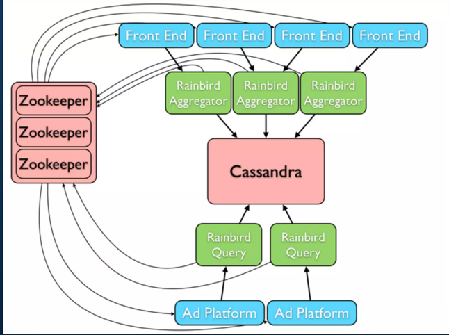
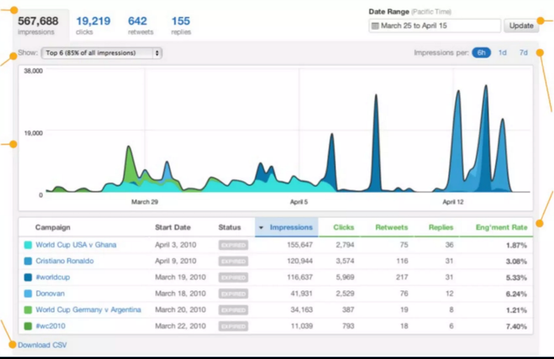
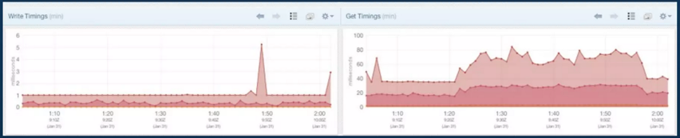
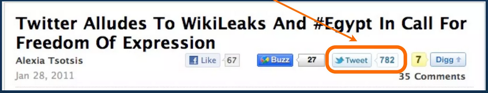

# Design Hit Counter System (Real-time Analytics & Reporting)

# Requirements

| Requirement                                 | Description                      |
|---------------------------------------------|----------------------------------|
| Extremely high write volume                 | Needs to scale to 100,000 of WPS |
| High read volume                            | Needs to scale to 10,000 of RPS  |
| Horizontally scalable (reads, storage etc.) | Needs to scale to 100+ TB        |
| Low Latency                                 | Most reads < 100ms               |

# Tech Stack
- [Casandra](../../1_Databases/11_WideColumn-Databases/ApacheCasandra.md).
- [Redis Cache](../../1_Databases/8_Caching-InMemory-Databases/Redis/Readme.md) (with Cluster enabled).
- [Zookeeper](../../10_ClusterCoordination/ApacheZookeeper.md) for servers coordination.

# Rainbird design
- Aggregators buffer for 1 min (configurable).
- Intelligent flush to [Casandra](../../1_Databases/11_WideColumn-Databases/ApacheCasandra.md)
- Query Servers read once written.



# Rainbird data structure

````
struct Event {
  i32 timstamp
  string category // Stat category name
  list<string> keys // Stat Keys (hierarchical)
  i64 value // Actual count
  optional set<property> properties
  optional map<Property, i64> propertiesWithCounts
}
````

Example1 - Hierarchical Aggregation
````
category = pti
keys = [advertiser_id, campaign_id, tweet_id]
count = 1
````

Example2 - Tracking URL shortening tweets/clicks
````
full_url = https://music.amazon.com/path
keys = [com, amazon, music, full URL]
count = 1
````

# Use Cases

## Promoted Tweets Analytics



## Internal Monitoring & Alerting



## Tweet Counts



# Other notes
- Permission system as separate service/database
  - UUID of the file system, instead of filename/folder
- Counter Update
  - Counter should be updated asynchronously
  - TransactionLock
  - Follow ACID, CAP theme
- [Journaling data changes](https://en.wikipedia.org/wiki/Journaling_file_system)
- Crash Recovery, Audit Log

# References
- [Design a Hit Counter - GFG](https://www.geeksforgeeks.org/design-a-hit-counter/?ref=lbp)
- [Design Hit Counter](https://leetcode.com/problems/design-hit-counter/)
- [Rainbird: Realtime Analytics at Twitter](https://www.slideshare.net/kevinweil/rainbird-realtime-analytics-at-twitter-strata-2011)
- [Microsoft virtual | Design distributed counter](https://leetcode.com/discuss/interview-question/system-design/685310/Microsoft-virtual-or-Design-distributed-counter)
- [What Web3 could learn from Twitter’s timeline architecture](https://medium.com/zettablock-hq/what-web3-could-learn-from-twitters-timeline-architecture-207e0673ed2d)