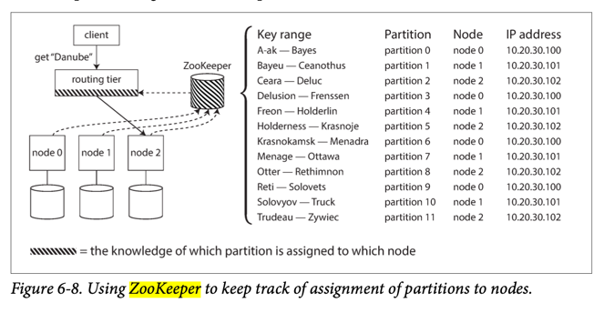

# Apache Zookeeper
- [Apache Zookeeper](https://zookeeper.apache.org/) can manage a [Cluster (new broker, new partition etc.) and servers coordination](Readme.md).
- ZooKeeper is modeled after [Google’s Chubby lock service](https://people.cs.rutgers.edu/~pxk/417/notes/chubby.html).

# :star: Real world use cases
- [Apache Kafka](../4_MessageBrokersEDA/Kafka/Readme.md#zookeeper)
- [Apache HBase](../3_Databases/11_WideColumn-Databases/ApacheHBase.md)
- [Apache Marathon & Mesos](../9_Container&Orchestration/ApacheMarathon&Mesos.md)
- [Apache SolrCloud](../3_Databases/9_Search-Databases/ApacheSolr.md)
- [Twitter Hit Counter](../0_UseCaseDesigns/HitCounterDesignTwitter/Readme.md)