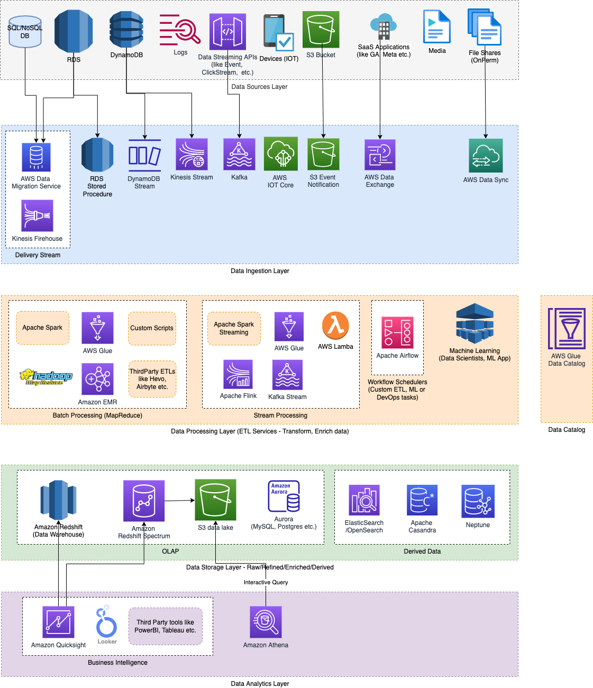

# Amazon S3 data lake
- [Amazon S3](https://docs.aws.amazon.com/whitepapers/latest/building-data-lakes/amazon-s3-data-lake-storage-platform.html) is an optimal foundation for a [data lake](../../../../5_BigDataServices/Glossaries/DataStorage/DataLake.md) because of its virtually unlimited scalability.
- You can increase storage from gigabytes to petabytes of content, paying only for what you use.

# ClickStream analytics using S3 on AWS

[Read more](../../../../12_HLDDesignProblemsUC/AWS_ClickStreamAnalytics/Readme.md)

# Use Cases

| Use Case                                                                                                           |
|--------------------------------------------------------------------------------------------------------------------|
| [Swiggy - Capturing CDC using S3 data lake](../../../../13_TechStacksRealWorld/SwiggyTechStack.md) |

