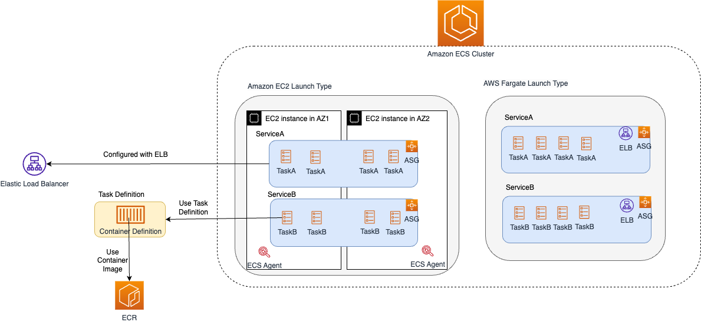

# AWS Fargate
- [AWS Fargate - Serverless compute for containers](https://aws.amazon.com/fargate/) is a serverless compute engine used in conjunction with [Amazon Elastic Container Service (ECS)](../4_ContainerOrchestrationServices/AmazonECS/Readme.md). 
- [Fargate has a flexible computing model](https://aws.amazon.com/fargate/faqs/?nc=sn&loc=4), which does not require you to select an instance type or directly configure your cluster. 
- It scales up transparently & you pay according to the CPU and memory resources you actually use.

# Features

| Feature                                                                                                                                       | Remarks                                                                                                                                                 |
|-----------------------------------------------------------------------------------------------------------------------------------------------|---------------------------------------------------------------------------------------------------------------------------------------------------------|
| Supports both Linux, Windows containers                                                                                                       | AWS Fargate now supports [Amazon ECS Windows containers](https://aws.amazon.com/about-aws/whats-new/2021/10/aws-fargate-amazon-ecs-windows-containers/) |
| Compatible with both [EKS](../4_ContainerOrchestrationServices/AmazonEKS.md) & [ECS](../4_ContainerOrchestrationServices/AmazonECS/Readme.md) | These services can run with Fargate as deployment option, instead of [Amazon EC2 instances](AmazonEC2/Readme.md).                                       |
| Serverless                                                                                                                                    | You can use it to run containers without managing servers or clusters of [Amazon EC2 instances](AmazonEC2/Readme.md).                                                                                                                                                         |

# ECS-Fargate with ELB

# Amazon ECS Availability with Fargate
- [Fargate](https://aws.amazon.com/blogs/containers/amazon-ecs-availability-best-practices/) ensures [Availability Zone](../AWS-Global-Architecture-Region-AZ.md) spread while removing the complexity of managing [EC2 infrastructure](AmazonEC2/Readme.md) and works to ensure that Tasks in a Replica Service are balanced across Availability Zones. 
- For RunTask launches with a Fargate launch type, Fargate will look to spread Task placement across all available Availability Zones ensuring even distribution of the [Task Definition Family](https://docs.aws.amazon.com/AmazonECS/latest/developerguide/task_definition_parameters.html) that the Task belongs to. 
- By leveraging Fargate, you are able to sidestep the undifferentiated heavy lifting of owning and managing infrastructure allowing you to focus on delivering applications to delight your customers.

# Source(s) and further reading
- [How to Setup AWS ECS Fargate with a Load Balancer | Step by Step](https://www.youtube.com/watch?v=o7s-eigrMAI)
- [Theoretical cost optimization by Amazon ECS launch type: Fargate vs EC2](https://aws.amazon.com/blogs/containers/theoretical-cost-optimization-by-amazon-ecs-launch-type-fargate-vs-ec2/)
