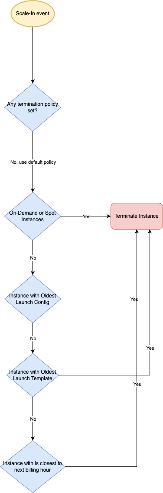

# Scaling Policies
- [AWS EC2 Auto Scaling](https://aws.amazon.com/getting-started/hands-on/ec2-auto-scaling-spot-instances/) enables you to automatically launch or terminate [Amazon EC2 instances](../Readme.md) based on user-defined policies, health status checks, and schedules.

| Scaling policy                                                                                                                           | Type of Scaling | Description                                                                                                                                                                                                                                                                                                                                                                                                                                                                                                                                               |
|------------------------------------------------------------------------------------------------------------------------------------------|-----------------|-----------------------------------------------------------------------------------------------------------------------------------------------------------------------------------------------------------------------------------------------------------------------------------------------------------------------------------------------------------------------------------------------------------------------------------------------------------------------------------------------------------------------------------------------------------|
| :star: [Step Scaling](https://docs.aws.amazon.com/autoscaling/ec2/userguide/as-scaling-simple-step.html#simple-scaling-policies-aws-cli) | Dynamic Scaling | [Step scaling policies](https://docs.aws.amazon.com/autoscaling/ec2/userguide/as-scaling-simple-step.html) increase or decrease the current capacity of a scalable target based on a set of scaling adjustments, known as [step adjustments](https://docs.aws.amazon.com/autoscaling/ec2/userguide/as-scaling-simple-step.html).  - The adjustments vary based on the size of the alarm breach.  - It doesn't wait for cool-down before responding to new alarms.                                                                                 |
| :star: [Target Tracking](https://docs.aws.amazon.com/autoscaling/ec2/userguide/as-scaling-target-tracking.html)                          | Dynamic Scaling | Target value that represents the ideal average utilization or throughput level for your application. - For example, let's say that you currently have an application that runs on two instances, and you want the CPU utilization of the Auto Scaling group to stay at around 50 percent when the load on the application changes.  - This gives you extra capacity to handle traffic spikes without maintaining an excessive number of idle resources.                                                                                           |
| [Scheduled scaling](https://docs.aws.amazon.com/autoscaling/ec2/userguide/ec2-auto-scaling-scheduled-scaling.html)                       | Fleet Scaling   | Best for Auto Scaling your EC2 instances for predictable traffic patterns. - To use scheduled scaling, you create scheduled actions which are performed automatically as a function of date and time.                                                                                                                                                                                                                                                                                                                                                 |
| [Simple Scaling](https://docs.aws.amazon.com/autoscaling/ec2/userguide/as-scaling-simple-step.html)                                      | Dynamic Scaling | With [simple scaling](https://docs.aws.amazon.com/autoscaling/ec2/userguide/as-scaling-simple-step.html), you choose scaling metrics and threshold values for the CloudWatch alarms that trigger the scaling process.  - The main issue is that after a scaling activity is started, the policy must wait for the scaling activity or health check replacement to complete and the [cooldown period](https://docs.aws.amazon.com/autoscaling/ec2/userguide/ec2-auto-scaling-scaling-cooldowns.html) to expire before responding to additional alarms. |

# Capacity Parameters

| Parameter        | Use Case                             | Remarks                                                              |
|------------------|--------------------------------------|----------------------------------------------------------------------|
| Min-Capacity     | Dynamic Scaling - Range of instances | Min is how many EC2 instances should at least be running.            |
| Max-Capacity     | Dynamic Scaling - Range of instances | Max is the number of EC2 instances allowed to run.                   |
| Desired-Capacity | Fleet Scaling - Specific Instances   | Desired capacity is how many EC2 instances, you want to run ideally. |

# Types of Scaling

| Type            | Description                                                                                                                                                                  | Formula                                                     |
|-----------------|------------------------------------------------------------------------------------------------------------------------------------------------------------------------------|-------------------------------------------------------------|
| Fleet Scaling   | Maintain desired number of instances across AZs (for [high availability](../../../../0_SystemGlossaries/Reliability/HighAvailability.md)) at all time. | Desired-Capacity = Min-Capacity = Max-Capacity = Fleet-Size |
| Dynamic Scaling | Automatically increase or decrease resource capacity in relation to the demand.                                                                                              | Based on demand                                             |

# Scaling Metrics

| Metric                                            | Description                                                                                                                                                                                                                          |
|---------------------------------------------------|--------------------------------------------------------------------------------------------------------------------------------------------------------------------------------------------------------------------------------------|
| CPUUtilization                                    | For example - Auto scale for CPU usage on a single instance rise above 80% for 5 mins.                                                                                                                                               |
| Memory                                            | -                                                                                                                                                                                                                                    |
| [Amazon SQS queue size](SQSBasedScalingPolicy.md) | Based on the [Amazon SQS queue size](../../../5_MessageBrokerServices/AmazonSQS/Readme.md), the [auto-scaling of the EC2 instances](https://docs.aws.amazon.com/autoscaling/ec2/userguide/as-using-sqs-queue.html) can also be done. |

# Scaling Activities

| Activity                | Remarks                                                                                                                                                                                        |
|-------------------------|------------------------------------------------------------------------------------------------------------------------------------------------------------------------------------------------|
| Re-balancing Activities | When rebalancing, Amazon EC2 Auto Scaling launches new instances before terminating the old ones, so that rebalancing does not compromise the performance or availability of your application. |
| Scaling activity        | Auto Scaling creates a new scaling activity for terminating the unhealthy instance and then terminates it. Later, another scaling activity launches a new instance to replace the terminated instance.                                                                                                                                                                                               |

[Amazon EC2 Auto Scaling benefits](https://docs.aws.amazon.com/autoscaling/ec2/userguide/auto-scaling-benefits.html)

# Termination policy for Scale-In event

[Read more](https://docs.aws.amazon.com/autoscaling/ec2/userguide/ec2-auto-scaling-termination-policies.html)
