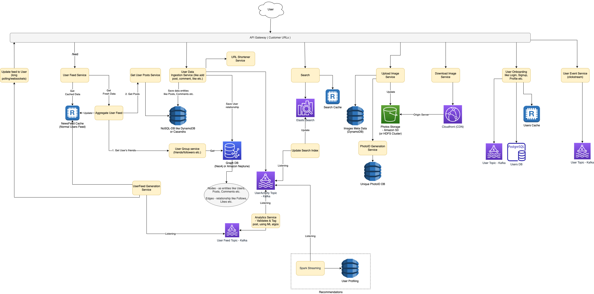

# Requirements - Facebook/Instagram Design Problem

## In Scope
The application should be able to support the following requirements.
- Users should be able to upload photos and view the photos they have uploaded.
- Users should be able to follow other users.
- Users can view feeds containing posts from the users they follow.
- Users should be able to like and comment the posts.

## Out of Scope
- Sending and receiving messages from other users.
- Generating machine learning based personalized recommendations to discover new people, photos, videos, and stories relevant one’s interest.

## NFR
- Read heavy system (100x more reads than writes)
- Lag is okay in some cases

# Ball-mark estimations
- [Calculator link](https://docs.google.com/spreadsheets/d/15vApko2QrmZmv5qTEIyU_IAWvgY3MD23TR3TuLUiPc8/edit#gid=230262262)

# System Design



# Real-world systems

|           | Remarks                                                         |
|-----------|-----------------------------------------------------------------|
| LinkedIn  | [Tech Stack](../../13_TechStacksRealWorld/LinkedInTechStack.md)  |
| Instagram | [Tech Stack](../../13_TechStacksRealWorld/InstagramTechStack.md) |
| Facebook  | [Tech Stack](../../13_TechStacksRealWorld/FacebookTechStack.md)  |
| Twitter   |                                                                 |


# User Categories

|          | Remarks                                                         |
|----------|-----------------------------------------------------------------|
| Famous   | Users with huge number of followers                             |
| Active   | Users accessing the system, within last few days (3 to 30 days) |
| Live     | Users actually accessing the system right now                   |
| Passive  | None of above categories                                        |
| Inactive | Users who have deleted their account                            |

# Tech Decisions

| Feature                              | Decision                                                                                                                                                                                             |
|--------------------------------------|------------------------------------------------------------------------------------------------------------------------------------------------------------------------------------------------------|
| Users DB                             | Postgres                                                                                                                                                                                             |
| Images Storage                       | [Amazon S3](../../11_AWSServices/7_StorageServices/3_ObjectStorageS3/Readme.md) or [HDFS](../../9_FileStorage/ApacheHDFS.md)   |
| Images MetaData                      | [Amazon DynamoDB](../../11_AWSServices/6_DatabaseServices/AmazonDynamoDB/Readme.md)                                                                                                                 |
| Partitioning Key for images metadata | PhotoID                                                                                                                                                                                              |
| User Activity - Data Entities Store  | [Amazon DynamoDB](../../11_AWSServices/6_DatabaseServices/AmazonDynamoDB/Readme.md) or [Cassandra](../../3_DatabaseServices/NoSQL-Databases/WideColumnDB/ApacheCasandra.md) |
| User Activity - Relationship Store   | Graph Databases like [Neo4j](../../3_DatabaseServices/NoSQL-Databases/GraphDB/Neo4j.md) or Amazon Neptune                                                                    |
| Data Streaming                       | [Kafka](../../4_MessageBrokers/Kafka/Readme.md) or [Amazon Kinesis](../../11_AWSServices/5_MessageBrokerServices/AmazonKinesis/Readme.md)                                     |
| App Servers                          | Separate app servers for READ and WRITE (Since read-write ratio is 100:1).                                                                                                                           |
| Home Feed DB                         | [Redis](../../3_DatabaseServices/In-Memory-DB/Redis/Readme.md)                                                                                                               |

# Reliability and Redundancy
- If we want to have [high availability](../../0_SystemGlossaries/Reliability/HighAvailability.md) of the system, we need to have multiple replicas of services running in the system so that even if a few services die down, the system remains available and running.
- Redundancy removes the single point of failure in the system.

# Images MetaData - DB Schema
- We need to store data about users, their uploaded photos, and the people they follow.

Photo table
- PhotoID (key)
- UserID
- PhotoPath
- PhotoLat
- PhotoLong
- UserLat
- UserLong
- CreationDate

Users
- Name
- Email
- DateOfBirth
- CreationDate
- LastLogin

User Follow Table
- FollowerID
- FolloweeID

# Data Sharding

## Option1 - Partitioning based on UserID (problem of hot spots)
- Let’s assume we shard based on the ‘UserID’ so that we can keep all photos of a user on the same shard.
- If one DB shard is 1TB, we will need four shards to store 3.7TB of data.
- Let’s assume, for better performance and scalability, we keep 10 shards.
- So we’ll find the shard number by UserID % 10 and then store the data there.
- To uniquely identify any photo in our system, we can append the shard number with each PhotoID.

What are the different issues with "Partitioning based on UserID"?
- How would we handle hot users? Several people follow such hot users, and a lot of other people see any photo they upload.
- Some users will have a lot of photos compared to others, thus making a non-uniform distribution of storage.
- What if we cannot store all pictures of a user on one shard? If we distribute photos of a user onto multiple shards, will it cause higher latencies?
- Storing all photos of a user on one shard can cause issues like unavailability of all the user’s data if that shard is down or higher latency if it is serving high load etc.

## Option2 - Partitioning based on PhotoID (recommended)
- If we can generate unique PhotoIDs first and then find a shard number through `PhotoID % 10`, the above problems will have been solved.

# PhotoID-Server
- We dedicate a separate database instance to generate auto-incrementing IDs.
- If our PhotoID can fit into 64 bits, we can define a table containing only a 64 bit ID field.
- Whenever we would like to add a photo in our system, we can insert a new row in this table and take that ID to be our PhotoID of the new photo.

# NewsFeed Service
- We can have dedicated servers that are continuously generating users News Feeds and storing them in a `UserNewsFeed` table.

## Push vs Pull model
- For celebrity user (user with large number of followers), use Pull model.
- For normal user, use Push model (long polling or websocket).

# User Activity Service

## Graph Data Models
- The reason we have chosen a [Neo4j](../../3_DatabaseServices/NoSQL-Databases/GraphDB/Neo4j.md) graph data-model is that our data will contain complex relationships between data entities such as users, posts, and comments as nodes of the graph.
- After that, we will use edges of the graph to store relationships such as follows, likes, comments, and so forth.


## NoSQL Data Models
- We will use NoSQL databases like [Amazon DynamoDB](../../11_AWSServices/6_DatabaseServices/AmazonDynamoDB/Readme.md) or [Cassandra](../../3_DatabaseServices/NoSQL-Databases/WideColumnDB/ApacheCasandra.md) to store information like user feeds, activities, and counters.
- Each row will contain feed/activity information of the user.
- We can also have a TTL based functionality to evict older posts.

````
User_id -> List
````


# References
- :star: [HighScalability - Designing Instagram](http://highscalability.com/blog/2022/1/11/designing-instagram.html)
- :star: [CodeKarle - Facebook System Design | Instagram System Design | System Design Interview Question](https://www.youtube.com/watch?v=9-hjBGxuiEs)
- :star: [CodeKarle - Twitter System Design | System Design Interview Question](https://www.youtube.com/watch?v=EkudBdvbDhs)
- [Facebook - Serving a Billion Personalized News Feeds](https://www.youtube.com/watch?v=Xpx5RYNTQvg)
- [Enjoyalgorithms - Design Instagram](https://www.enjoyalgorithms.com/blog/design-instagram)
- [Instagram System Architecture](https://medium.com/interviewnoodle/instagram-system-architecture-fdbec22e48ee)
- [Educative - System Design: Instagram](https://www.educative.io/courses/grokking-the-system-design-interview/m2yDVZnQ8lG)