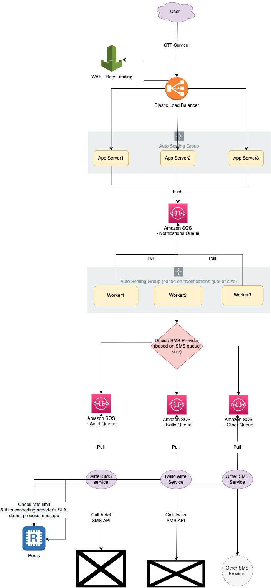

# Transaction SMS - System Design
- Let's design `Send-SMS` api which sends transaction SMS (like OTP) to the users.

# Tech Stack

| Tech Stack                                                                                                                             |
|----------------------------------------------------------------------------------------------------------------------------------------|
| [AWS AutoScaling Group](../../11_AWSServices/3_ComputeServices/AmazonEC2/AutoScalingGroup/Readme.md)                                  |
| [AWS AutoScaling based on SQS Queue Size](../../11_AWSServices/3_ComputeServices/AmazonEC2/AutoScalingGroup/SQSBasedScalingPolicy.md) |
| [Elastic Load Balancing](../../11_AWSServices/1_NetworkingAndContentDelivery/2_ApplicationNetworking/ElasticLoadBalancer/Readme.md)   |
| [Amazon SQS](../../11_AWSServices/5_MessageBrokerServices/AmazonSQS/Readme.md)                                                        |
| [Redis](../../3_DatabaseServices/In-Memory-DB/Redis/Readme.md)                                                 |

# How would we implement rate limiting of the 3rd party SMS providers? (& follow their SLA)
- We would need to rate limit on our end, before calling 3rd-party API (which might have a limit in their SLA).
- We can achieve this either by using [Redis](../../3_DatabaseServices/In-Memory-DB/Redis/Readme.md) (for distributed system) or we can check the current processing queue size to handle this.
- [To understand more about Rate Limiting, check here](../RateLimiterAPI/Readme.md)

# References
- Asked in GoGroup interview, 22-June-2022