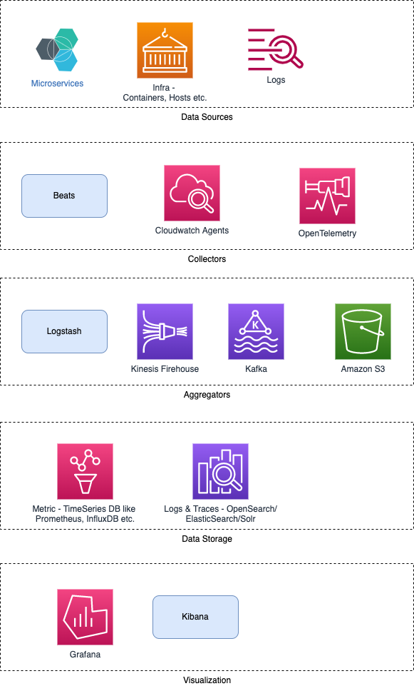

# ELK stack

| Service                                                               | Category                | Remarks                                                                         |
|-----------------------------------------------------------------------|-------------------------|---------------------------------------------------------------------------------|
| [Elasticsearch](../3_DatabaseServices/Search-Databases/ElasticSearch) | NoSQL database          | Used to store the unstructured data                                             |
| [Logstash](https://www.elastic.co/logstash/)                          | Log pipeline tool       | Perform transformation on data                                                  |
| [Kibana](https://www.elastic.co/kibana/)                              | Data visualization tool | Provides an interactive UI (User Interface) to the users for data visualization |

# What are the reason for using ELK stack?
- ELK works best when logs from various Apps of an enterprise converge into a single ELK instance
- It provides amazing insights for this single instance and also eliminates the need to log into a hundred different log data sources. 
- Rapid on-premise installation 
- Easy to deploy Scales vertically and horizontally 
- Elastic offers a host of language clients, which includes Ruby. Python. PHP, Perl, .NET, Java, and JavaScript, and more 
- Availability of libraries for different programming and scripting language

# :star: Real world use cases of ELK

## Observability System Design

[Read more](../0_HLDUseCasesProblems/ObervabilityLoggingSolution/Readme.md)

# Others
- [Distributed Logging Solution](../0_HLDUseCasesProblems/ObervabilityLoggingSolution/LoggingFileAggregation/Readme.md)
- [How filebeat works?](https://www.elastic.co/guide/en/beats/filebeat/current/how-filebeat-works.html)
- [Installation using Docker ELK](https://github.com/deviantony/docker-elk)

# Deployment on AWS
- [ELK]() can be deployed using [Amazon OpenSearch](../2_AWSServices/6_DatabaseServices/AmazonOpenSearch.md), on [AWS](../2_AWSServices).

