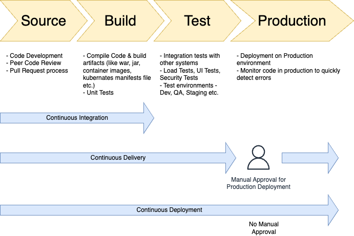

# CI/CD
- [CI/CD](https://www.redhat.com/en/topics/devops/what-is-ci-cd) is a method to frequently deliver apps to customers by introducing automation into the stages of app development.

# Trunk-based development 
- [Trunk-based development](https://www.atlassian.com/continuous-delivery/continuous-integration/trunk-based-development) is a version control management practice where developers merge small, frequent updates to a core “trunk” or main branch. 
- Since it streamlines merging and integration phases, it helps achieve CI/CD and increases software delivery and organizational performance.