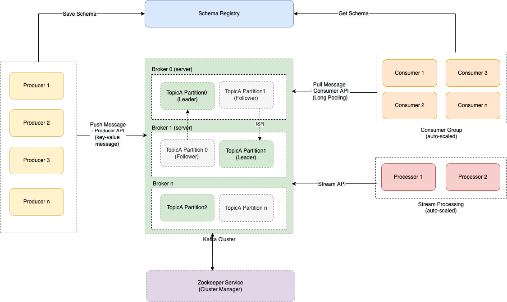
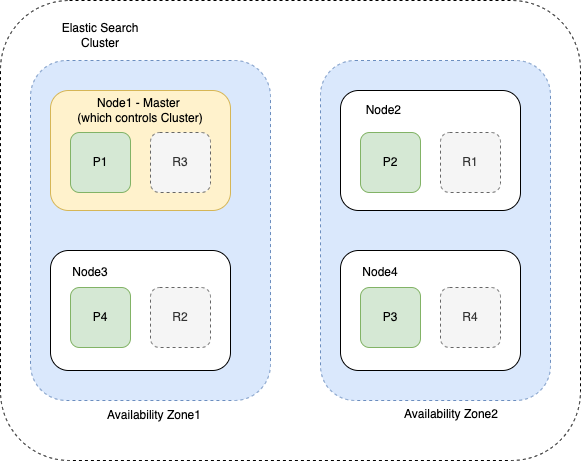

# DB Scalability Techniques
- A database can use one or multiple techniques, to handle scale.

| Technique                                | Queries type | Built-In-DBs                                                                                                                                                                                                                                                                                         | Remarks                                                                                                                                                                                                                |
|------------------------------------------|--------------|------------------------------------------------------------------------------------------------------------------------------------------------------------------------------------------------------------------------------------------------------------------------------------------------------|------------------------------------------------------------------------------------------------------------------------------------------------------------------------------------------------------------------------|
| :star: Single-Leader-Multi-Read-Replicas | Reads        | All-DBs (except few like [Casandra](../11_WideColumn-Databases/ApacheCasandra.md))                                                                                                                                                                                                                   | Being able to handle a higher volume of reads than a single machine could handle, by performing [reads on replicas](ReadReplicaVsCache.md). - [Read more](../4_Consistency-Replication/SingleLeaderReplication.md) |
| Indexing                                 | Reads        | All-DBs (except few like [Casandra](../11_WideColumn-Databases/ApacheCasandra.md))                                                                                                                                                                                                                   | [Read more](../5_Database-Internals/Indexing.md)                                                                                                                                                                        |
| Caching using In-Memory-DBs like Redis   | Reads        | None                                                                                                                                                                                                                                                                                                 | [Read more](ReadReplicaVsCache.md)                                                                                                                                                                                     |
| SQL Tuning                               | Reads        | SQL-DBs                                                                                                                                                                                                                                                                                              | [Read more](SQLTuning.md)                                                                                                                                                                                              |
| :star: Partitioning/Sharding             | Writes       | No-SQL-DBs like [Amazon DynamoDB](https://github.com/Anshul619/AWS-Services/tree/main/1_Databases/AmazonDynamoDB/Readme.md), [Kafka Cluster](../../2_MessageBrokersEDA/Kafka/Readme.md), [Redis Cluster](../8_Caching-InMemory-Databases/Redis/RedisCluster.md), [ElasticSearch Cluster](../9_Search-Databases/ElasticSearch/Cluster.md) etc. | For very large datasets, or very high query throughput, we would need to break the data up into partitions, also known as [sharding](PartitioningSharding/Readme.md).                                                  |
| Vertical Scale-up                        | Writes       | SQL-DBs                                                                                                                                                                                                                                                                                              | Generally, it's **not recommended** to do vertical scalability (due to cost, other limitations).                                                                                                                       |

# Amazon RDS Cluster

# Kafka Cluster

# ElasticSearch Cluster

# Redis Cluster

# References
- [Scalability and High Availability](https://dzone.com/refcardz/scalability)