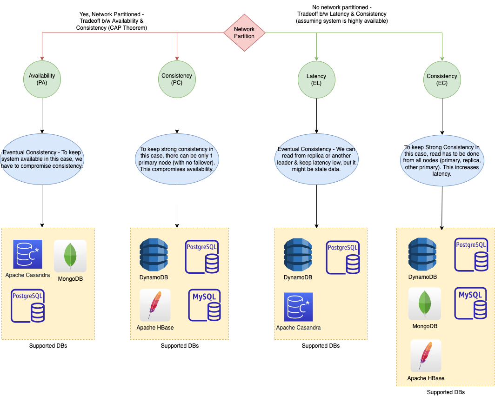

# Data Consistency (Read) patterns

|                                      | :star: Semi-synchronous consistency (replication)                                                                                            | :star: Eventual Consistency (async replication)                                                               | Strong Consistency (fully-sync replication)                                                                                                                                                          |
|--------------------------------------|----------------------------------------------------------------------------------------------------------------------------------------------|---------------------------------------------------------------------------------------------------------------|------------------------------------------------------------------------------------------------------------------------------------------------------------------------------------------------------|
| Description                          | To decrease delay in writes in fully-sync replication, we can have one of the follower replication as synchronous while others as asynchronous. | In case of asynchronous replication, leader sends the message, but does not wait for a response from the follower. | In case of synchronous replication, the leader waits until follower1 has confirmed that it received the write before reporting success to the user, and before making the write visible to other clients. |
| Writes Throughput                    | :rocket: Normal                                                                                                                              | :rocket: Very High                                                                                            | Comparatively low                                                                                                                                                                                    |
| [Replication Lag](ReplicationLag.md) | Usually milliseconds/seconds                                                                                                                 | Usually milliseconds/seconds                                                                                  | No replication lag                                                                                                                                                                                   |
| [Replication Algo](Replication.md)   | [Single-Leader replication](SingleLeaderReplication.md)                                                                                      | [Single-Leader replication](SingleLeaderReplication.md) & [Leaderless replication](Replication.md)            | [Single-Leader replication](SingleLeaderReplication.md)                                                                                                                                              |
| Used by                              | [Kafka Cluster](../../2_MessageBrokersEDA/Kafka/Readme.md), [Amazon Aurora](https://github.com/Anshul619/AWS-Services/tree/main/1_Databases/AmazonRDS/AmazonAurora/Readme.md) | [No-SQL DBs like Casandra, Dynamodb, MongoDB](../11_WideColumn-Databases)                                     | [SQL-DBs](../7_SQL-Databases/Readme.md), [Apache HBase](../11_WideColumn-Databases/ApacheHBase.md), Amazon DynamoDB, MongoDB                                                                         |

# PACELC Theorem

[Read more](../2_CAP-PACELC-Theorems/Readme.md)

# References
- [Data consistency](https://en.wikipedia.org/wiki/Data_consistency)
- [Consistency Patterns](https://github.com/donnemartin/system-design-primer#consistency-patterns)
