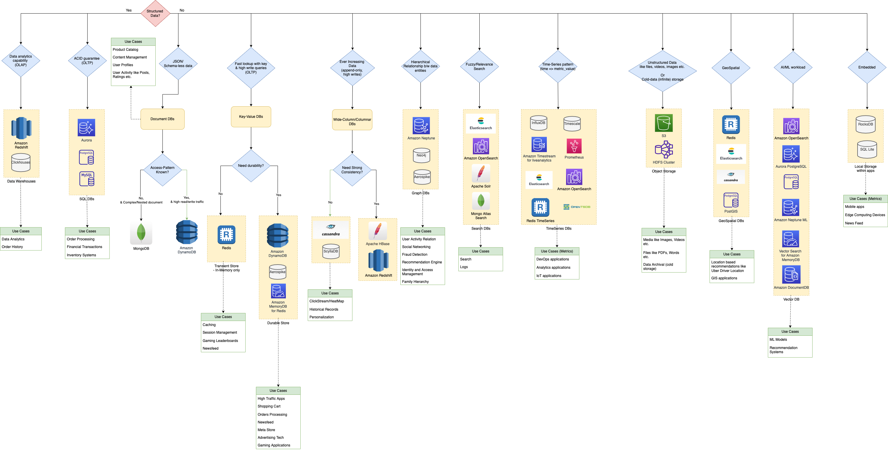
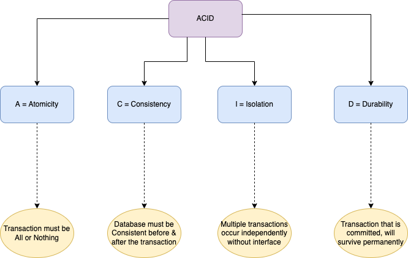

# Database Design Tips | Choosing the Best Database in a System Design

[Read more](https://www.youtube.com/watch?v=cODCpXtPHbQ)

# Key Parameters

| Title                 | Remarks                                                                                                                                                              |
|-----------------------|----------------------------------------------------------------------------------------------------------------------------------------------------------------------|
| :star: Query Patterns | How complex are your query patterns?  - Do you just need retrieval by key, or also by various other parameters? - Do you also need fuzzy search on the data? |
| Consistency           | Is Strong Consistency required? - Read after write, especially when you switch writes to a different data-center  Or Eventual Consistency is OK?             |
| Performance           | What is the needed throughput and latency?                                                                                                                           |
| Storage Capacity      | How much storage capacity is needed?                                                                                                                                 |

[Read more](https://medium.com/wix-engineering/how-to-choose-the-right-database-for-your-service-97b1670c5632)

# Key Considerations

| Title                                                                                         | Category | Remarks                                                                                                                                                                                           |
|-----------------------------------------------------------------------------------------------|----------|---------------------------------------------------------------------------------------------------------------------------------------------------------------------------------------------------|
| [SQL vs NoSQL](SQLvsNoSQL.md)                                                                 | General  | [Terms Comparison - SQL vs NoSQL](Terminologies.md)                                                                                                                                               |
| [All Databases list](All-DBs-List.md)                                                         | General  |                                                                                                                                                                                                   |
| [DB Scalability Techniques](3_Scalability-Techniques/Readme.md)                               | General  |                                                                                                                                                                                                   |
| [OLTP vs OLAP](OLTPvsOTAP.md)                                                                 | General  |                                                                                                                                                                                                   |
| [Sharding of the database](3_Scalability-Techniques/PartitioningSharding/Readme.md)           | Sharding | To scale the data store horizontally (& improve write scalability), shard the databases using [consistent hashing technique](3_Scalability-Techniques/PartitioningSharding/ConsistentHashing.md). |
| [Partitioning Key Tips](3_Scalability-Techniques/PartitioningSharding/PartitionKey/Readme.md) | Sharding | Decide partition key carefully (to prevent hot partition problem).                                                                                                                                |
| [DynamoDB vs MongoDB vs Casandra](DynamoDBVsMongoDBVsCasandra.md)                             | NoSQL DB |                                                                                                                                                                                                   |
| [NoSQL tips & patterns](NoSQLTips.md)                                                         | NoSQL DB |                                                                                                                                                                                                   |

# PACLEC Theorem

[Read more](2_CAP-PACELC-Theorems/Readme.md)

# ACID Transactions

[Read more](1_ACID-Transactions/Readme.md)

# References
- :star: [AWS re:Invent 2021 - Which NoSQL database is right for you?](https://www.youtube.com/watch?v=ivBaro-8PhI)
- [How To Choose The Right Database?](https://www.youtube.com/watch?v=kkeFE6iRfMM)
- [AWS re:Invent 2022 - From RDBMS to NoSQL (PRT314)](https://www.youtube.com/watch?v=eEENrNKxCdw)
- [Databases on AWS: The Right Tool for the Right Job](https://www.youtube.com/watch?v=WE8N5BU5MeI&t=3710s)
- [Wix Engineering - How to choose the right database for your service](https://medium.com/wix-engineering/how-to-choose-the-right-database-for-your-service-97b1670c5632)
- [Wix Engineering - 5 Database technologies used by 2000 Wix microservices](https://medium.com/wix-engineering/5-database-technologies-used-by-2000-wix-microservices-e4769638b8c3)
- [AWS - What Is a Document Database?](https://aws.amazon.com/nosql/document/)
- [Why PostgreSQL Should Be Your Database Default (And Why Everything Else Is Just Marketing)?](https://bytes.vadeai.com/why-postgresql-should-be-your-database-default-and-why-everything-else-is-just-marketing/)