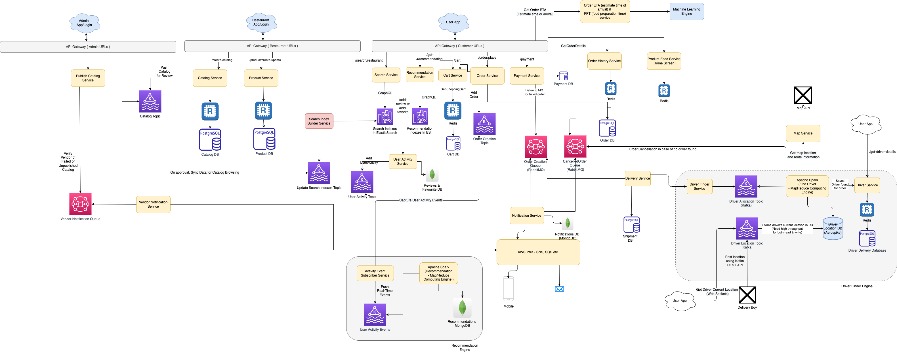
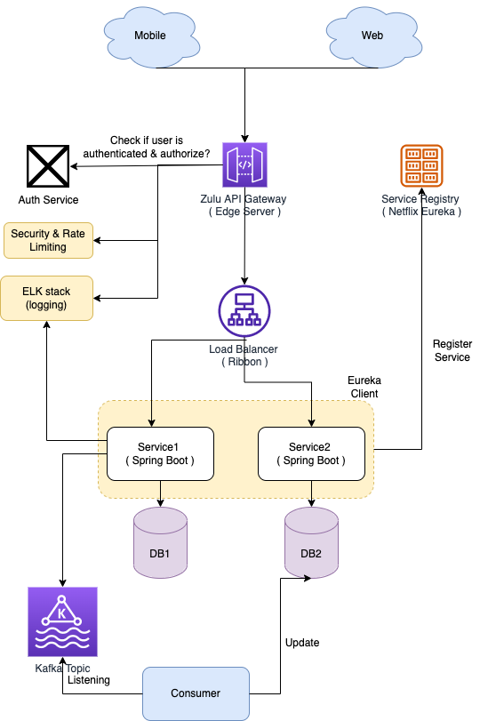

# Microservices design
- [Microservices](https://microservices.io/index.html) are a modern [Service-Oriented Architecture](https://www.geeksforgeeks.org/service-oriented-architecture/).
- In a Microservice Architecture, each service is self-contained and implements a single business capability.
- Microservice architecture makes it easier and fastest way to build and work on individual parts of an application, and thus the application as a whole.
- Example - User Management, Order Management, Checkout, Address etc.

# OnPerm - Microservice Implementation in Spring Boot

[Read more](../../6_ProgrammingLanguages/2_Java/SpringBootAndMicroServices/README.md)

# Design Patterns

|                                                                       | Type                          | Architecture                                            | Remarks                                                                                                                                                                                                                                                                                                                                                                                                                                              |
|-----------------------------------------------------------------------|-------------------------------|---------------------------------------------------------|------------------------------------------------------------------------------------------------------------------------------------------------------------------------------------------------------------------------------------------------------------------------------------------------------------------------------------------------------------------------------------------------------------------------------------------------------|
| :star: Database per service                                           | Data management               | All                                                     | Each service has its [own private database](https://microservices.io/patterns/data/database-per-service.html).                                                                                                                                                                                                                                                                                                                                       |
| Local cache using Redis                                               | Data management               | All                                                     | Microservices can cache the data locally in [Redis](../3_DatabaseComponents/In-Memory-DB/Redis), instead of requesting data from another service everytime.                                                                                                                                                                                                                                                                                          |
| Saga                                                                  | Data management - Consistency | [Event Driven Architecture](EventDrivenArchitecture.md) | A [saga](https://microservices.io/patterns/data/saga.html) is a sequence of local transactions.  - Each local transaction updates the database and publishes a message or event to trigger the next local transaction in the saga. - If a local transaction fails because it violates a business rule then the saga executes a series of compensating transactions that undo the changes that were made by the preceding local transactions. |
| Command Query Responsibility Segregation (CQRS)                       | Data management               | [Event Driven Architecture](EventDrivenArchitecture.md) | Define a view database, which is a read-only replica that is designed to support that query.  - The application keeps the replica up to data by subscribing to Domain events (through [Message Brokers like Kafka](../4_MessageBrokers/Readme.md)) published by the service that own the data. - [Read more](https://microservices.io/patterns/data/cqrs.html)                                                                               |
| Event sourcing                                                        | Data management               | [Event Driven Architecture](EventDrivenArchitecture.md) | [Event sourcing](https://microservices.io/patterns/data/event-sourcing.html) persists the state of a business entity such an Order or a Customer as a sequence of state-changing events.  - Whenever the state of a business entity changes, a new event is appended to the list of events.                                                                                                                                                      |
| Asynchronous Messaging                                                | Communication - Style         | [Event Driven Architecture](EventDrivenArchitecture.md) | Use asynchronous messaging for inter-service communication, using [Message Brokers](../4_MessageBrokers) to pass events b/w microservices.  - Services communicating by exchanging messages over messaging channels. - [Read more](https://microservices.io/patterns/communication-style/messaging.html).                                                                                                                                    |
| Circuit Breaker                                                       | Reliability                   | Request-Driven Architecture                             | Invoke a remote service via a proxy that fails immediately when the failure rate of the remote call exceeds a threshold. - [Read more](https://microservices.io/patterns/reliability/circuit-breaker.html)                                                                                                                                                                                                                                       |
| Request/Reply-based protocol                                          | Communication - Style         | Request-Driven Architecture                             | Use [gRPC](../2_APITechOptions/gRPC.md) or [REST](../2_APITechOptions/REST.md) for inter-service communication. - The client uses a request/reply-based protocol to make requests to a service.                                                                                                                                                                                                                                                  |
| [API Gateway](1_APIGateway/Readme.md)                                 | Communication - External API  | All                                                     | A service that provides each client with unified interface to services. - Example - [AWS API Gateway](../../2_AWSComponents/1_NetworkingAndContentDelivery/2_ApplicationNetworking/AmazonAPIGateway/Readme.md), [Zulu](1_APIGateway/ZuluAPIGateway.md) etc.  - [Read more](https://microservices.io/patterns/apigateway.html)                                                                                                                |
| [Service Registry & discovery](2_ServiceRegistry&Discovery/Readme.md) | Communication                 | All                                                     | The router queries a service registry (a database of service instance locations) to discover the locations of service instances. - [Read more](https://microservices.io/patterns/server-side-discovery.html)                                                                                                                                                                                                                                     |
| [Logging & monitoring](../8_MonitoringTools/Readme.md)                | Observability                 | All                                                     | Using [New Relic](../8_MonitoringTools/NewRelic.md), AWS Cloudwatch, [ELK](../8_MonitoringTools/ELK.md) etc. - [Read more](https://microservices.io/patterns/observability/application-logging.html)                                                                                                                                                                                                                                             |
| Distributed Tracing - [Service Mesh](3_ServiceMesh.md)                | Observability                 | All                                                     | [New Relic](../8_MonitoringTools/NewRelic.md), [AWS AppMesh](../../2_AWSComponents/1_NetworkingAndContentDelivery/2_ApplicationNetworking/AWSAppMesh.md) can be used as service mesh for distributed tracing.                                                                                                                                                                                                                                        |
| Service instance per container                                        | Deployment patterns           | All                                                     | Use [Container orchestration service](../6_ContainerOrchestrationServices/Readme.md) for container deployments. - [Kubernates](../6_ContainerOrchestrationServices/Kubernates.md), [Amazon EKS](../../2_AWSComponents/4_ContainerOrchestrationServices/AmazonEKS.md), [AWS ECS](../../2_AWSComponents/4_ContainerOrchestrationServices/AmazonECS/Readme.md) etc.                                                                                 |
| Session                                                               | Security                      | All                                                     | [Redis](../3_DatabaseComponents/In-Memory-DB/Redis) can be used to share the session data between microservices.                                                                                                                                                                                                                                                                                                                                     |
| Access token                                                          | Security                      | All                                                     | The [API Gateway](1_APIGateway/Readme.md) authenticates the request and passes an access token (e.g. JSON Web Token) that securely identifies the requestor in each request to the services.  - A service can include the access token in requests it makes to other services.                                                                                                                                                                   |

[Read more](https://microservices.io/patterns/)

# :thumbsup: Advantages of Microservices design

| Title                                         | Remarks                                                                                                     |
|-----------------------------------------------|-------------------------------------------------------------------------------------------------------------|
| :star: Separation of Concern, loosely coupled | Each service can be scaled independently and would have its team which owns the microservice.               |
| Increased Scalability                         | Scalability would become easy.                                                                              |
| :sunglasses: Engineering becomes easy         | Dedicated data store & own programming language for each microservice.                                      |
| rocket: Deployment becomes independent & fast | Deployment becomes easy, independent & fast. - A large monolithic code can take up to 1 day, to deploy. |

# :thumbsdown: Disadvantages of Microservices design

| Title                       | Remarks                                                                                                   |
|-----------------------------|-----------------------------------------------------------------------------------------------------------|
| :family_man_woman_boy: Team | Monolithic is good for small team while Microservice is good for large team.                              |
| :moneybag: Increased Budget | With microservices, the budget increases (deployment, time to make change, team size etc.)                |
| Obviousness                 | With large number of services, it would be a bit tricky to find the microservice for the required change. |
| Increased Complexity        | Wide variety of resources, exponential complexity increase.                                               |
| Safety                      | The contract should be defined properly between microservices.                                            |
| Resilience                  | Client should be able to handle failure scenarios properly.                                               |
| Dependency                  | Micro-services would be dependent to each other. Sometimes, there can be circular dependencies also.      |

# References
- [What Are Microservices Really All About? (And When Not To Use It)](https://www.youtube.com/watch?v=lTAcCNbJ7KE)
- [Difference between Microservice and API](https://www.geeksforgeeks.org/difference-between-microservice-and-api/)
- [Moving from Monoliths to Microservices](https://www.youtube.com/watch?v=rckfN7xFig0&list=PLMCXHnjXnTnvo6alSjVkgxV-VH6EPyvoX&index=34)
- [The Human Side of Airbnb’s Microservice Architecture](https://www.infoq.com/presentations/airbnb-culture-soa/)
- [Handling Microservices with gRPC and REST API](https://fonradar.medium.com/ali-okan-kara-a3d0b61610d)
- [Materialized View Pattern](https://medium.com/design-microservices-architecture-with-patterns/materialized-view-pattern-f29ea249f8f8)
- [Uber - Service Oriented Architecture](https://eng.uber.com/service-oriented-architecture/)