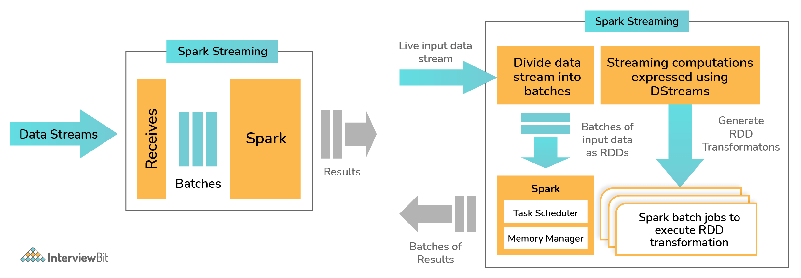

# What is Apache Spark Streaming and how is it implemented in Spark?
- Data from sources like [Kafka](../../../4_MessageBrokers/Kafka/Readme.md), [Kinesis](../../../../2_AWSComponents/5_MessageBrokerServices/AmazonKinesis/Readme.md) etc. are processed and pushed to various destinations like databases, dashboards, machine learning APIs or as simple as file systems.
- The data is divided into various streams (similar to batches) and is processed accordingly.
- Spark Streaming supports [highly scalable](../../../3_DatabaseComponents/1_Glossaries/ScalabilityDB.md), [fault-tolerant](../../../0_SystemGlossaries/Reliability/FaultTolerance.md) continuous stream processing which is mostly used in cases like fraud detection, website monitoring, website click baits, IoT (Internet of Things) sensors, etc.
- Spark Streaming first divides the data from the data stream into `batches of X seconds which are called Dstreams or Discretized Streams`.
    - They are internally nothing but a sequence of multiple RDDs.
    - The Spark application does the task of processing these RDDs using various Spark APIs and the results of this processing are again returned as batches.

