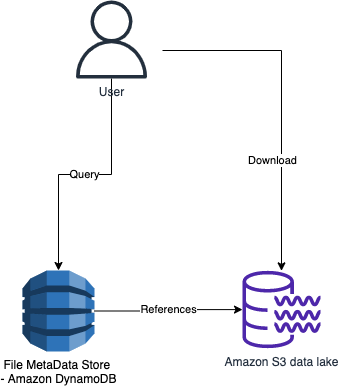

# Amplitude System Design

# Tech Stack

| Use Case                             | Service                                                                                                     |
|--------------------------------------|-------------------------------------------------------------------------------------------------------------|
| Cloud Platform                       | [AWS](../../2_AWSServices/Readme.md)                                                                      |
| Metadata store (files, columns etc.) | [Amazon DynamoDB](../../2_AWSServices/6_DatabaseServices/AmazonDynamoDB/Readme.md)                        |
| Data Lake                            | [Amazon S3](../../2_AWSServices/10_BigDataServices/StorageDBs/DataLakes/S3DataLake.md)                  |
| Files Caching                        | [EC2 Instance Store](../../2_AWSServices/7_StorageServices/1_BlockStorageTypes/AmazonEC2InstanceStore.md) |
| Message Broker/Data-Ingestion        | [Apache Kafka](../../4_MessageBrokersEDA/Kafka/Readme.md)                                |

# Read more
- [Nova 2.0: Re-architecting the Analytics Engine behind Amplitude](https://amplitude.com/blog/nova-2-0)
- [Reducing costs with AZ-awareness](https://amplitude.engineering/reducing-costs-with-az-awareness-efc92bc7113a)
