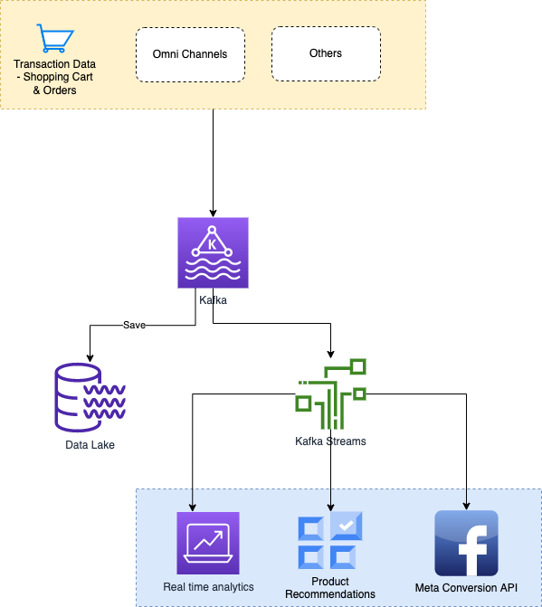

# Tech Stack

| Purpose        | Service                                                               |
|----------------|-----------------------------------------------------------------------|
| Cloud Platform | Google Cloud Service                                                  |
| Data Platform  | [Kafka](../../5_MessageBrokersEDA/Kafka/Readme.md) |

# System Design
- BigCommerce’s Data platform ingests over 1.6 billion eCommerce events each day such as visits, product page views, add to cart, checkouts, orders, etc.

# Stats

| Feature         | Number                      |
|-----------------|-----------------------------|
| Kafka Brokers   | 20 Kafka Brokers            |
| Zookeeper nodes | 6 Zookeeper nodes           |
| Traffic         | 1.6 billion events each day |

# Read more
- [Use of Kafka and Kafka Streams at BigCommerce](https://www.bigeng.io/kafka/)
