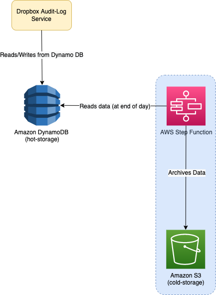

# Dropbox Saves Millions by Building a Scalable Metadata Store (for AuditLog Data) on Amazon DynamoDB and Amazon S3

[Read more](https://aws.amazon.com/solutions/case-studies/dropbox-dynamodb-case-study/?pg=dynamodb&sec=cs#dropbox)

# Building Hot and Cold Metadata Stores Using AWS Solutions
- [Amazon DynamoDB](../../2_AWS/6_DatabaseServices/AmazonDynamoDB/Readme.md) acts as the [hot storage layer](../../11_FileStorages/StorageOptions.md), ingesting audit logging data to six DynamoDB tables at **4,000–6,000 writes per second per table**. 
- Then each of these tables stores **50–80 GB daily**. 
- At the end of each day, the team offloads the metadata from these tables into [Amazon S3](../../2_AWS/7_StorageServices/3_ObjectStorageS3/Readme.md) for permanent storage, after which the tables in [Amazon DynamoDB](../../2_AWS/6_DatabaseServices/AmazonDynamoDB/Readme.md) are deleted.
- We could scale **100–1,000 times on AWS** without designing the system ahead of time.

# Continuing to Create a Superior User Storage Experience
- The Alki team is now exploring how it might use [Amazon EMR](../../2_AWS/10_BigDataServices/DataProcessing/AmazonEMR.md) to **more efficiently offload the data from Amazon DynamoDB to Amazon S3**, a process that is currently handled by Dropbox’s own batch processing system. 

# References
- [Dropbox Saves Millions by Building a Scalable Metadata Store on Amazon DynamoDB and Amazon S3](https://aws.amazon.com/solutions/case-studies/dropbox-dynamodb-case-study/?pg=dynamodb&sec=cs#dropbox)
- [AWS re:Invent 2020: Dropbox cuts costs with cold metadata store using Amazon DynamoDB and S3](https://www.youtube.com/watch?v=EqtkKttteyI)