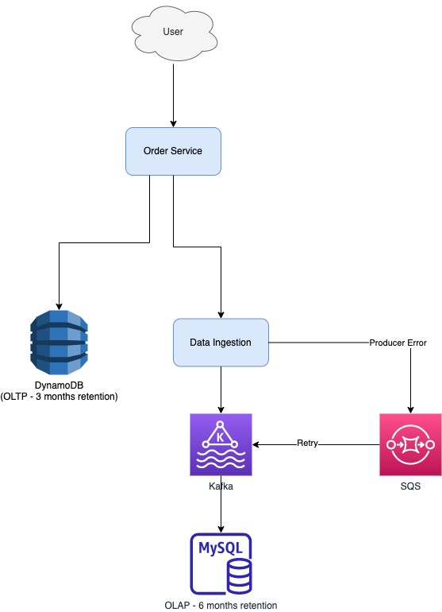

# How Grab store and process millions of orders daily?
- In the real world, after a passenger places a GrabFood order from the Grab App, the merchant-partner will prepare the order. 
- A driver-partner will then collect the food and deliver it to the passenger.
- The Grab Order Platform is a distributed system that processes millions of GrabFood or GrabMart orders every day.
- [Read more](https://engineering.grab.com/how-we-store-millions-orders)

# Architecture

# Key Consideration

| Title                                                                                | Remarks                                                                                                                                                                 |
|--------------------------------------------------------------------------------------|-------------------------------------------------------------------------------------------------------------------------------------------------------------------------|
| Traffic                                                                              | A million of orders per day                                                                                                                                             |
| [Consistency](../../3_DatabaseServices/4_Consistency&Replication/Readme.md) | Strong consistency for transactional queries, and eventually consistency for analytical queries.                                                                        |
| Traffic Pattern - Peak Hours                                                         | During peak hours, the write Queries per Second (QPS) is three times of primary key reads; whilst the range Queries per Second are four times of the primary key reads. |

# Requirements

| Use Case                                                     | Query Type | System                                                                             |
|--------------------------------------------------------------|------------|------------------------------------------------------------------------------------|
| Create an order                                              | Write      | OLTP/Transactional                                                                 |
| Update an order                                              | Write      | OLTP/Transactional                                                                 |
| Get order by id                                              | Read       | OLTP/Transactional                                                                 |
| Get ongoing orders by passenger id.                          | Read       | OLTP/Transactional                                                                 |
| Get historical orders by various conditions.                 | Read       | [OLAP/Analytical](../../6_BigDataServices/StorageDBs/DataWarehouses/Readme.md) |
| Get order statistics (for example, get the number of orders) | Read       | [OLAP/Analytical](../../6_BigDataServices/StorageDBs/DataWarehouses/Readme.md) |

# Tech Stack

| Purpose                 | Service                                                                            | Remarks                                                                                                                                          |
|-------------------------|------------------------------------------------------------------------------------|--------------------------------------------------------------------------------------------------------------------------------------------------|
| OLTP Database           | [Amazon DynamoDB](../../2_AWSServices/6_DatabaseServices/AmazonDynamoDB/Readme.md) | An OLTP database serves queries critical to online order processing.  - This table keeps data for only a short period of time.               |
| OLAP database           | Amazon MySQL RDS                                                                   | an OLAP database has the same set of data, but serves our historical and statistical queries.  - This database keeps data for a longer time. |
| Data Ingestion Pipeline | [Kafka](../../4_MessageBrokersEDA/Kafka/Readme.md)                                    | The data ingestion pipeline ensures that the OLAP database data is eventually consistent.                                                        |

# OLTP database - DynamoDB
- The retention period of the [DynamoDB data](../../2_AWSServices/6_DatabaseServices/AmazonDynamoDB/Readme.md) is three months.

## DynamoDB Indexes

| Key        | Type          | Remarks                                                       |
|------------|---------------|---------------------------------------------------------------|
| Order ID   | Partition Key | We can easily support key-value queries by the partition key. |
| pax_id_gsi | GSI           | At any time, the GSI table only stores the ongoing orders.    |

# OLAP database - Amazon MySQL RDS
- MySQL partitioning is used for data retention.
- The order table is partitioned by creation time monthly. 
- Since the data access pattern is mostly by month, the partition key can reduce cross-partition queries. 
- Partitions older than six months are dropped at the beginning of each month.

# Data Stream
- A [Kafka](../../4_MessageBrokersEDA/Kafka/Readme.md) is used to process data in the data ingestion pipeline. 
- We choose the Kafka, because it has 99.95% SLA.
- On the stream consumer side, we use back-off retry at both stream and database levels to ensure consistency. 
- In a worst-case scenario, we can rewind the stream events from Kafka.
- Duplicate messages are handled by the database level unique key (for example, order ID + creation time).

# Cost Efficiency
- Cost efficiency is achieved by data retention in both databases.

# References
- [How we store and process millions of orders daily](https://engineering.grab.com/how-we-store-millions-orders)

