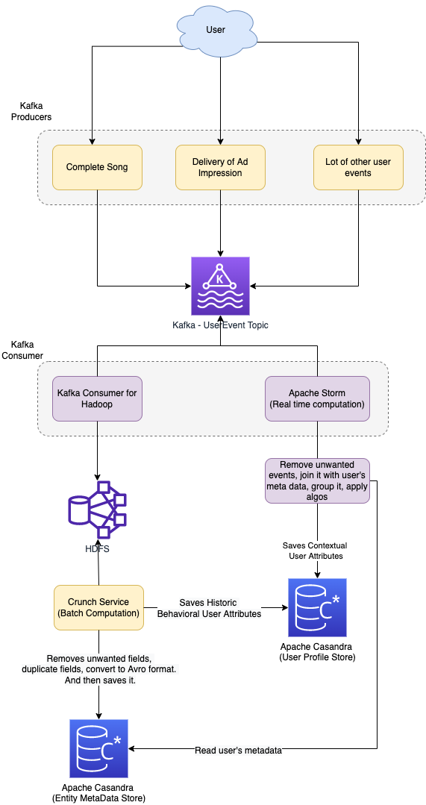

# Personalization at Spotify using Cassandra & HDFS



# Casandra Column Families

```sql
CREATE TABLE entitymetadata (
    entityid text,
    featurename text,
    featurevalue text,
    PRIMARY KEY (entityid, featurekey)
)

CREATE TABLE userprofilelatest (
    userid text,
    featurename text,
    featurevalue text,
    PRIMARY KEY (userid, featurename)
)

CREATE TABLE playlisttag (
  entityid text,
  featurevalue list<text>,
  PRIMARY KEY (entityid)
)
```

# Reference
- [Personalization at Spotify using Cassandra](https://engineering.atspotify.com/2015/01/personalization-at-spotify-using-cassandra/)
- [Fleet Management at Spotify](https://engineering.atspotify.com/2023/05/fleet-management-at-spotify-part-2-the-path-to-declarative-infrastructure/)