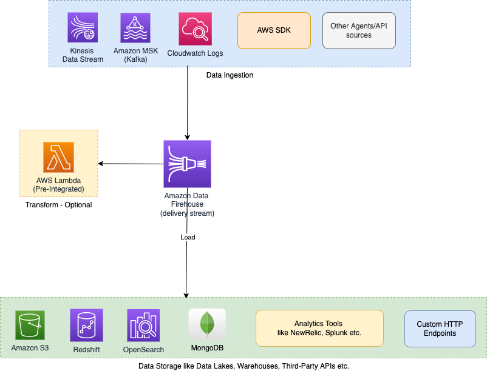
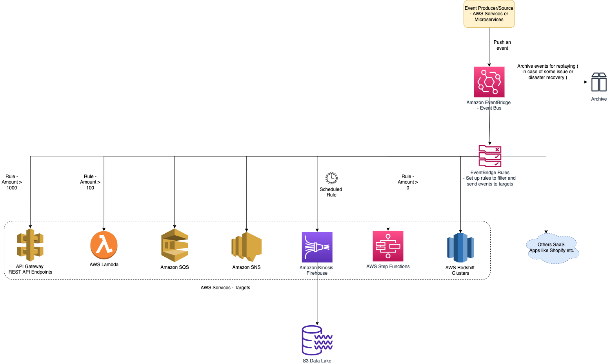

# Amazon Data Firehouse
- [Amazon Kinesis Data Firehose](https://aws.amazon.com/kinesis/data-firehose/) is the easiest way to [extract, transform, and load data streams (ETL)](../../../../6_BigData/DataProcessing/ETL.md) into various [data stores](../../../1_DatabaseServices), [data lakes](../../DataStorage/DataLakes) & [analytics services](../../DataConsumption), for near real-time analytics with existing business intelligence tools.
- It is a fully managed service that automatically scales to match the throughput of your data and requires no ongoing administration. 
- It can also batch, compress, and encrypt the data before loading it, minimizing the amount of storage used at the destination and increasing security.
- You cannot set up multiple consumers for Kinesis Data Firehose delivery streams as it can dump data in a single data repository at a time.

> Note
> - When a [Kinesis data stream](../../../4_MessageBrokerServices/AmazonKinesis/Readme.md) is configured as the source of a Firehose delivery stream, [Firehose’s PutRecord and PutRecordBatch operations](../../../4_MessageBrokerServices/AmazonKinesis/Readme.md) are disabled and Kinesis Agent cannot write to Firehose delivery stream directly.
> - Data needs to be added to the [Kinesis data stream](../../../4_MessageBrokerServices/AmazonKinesis/Readme.md) through the [Kinesis Data Streams PutRecord and PutRecords operations](../../../4_MessageBrokerServices/AmazonKinesis/Readme.md) instead.

# Supported Data Destinations

| Data Destinations                                                                             | Destination Type                                      |
|-----------------------------------------------------------------------------------------------|-------------------------------------------------------|
| [Amazon S3](../../../6_StorageServices/3_S3ObjectStorage/Readme.md)                           | [AWS data stores](../../../1_DatabaseServices)        |
| [S3 Data Lake](../../DataStorage/DataLakes/S3DataLake.md)                                     | [Data Lakes](../../DataStorage/DataLakes)             |
| [Amazon Redshift](../../DataStorage/DataWarehouses/AmazonRedshift.md)                         | [AWS data stores](../../../1_DatabaseServices)        |
| [Amazon OpenSearch](../../../1_DatabaseServices/AmazonOpenSearch/Readme.md)         | [AWS data stores](../../../1_DatabaseServices)        |
| [NewRelic](https://docs.aws.amazon.com/AmazonCloudWatch/latest/logs/SubscriptionFilters.html) | Logs/Analytics Tools                                  |
| [MongoDB](../../../../3_Databases/10_Document-Databases/MongoDB.md)                           | [Open Source data store](../../../1_DatabaseServices) |
| Splunk, Datadog, Dynatrace, Sumo Logic, LogicMonitor etc.                                     | Logs/Analytics Tools                                  |
| HTTP End Point as destination                                                                 | Custom                                                |

[Read more](https://aws.amazon.com/kinesis/data-firehose/faqs/)

# Amazon Data Firehouse & Event Bridge

# References
- [Delivering Real-time Streaming Data to Amazon S3 Using Amazon Kinesis Data Firehose](https://towardsdatascience.com/delivering-real-time-streaming-data-to-amazon-s3-using-amazon-kinesis-data-firehose-2cda5c4d1efe)