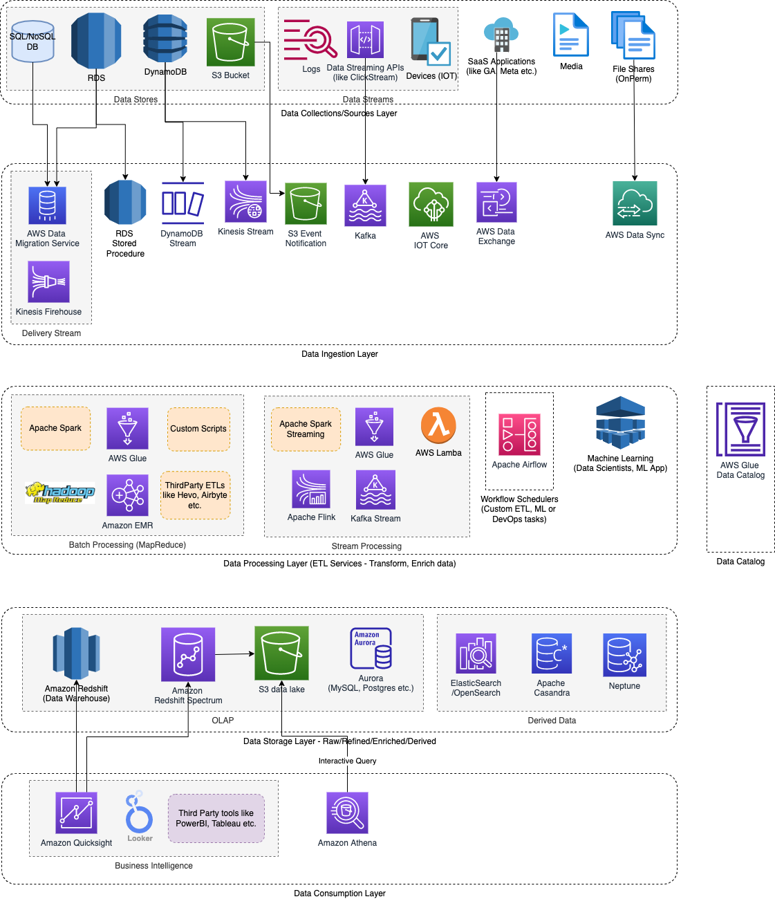

# Amazon Redshift Spectrum
- [Amazon Redshift Spectrum](https://docs.aws.amazon.com/redshift/latest/dg/c-getting-started-using-spectrum.html) can be used to perform in-place querying of data assets in an [Amazon S3-based data lake](../../../7_StorageServices/3_S3ObjectStorage/Readme.md).
- [Amazon Redshift Spectrum]() resides on dedicated Amazon Redshift servers that are independent of your cluster. 
- [Redshift Spectrum]() pushes many compute-intensive tasks, such as predicate filtering and aggregation, down to the Redshift Spectrum layer. 
- Thus, Redshift Spectrum queries use much less of your cluster's processing capacity than other queries.

