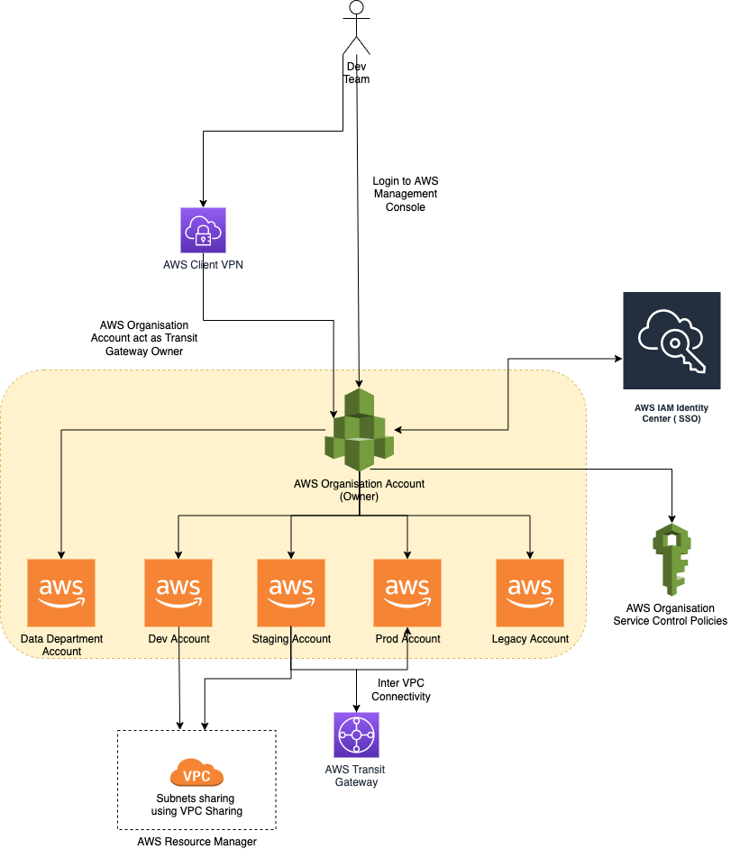

# VPC Sharing
- [VPC sharing](https://docs.aws.amazon.com/vpc/latest/userguide/vpc-sharing.html) (part of [Resource Access Manager](../../../18_OrgMultipleAccounts/AWSResourceAccessManager.md)) allows multiple AWS accounts to create their application resources such as EC2 instances, RDS databases, Redshift clusters, and Lambda functions, into [shared and centrally-managed Amazon Virtual Private Clouds (VPCs)](../Subnets.md).
- :star: To set this up, the account that owns the VPC (owner) shares [one or more subnets](../Subnets.md) with other accounts (participants) that belong to the same organization from AWS Organizations.

# References
- [Reduce Cost and Increase Security with Amazon VPC Endpoints](https://aws.amazon.com/blogs/architecture/reduce-cost-and-increase-security-with-amazon-vpc-endpoints/)
