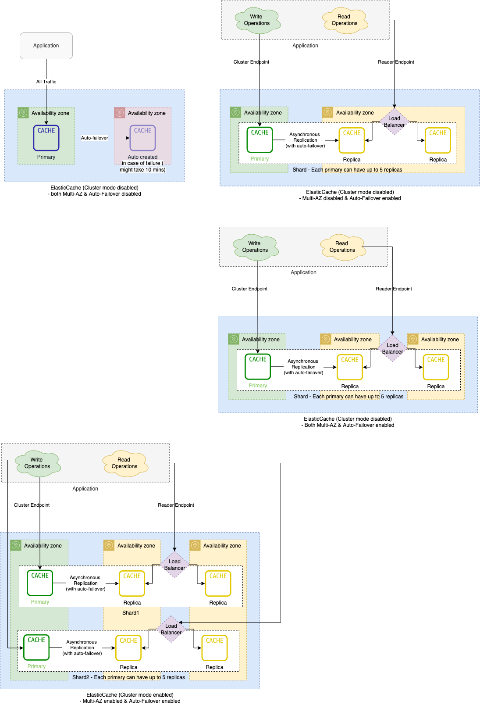

# Amazon Elastic Cache
- [Amazon Elastic Cache](https://aws.amazon.com/elasticache/) is a [fully Managed Memcached or Redis](../../../3_Databases/8_Caching-InMemory-Databases/Redis/Readme.md).
- It scales from one to many nodes, using [Cluster](../../../7_Scalability/ServersCluster.md) and self-heal (i.e. automatically replaces dead instance).
- It provides [single-digit millisecond speed](../../../7_Scalability/Latency.md).

# Elastic Cache - Multi-AZ architecture

# Features

| Feature                                                                                     | Remarks                                                                                                                                                                                                 |
|---------------------------------------------------------------------------------------------|---------------------------------------------------------------------------------------------------------------------------------------------------------------------------------------------------------|
| Multi-AZ                                                                                    | If Multi-AZ is enabled, replicas would be created in different AZs. - Can be enabled only if there is atleast 1 replica.                                                                            |
| Auto-failover                                                                               | If Auto-failover is enabled, most up-to-date replica would be promoted as primary in case of primary failure. - Can be enabled only if there is atleast 1 replica.                                  |
| [Replication - Cluster mode](ClusterMode.md)                                                | If cluster-mode is enabled, sharding would happen.                                                                                                                                                      |
| [Redis AUTH command](https://docs.aws.amazon.com/AmazonElastiCache/latest/red-ug/auth.html) | Redis authentication tokens, or passwords, enable Redis to require a password before allowing clients to run commands, thereby improving data security. - IAM Auth is not supported by ElastiCache. |

# References
- [Benefits of Fully Managed Redis](https://aws.amazon.com/elasticache/redis/fully-managed-redis/)
- [Connect to the cluster's node](https://docs.aws.amazon.com/AmazonElastiCache/latest/red-ug/GettingStarted.ConnectToCacheNode.html)
- [Mitigating Failures](https://docs.aws.amazon.com/AmazonElastiCache/latest/red-ug/FaultTolerance.html)
- [AWS Redis cluster mode - what is the difference between Auto-failover and Multi-AZ flag?](https://stackoverflow.com/questions/69105387/aws-redis-cluster-mode-what-is-the-difference-between-auto-failover-and-multi)
- [Caching Pitfalls Every Developer Should Know](https://www.youtube.com/watch?v=wh98s0XhMmQ)