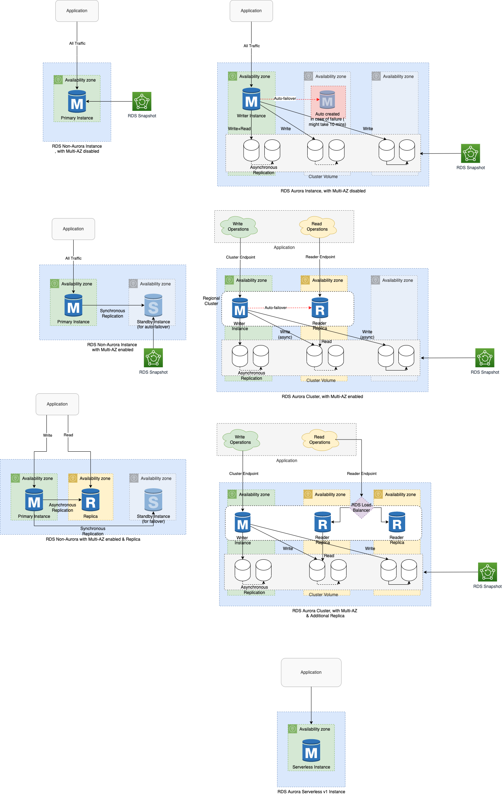

# Amazon Aurora vs Other DB Engines

| Basis                                                                                                                                                     | :star: [Amazon Aurora](AmazonAurora/Readme.md)                                                                                                                                                                       | [Non-Aurora Engines](Readme.md)                                                                                                     |
|-----------------------------------------------------------------------------------------------------------------------------------------------------------|----------------------------------------------------------------------------------------------------------------------------------------------------------------------------------------------------------------------|-------------------------------------------------------------------------------------------------------------------------------------|
| Compatible DB Engines                                                                                                                                     | Postgres, MySQL                                                                                                                                                                                                      | Postgres, MySQL, Oracle, MS SQL                                                                                                     |
| Performance                                                                                                                                               | :+1: 5x faster than [RDS MySQL](Readme.md), 3x than [RDS Postgres](Readme.md).  - [High throughput (200K writes/second)](../../../7_Scalability/Throughput.md)                       | Comparatively slower than Aurora Engines                                                                                            |
| [Serverless Computing support]()                                                                                                                          | :white_check_mark: Yes, through [Aurora Serverless](AmazonAurora/Serverless/Readme.md)                                                                                                                               | :x: Not-Supported                                                                                                                   |
| [High Availability - Storage (automatic failover)](../../../7a_HighAvailability/Readme.md)                                | :white_check_mark: Yes  - [By default, Aurora synchronously replicates data in 6 storage notes in 3 AZs](https://docs.aws.amazon.com/AmazonRDS/latest/AuroraUserGuide/Concepts.AuroraHighAvailability.html).     | If [Multi-AZ enabled](RDSDeploymentOptions/MultiAZInstance.md), its supported.                                                                         |
| [High Availability - Compute (automatic failover)](../../../7a_HighAvailability/Readme.md)                                | :white_check_mark: Yes                                                                                                                                                                                               | If [Multi-AZ enabled](RDSDeploymentOptions/MultiAZInstance.md), its supported.                                                                         |
| :stopwatch: [High Availability - Fail Over time](../../../7a_HighAvailability/Readme.md#fail-over-policies)               | :+1: If [Multi-AZ](RDSDeploymentOptions/MultiAZInstance.md) enabled, less than 30 secs (since a replica would be promoted based on Priority-tier).  - Otherwise up to 10 minutes (since new replacement DB instance would be created). | If [Multi-AZ enabled](RDSDeploymentOptions/MultiAZInstance.md), around 60-120 seconds.                                                                 |
| [High Availability - Read Replica promotion](RDSReadReplicas.md)                                                                                          | :white_check_mark: Automatic promotion of replica to primary instance, in case of fail-over.                                                                                                                         | :-1: Replica can be MANUALLY promoted to primary instance, in case of fail-over.                                                    |
| [Scalability - Read Replicas](RDSReadReplicas.md)                                                                                                         | :+1: [Upto 15 read-replicas per master, within same region](https://docs.aws.amazon.com/AmazonRDS/latest/AuroraUserGuide/Concepts.AuroraHighAvailability.html)                                                       | [Up to 5 read-replicas](Readme.md)                                                                                                  |
| :stopwatch: [Scalability - Read Replica lag](RDSReadReplicas.md)                                                                                          | :rocket: [~100 ms (max 1 second)](../../../7_Scalability/Latency.md) - Since same data volume is shared in Aurora.                                                                   | ~ few seconds to minutes                                                                                                            |
| [Auto-Scaling - Storage](https://docs.aws.amazon.com/AmazonRDS/latest/UserGuide/USER_PIOPS.StorageTypes.html)                                             | :+1: Enabled by default                                                                                                                                                                                              | Disabled by default                                                                                                                 |
| [Auto-Scaling - Compute](https://docs.aws.amazon.com/AmazonRDS/latest/AuroraUserGuide/Aurora.Integrating.AutoScaling.html)                                | :white_check_mark: [Yes, through Read Replicas](RDSReadReplicas) or vertical scaling using [Aurora Serverless v2](AmazonAurora/Serverless/Readme.md)                                                                 | :white_check_mark: [Yes, through Read Replicas](RDSReadReplicas)                                                                    |
| :star: IOPs (input/output operations per second)                                                                                                          | Greater than 80K IOPS                                                                                                                                                                                                | Max 80K IOPS                                                                                                                        |
| Storage Type                                                                                                                                              | Uses a single, virtual cluster volume that uses SSDs.                                                                                                                                                                | Supports [Amazon EBS](../../6_StorageServices/1_BlockStorageTypes/AmazonEBS/Readme.md) solid state drive (SSD)-based storage types. |
| Storage Limit                                                                                                                                             | :+1: Supports upto 128 TB DB size                                                                                                                                                                                    | Supports upto 64 TB DB size                                                                                                         |
| [DB Version Upgrades]()                                                                                                                                   | :white_check_mark: All instances are updated together.                                                                                                                                                               | :-1: Primary, Replicas needs to be upgraded independently.                                                                          |
| [Database Cloning](AmazonAurora/DBCloning.md)                                                                                                             | :white_check_mark: Supported                                                                                                                                                                                         | :x: Not-Supported                                                                                                                   |
| [Multi-Master support](AmazonAurora/AuroraMultiMasterCluster.md)                                                                                          | :white_check_mark: Yes                                                                                                                                                                                               | :x: Not-Supported                                                                                                                   |
| [Cross-Region Read Replicas](https://docs.aws.amazon.com/AmazonRDS/latest/UserGuide/Concepts.RDS_Fea_Regions_DB-eng.Feature.CrossRegionReadReplicas.html) | :white_check_mark: Supported                                                                                                                                                                                         | :white_check_mark: Supported                                                                                                        |
| [Multi-Region replication support]()                                                                                                                      | :white_check_mark: Yes, through [Aurora Global Database](AmazonAurora/AuroraGlobalDatabase.md)                                                                                                                       | :x: Not-Supported                                                                                                                   |
| [Cross-Region Automated backups](https://docs.aws.amazon.com/AmazonRDS/latest/UserGuide/USER_ReplicateBackups.html)                                       | :white_check_mark: Supported                                                                                                                                                                                         | :white_check_mark: Supported                                                                                                        |
| Crash Recovery                                                                                                                                            | :+1: Quicker than RDS                                                                                                                                                                                                | -                                                                                                                                   |

# RDS Multi-AZ Replica

