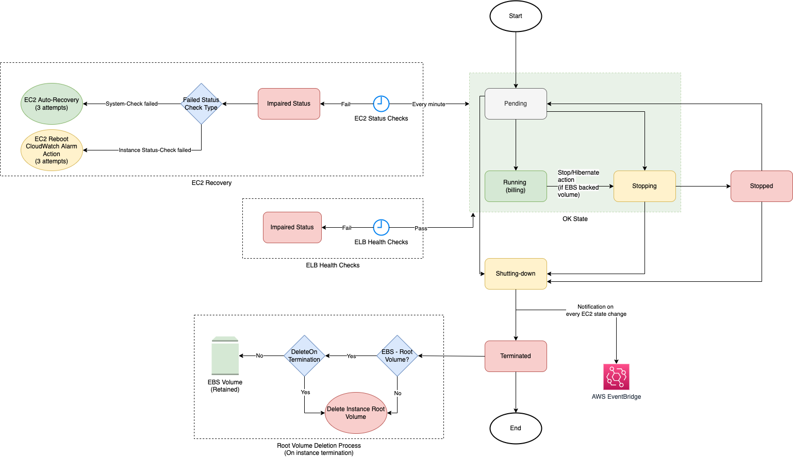

# EC2 Instance Life Cycle

# Other Facts

| Fact                                            | Remarks                                                                                                                                                                                                                                                                           |
|-------------------------------------------------|-----------------------------------------------------------------------------------------------------------------------------------------------------------------------------------------------------------------------------------------------------------------------------------|
| EC2 Instance State-change Notification event    | Amazon EC2 sends an [EC2 Instance State-change Notification event](https://docs.aws.amazon.com/AWSEC2/latest/UserGuide/monitoring-instance-state-changes.html) to [Amazon EventBridge](../../4_MessageBrokerServices/AmazonEventBridge.md) when the state of an instance changes. |
| DeleteOnTermination - Default                   | By default, the DeleteOnTermination attribute is set to True for the root volume and is set to False for all other volume types.                                                                                                                                                                                                                                                                                  |
| Change DeleteOnTermination for running instance | If the instance is already running, you can set DeleteOnTermination to False using the command line.                                                                                                                                                                                                                                                                                  |
