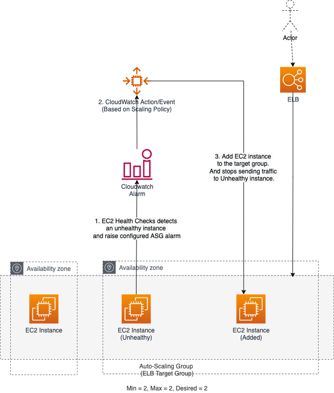

# Health check types

| Health check type                                                                                                         | Default                | What it checks?                                                                                                                    |
|---------------------------------------------------------------------------------------------------------------------------|------------------------|------------------------------------------------------------------------------------------------------------------------------------|
| :star: [ELB Health checks](../../16_NetworkingAndContentDelivery/2_ApplicationNetworking/ElasticLoadBalancer/Readme.md) | No                     | Checks whether the load balancer reports the instance as healthy.                                                                  |
| [EC2 status checks and scheduled events](../../2_ComputeServices/AmazonEC2/EC2StatusChecks.md)                                                           | :white_check_mark: Yes | Check if [instance is running](../../2_ComputeServices/AmazonEC2/Readme.md) or there is an underlying hardware or software issues that might impair the instance. |
| Custom Health Checks                                                                                                      | No                     | Checks for any other problems that might indicate instance health issues, according to the custom health checks.                   |

[Read more](https://docs.aws.amazon.com/autoscaling/ec2/userguide/ec2-auto-scaling-health-checks.html)

# ELB & ASG
- When you attach an [Application Load Balancer, Network Load Balancer, or Gateway Load Balancer](../../16_NetworkingAndContentDelivery/2_ApplicationNetworking/ElasticLoadBalancer/Readme.md), you attach a [target group](../../16_NetworkingAndContentDelivery/2_ApplicationNetworking/ElasticLoadBalancer/Readme.md). 
- [Amazon EC2 Auto Scaling]() adds instances to the attached target group when they are launched.
- You can attach one or multiple target groups, and configure health checks on a per target group basis.

# How ELB Health checks work?

