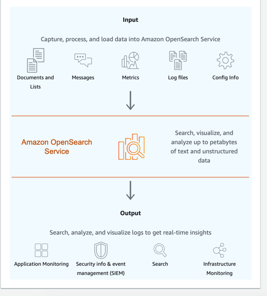

# Amazon OpenSearch
- [Amazon OpenSearch Service](https://aws.amazon.com/what-is/opensearch/) is a full-managed [ElasticSearch](../../../3_Databases/9_Search-Databases/ElasticSearch/Readme.md) service which makes it easy for you to perform interactive log analytics, real-time application monitoring, website search, and more.
- It's a successor to [Amazon Elasticsearch](../../../3_Databases/9_Search-Databases/ElasticSearch/Readme.md) Service, and offers the latest versions of [OpenSearch](../../../3_Databases/9_Search-Databases/OpenSearch.md), support for 19 versions of Elasticsearch (1.5 to 7.10 versions), as well as visualization capabilities powered by OpenSearch Dashboards and [Kibana (1.5 to 7.10 versions)](../../../12_Observability/ELK.md).
- It currently has tens of thousands of active customers with hundreds of thousands of clusters under management processing hundreds of trillions of requests per month.

# Deployment Types

| Type                                          | Description                                                                                                                           |
|-----------------------------------------------|---------------------------------------------------------------------------------------------------------------------------------------|
| [OpenSearch Serverless](Serverless/Readme.md) | Start working with your data with a simple scalable solution                                                                          |
| Managed Clusters                              |                                                                                                                                       |
| Ingestion                                     | Create an ingestion Serverless pipeline to filter, enrich, transform, and aggregate data and deliver to an OpenSearch Service domain. |

# References
- [AWS re:Invent 2021 - OpenSearch: Building the future of search together](https://www.youtube.com/watch?v=E2d6mMee01Q)
- [Operational best practices for Amazon OpenSearch Service](https://docs.aws.amazon.com/opensearch-service/latest/developerguide/bp.html)

