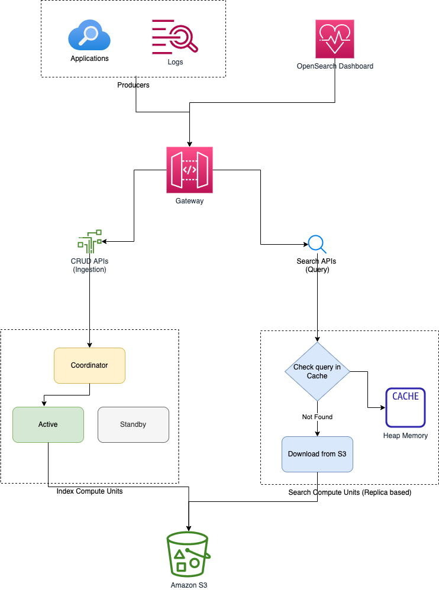

# Amazon OpenSearch Serverless
- [Read more](https://docs.aws.amazon.com/opensearch-service/latest/developerguide/serverless.html)

# Collections
- A group of OpenSearch indexes/tables, that work together to support a specific workload/use case.
- Alternative to OpenSearch clusters.

# Architecture
- Traditional OpenSearch clusters have a single set of instances that perform both indexing and search operations, and index storage is tightly coupled with compute capacity. 
- By contrast, OpenSearch Serverless uses a [cloud-native architecture]() that separates the indexing (ingest) components from the search (query) components, with Amazon S3 as the primary data storage for indexes.

## Data Ingestion/CRUD APIs
- When you write data to a collection, OpenSearch Serverless distributes it to the indexing compute units. 
- The indexing compute units ingest the incoming data and move the indexes/tables to [S3](../../../7_StorageServices/3_S3ObjectStorage/Readme.md).

## Data Querying/Searching
- When you perform a search on the collection data, OpenSearch Serverless routes requests to the search compute units that hold the data being queried. 
- The search compute units download the indexed data directly from [S3](../../../7_StorageServices/3_S3ObjectStorage/Readme.md) (if it's not already cached locally), run search operations, and perform aggregations.

# Collection Types

| Type          | Description                                                                                                                                                                                                                           |
|---------------|---------------------------------------------------------------------------------------------------------------------------------------------------------------------------------------------------------------------------------------|
| Time series   | The log analytics segment that focuses on analyzing large volumes of semi-structured, machine-generated data in real-time for operational, security, user behavior, and business insights.                                            |
| Search        | Full-text search that powers applications in your internal networks (content management systems, legal documents) and internet-facing applications, such as ecommerce website search and content search.                              |
| Vector search | Semantic search on vector embeddings that simplifies vector data management and powers machine learning (ML) augmented search experiences and generative AI applications, such as chatbots, personal assistants, and fraud detection. |

# OCU
- OpenSearch Serverless compute capacity for data ingestion, searching, and querying are measured in OpenSearch Compute Units (OCUs). 
- Each OCU is a combination of **6 GiB of memory** and **corresponding virtual CPU (vCPU)**, as well as data transfer to Amazon S3. 
- Each OCU includes enough hot ephemeral storage for **120 GiB of index data**.

# References
- [OpenSearch Service vs Serverless](https://docs.aws.amazon.com/opensearch-service/latest/developerguide/serverless-overview.html#serverless-comparison)
