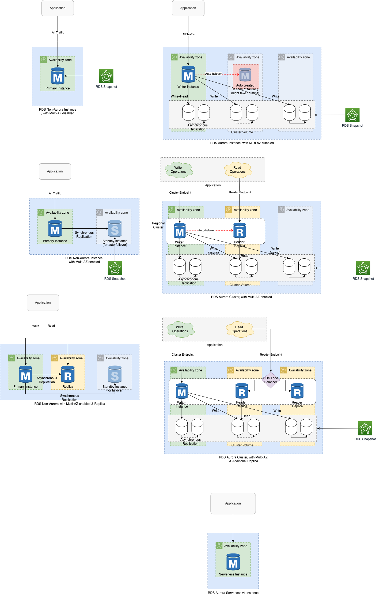
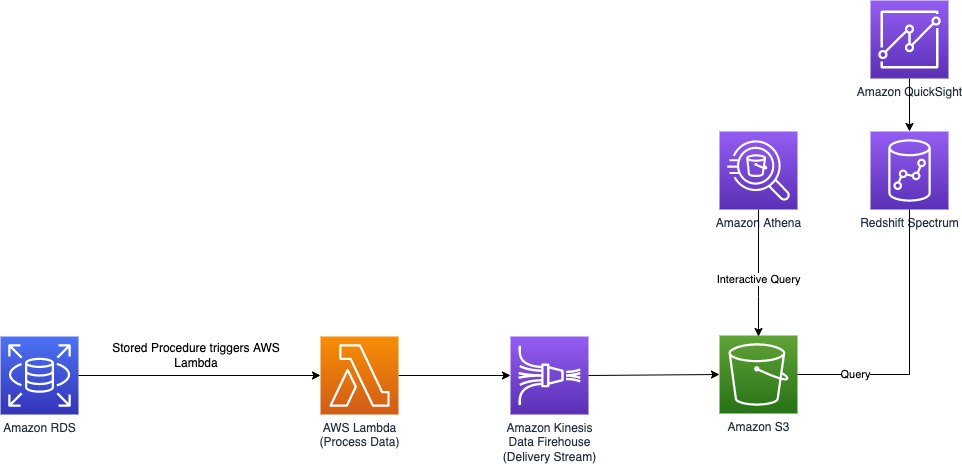

# Amazon RDS
- [Amazon RDS](https://aws.amazon.com/rds/) is a database management service for relational databases (structured data engines like MySQL, PostgresSQL, SQL Server etc.).

# Features

| Feature                                                                                                                                      | Remarks                                                                                                                                                                                                                                                                                                                                                                                                                                                                                                                                                                                                                        |
|----------------------------------------------------------------------------------------------------------------------------------------------|--------------------------------------------------------------------------------------------------------------------------------------------------------------------------------------------------------------------------------------------------------------------------------------------------------------------------------------------------------------------------------------------------------------------------------------------------------------------------------------------------------------------------------------------------------------------------------------------------------------------------------|
| :star: [Amazon RDS Aurora vs Other RDS DB engines](AmazonAuroraVsOtherDBEngines.md)                                                          |                                                                                                                                                                                                                                                                                                                                                                                                                                                                                                                                                                                                                                |
| [High Availability using Amazon RDS Multi-AZ deployments](RDSDeploymentOptions/MultiAZInstance.md)                                           | When [you provision a Multi-AZ DB instance](https://aws.amazon.com/rds/features/multi-az/), Amazon RDS automatically creates a primary DB instance and synchronously replicates the data to an [invisible standby instance in a different Availability Zone](https://stackoverflow.com/questions/58779115/difference-between-multi-az-deployment-and-read-replica-verison-multi-az-depl).                                                                                                                                                                                                                                      |
| [Scalability using Read Replicas](https://docs.aws.amazon.com/AmazonRDS/latest/AuroraUserGuide/Aurora.Replication.html)                      | Amazon RDS can be scaled either through [Horizontal Scaling (read replicas)](../../../3_Databases/3_ScalabilityTechniques/Readme.md) or [Vertical Scaling](../../../3_Databases/3_ScalabilityTechniques/Readme.md).                                                                                                                                                                                                                                                                                                                                                                                              |
| Security - Security Group                                                                                                                    | RDS is protected by the [VPC security group](https://docs.aws.amazon.com/AmazonRDS/latest/UserGuide/UsingWithRDS.html). It doesn't have its own security group.                                                                                                                                                                                                                                                                                                                                                                                                                                                                |
| Security - Encryption at rest                                                                                                                | Encryption at rest using [AWS KMS](../../2c_SecurityServices/1_DataProtectionServices/AWSKMS.md) with [AES-256 encryption algorithm](https://docs.aws.amazon.com/AmazonRDS/latest/UserGuide/Overview.Encryption.html). - If master database is encrypted, automated backups, [snapshots](../../12_Backup&DR/RDSSnapshot.md) & [replicas](RDSReadReplicas.md) would also be encrypted. - If the master database is not encrypted, the read replicas cannot be encrypted. Encryption can only be enabled during creation.                                                                                            |
| Security - Encryption at transmit/flight                                                                                                     | Encryption in flight/transmit using SSL.                                                                                                                                                                                                                                                                                                                                                                                                                                                                                                                                                                                       |
| :moneybag: Billing, Capacity Modes                                                                                                           | [Serverless (if Aurora)](../AmazonDynamoDB/CapacityModes/Readme.md) - OnDemand - Per hour basis billing. - Reserved - Reserve instance for 1 to 3 years, on discounted pricing.                                                                                                                                                                                                                                                                                                                                                                                                                                        |
| [DB instance classes](https://docs.aws.amazon.com/AmazonRDS/latest/UserGuide/Concepts.DBInstanceClass.html)                                  | Applicable for Provisioned capacity type. The DB instance class determines the computation and memory capacity of an Amazon RDS DB instance.  - [Memory, Burstable & Servless v2 are different instance types](https://aws.amazon.com/rds/instance-types/).                                                                                                                                                                                                                                                                                                                                                                |
| [Maintenance window](https://docs.aws.amazon.com/AmazonRDS/latest/UserGuide/USER_UpgradeDBInstance.Maintenance.html)                         | [RDS maintenance window](https://docs.aws.amazon.com/AmazonRDS/latest/UserGuide/USER_UpgradeDBInstance.Maintenance.html) lets you decide when DB instance modifications, database engine version upgrades, and software patching have to occur. - The automatic scheduling is done only for patches that are related to security and [durability](../../../3_Databases/1_ACIDTransactions/Durability.md). - By default, there is a 30-minute value assigned as the maintenance window and the DB instance will still be available during these events though you might observe a minimal effect on performance. |
| [Backup & Restore](https://docs.aws.amazon.com/AmazonRDS/latest/UserGuide/CHAP_CommonTasks.BackupRestore.html)                               | Using [Point-In-Time snapshots](../../12_Backup&DR/RDSSnapshot.md), we can restore a DB. - It also automatically backs up data & [snapshots](../../12_Backup&DR/RDSSnapshot.md) in [Amazon S3](../../7_StorageServices/3_ObjectStorageS3/Readme.md).                                                                                                                                                                                                                                                                                                                                                                       |
| [AWS Database Migration Service](../../10_BigDataServices/DataConnectors/AWSDatabaseMigrationService/Readme.md)                              | It helps to migrate other databases to [Amazon RDS]().                                                                                                                                                                                                                                                                                                                                                                                                                                                                                                                                                                         |
| [Amazon RDS Proxy](RDSProxy.md)                                                                                                              | [Amazon RDS Proxy](RDSProxy.md) is a fully managed, highly available database proxy for Amazon Relational Database Service (RDS) that makes applications more scalable, more resilient to database failures, and more secure.                                                                                                                                                                                                                                                                                                                                                                                                  |
| [Minor upgrades using ZDP](https://docs.aws.amazon.com/AmazonRDS/latest/AuroraUserGuide/Concepts.Aurora_Fea_Regions_DB-eng.Feature.ZDP.html) | The zero-downtime patching (ZDP) feature attempts, on a best-effort basis, to preserve client connections through an Aurora upgrade.  - If ZDP completes successfully, application sessions are preserved and the database engine restarts while the upgrade is in progress.                                                                                                                                                                                                                                                                                                                                               |
| [RDS Custom for Oracle](https://aws.amazon.com/blogs/aws/amazon-rds-custom-for-oracle-new-control-capabilities-in-database-environment/)     | With RDS Custom for Oracle, you can now access and customize your database server host and operating system, for example by applying special patches and changing the database software settings to support third-party applications that require privileged access. -  Many applications, including those built on modern serverless architectures, can have a large number of open connections to the database server and may open and close database connections at a high rate, exhausting database memory and compute resources.                                                                                      |

# Supported DB Engines

# :star: RDS - Different Roles

| Role              | Capacity Type | RDS Engine                       | Writer vs Reader?      | Remarks                                                  |
|-------------------|---------------|----------------------------------|------------------------|----------------------------------------------------------|
| Regional Cluster  | Provisioned   | [Aurora](AmazonAurora/Readme.md) |                        | Aurora DB Cluster                                        |
| Writer Instance   | Provisioned   | [Aurora](AmazonAurora/Readme.md) | Writer                 |                                                          |
| Reader Instance   | Provisioned   | [Aurora](AmazonAurora/Readme.md) | Reader                 |                                                          |
| Primary           | Provisioned   | Non-Aurora                       | Writer                 |                                                          |
| Replica           | Provisioned   | Non-Aurora                       | Reader                 |                                                          |
| ~~Serverless (v1) | Serverless    | [Aurora](AmazonAurora/Readme.md) | Both writer and reader | Deprecating, in favor of Serverless v2 instance class.~~ |

# Real-time data analytics architecture - Using stored procedure of RDS

# References
- [AWS RDS Max Connections Limit As Per Instance Type](https://sysadminxpert.com/aws-rds-max-connections-limit/)
- [What does it mean by read replica in Amazon RDS? Is that similar to the slave server?](https://www.quora.com/What-does-it-mean-by-read-replica-in-Amazon-RDS-Is-that-similar-to-the-slave-server)
- [Is Amazon RDS for PostgreSQL or Amazon Aurora PostgreSQL a better choice for me?](https://aws.amazon.com/blogs/database/is-amazon-rds-for-postgresql-or-amazon-aurora-postgresql-a-better-choice-for-me/)