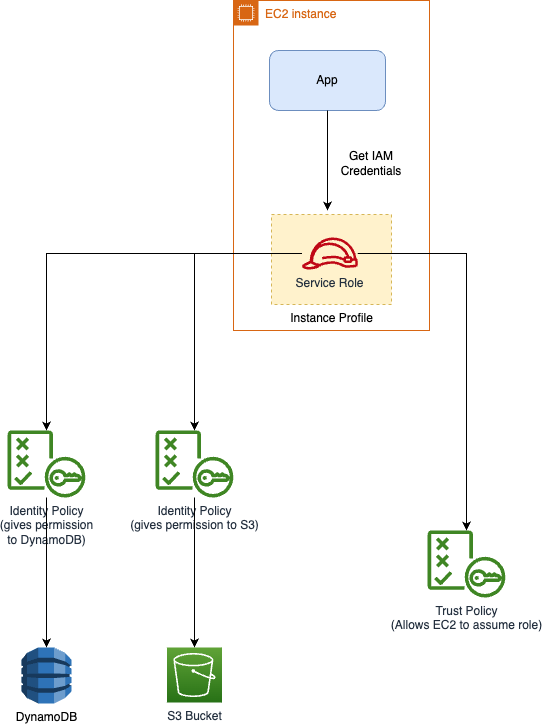
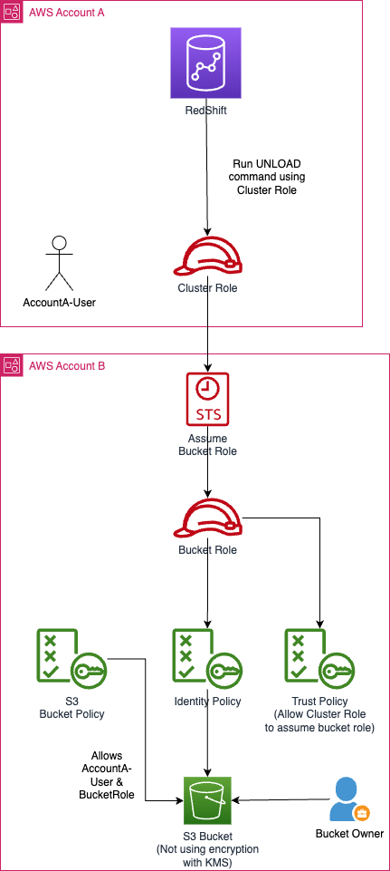

# IAM Roles
- [An IAM Roles](https://docs.aws.amazon.com/IAM/latest/UserGuide/id_roles.html) is an IAM identity that you can create in your account that has specific permissions.  
- An IAM role is similar to an IAM user, in that it is an AWS identity with permission policies that determine what the identity can and cannot do in AWS.

# Features

| Feature                                                                                                  | Remarks                                                                                                                                                                                                                                                                                                                      |
|----------------------------------------------------------------------------------------------------------|------------------------------------------------------------------------------------------------------------------------------------------------------------------------------------------------------------------------------------------------------------------------------------------------------------------------------|
| Temporary Credentials                                                                                    | A role does not have standard long-term credentials such as a password or access keys associated with it.  - Instead, when you assume a role, it provides you with temporary security credentials for your role session.                                                                                                 |
| Delegate Access                                                                                          | You can use roles to delegate access to users, applications, or services that don't normally have access to your AWS resources.  - For example, you might want to grant users in your AWS account access to resources they don't usually have, or grant users in one AWS account access to resources in another account. |

# Types of Roles

| Type of Role                     | Pre-Defined?           | Modifiable?            | Remarks                                                                                                                                                                                                                                                                                                                                                                                                              |
|----------------------------------|------------------------|------------------------|----------------------------------------------------------------------------------------------------------------------------------------------------------------------------------------------------------------------------------------------------------------------------------------------------------------------------------------------------------------------------------------------------------------------|
| Service Role                     | No                     | :white_check_mark: Yes | A service role is an IAM role that a service assumes to perform actions on your behalf.  - Service roles provide access only within your account and cannot be used to grant access to services in other accounts.                                                                                                                                                                                               |
| Service role for an EC2 instance | No                     | :white_check_mark: Yes | A special type of service role that an application running on an Amazon EC2 instance can assume to perform actions in your account. This role is assigned to the EC2 instance when it is launched. Applications running on that instance can retrieve temporary security credentials and perform actions that the role allows.                                                                                       |
| Service-linked roles             | :white_check_mark: Yes | :x: No                 | A service-linked role is a UNIQUE type of service role that is linked to an AWS service.  - The service can assume the role to perform an action on your behalf. - An IAM administrator can view, but not edit the permissions for service-linked roles.                                                                                                                                                     |
| Role for cross-account access    | No                     | :white_check_mark: Yes | A role that grants access to resources in one account to a trusted principal in a different account. Roles are the primary way to grant cross-account access. However, some AWS services allow you to attach a policy directly to a resource (instead of using a role as a proxy). These are called resource-based policies, and you can use them to grant principals in another AWS account access to the resource. |

[Read more](https://docs.aws.amazon.com/IAM/latest/UserGuide/id_roles_terms-and-concepts.html)

# Service role for an EC2 instance

[Read more](https://docs.aws.amazon.com/IAM/latest/UserGuide/id_roles_use_switch-role-ec2.html)

# Task Role vs Execution role vs trigger role

|               | ExecutionRoleArn                               | TaskRoleArn                                        |
|---------------|------------------------------------------------|----------------------------------------------------|
| What it's for | Pulling images, writing logs, fetching secrets | Your application (in container)                    |
| Who uses it?  | ECS Agent (infrastructure)                     | Interacting with AWS services (e.g., S3, DynamoDB) |
| Common policy | AmazonECSTaskExecutionRolePolicy               | App-specific policies                              |

# Who can assume Service Role?

|                | Remarks                                                                                                                                                                                                                                                                                                                                                 |
|----------------|---------------------------------------------------------------------------------------------------------------------------------------------------------------------------------------------------------------------------------------------------------------------------------------------------------------------------------------------------------|
| EC2 Instance   | If you are going to use the role with Amazon EC2 or another AWS service that uses Amazon EC2, you must store the role in an instance profile.  - An instance profile is a container for a role that can be attached to an Amazon EC2 instance when launched.  - An instance profile can contain only one role, and that limit cannot be increased. |
| AWS Lambda     |                                                                                                                                                                                                                                                                                                                                                         |
| Cloudformation |                                                                                                                                                                                                                                                                                                                                                         |

# Role for cross-account access
- IAM roles enable several scenarios to delegate access to your resources, and [cross-account access](https://docs.aws.amazon.com/AmazonS3/latest/userguide/example-walkthroughs-managing-access-example4.html#access-policies-walkthrough-example4-overview) is one of the key scenarios. 

## Cross-Account account - S3, Redshift
- In this example, the bucket owner, Account A, uses an IAM role to temporarily delegate object access cross-account to users in another AWS account, Account C.

[Read more](https://repost.aws/knowledge-center/s3-access-denied-redshift-unload)

# References
- [AWS IAM Roles Types - Service Role vs Service-Linked Role - Comparison](https://www.youtube.com/watch?v=Uuw0OXXp7W8)