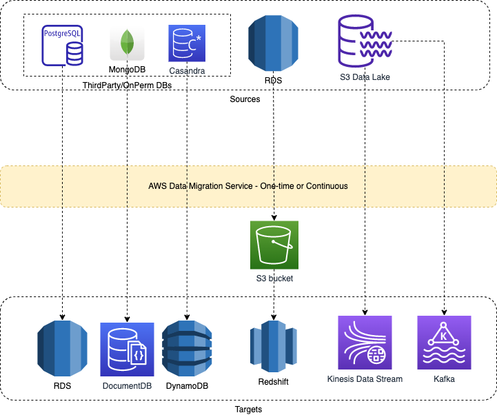

# AWS Database Migration Service
- [AWS Database Migration Service](https://aws.amazon.com/dms/) helps to migrate (one-time or continuously) from one source to another target.
- [AWS DMS]() enables you to seamlessly migrate data from supported sources to relational databases, data warehouses, streaming platforms, and other data stores in AWS cloud.

# Example Source/Targets

| Source                                                                                             | Target                                                                                   | Remarks                                                                                                                                                                                                                                                                                                                                                                                    |
|----------------------------------------------------------------------------------------------------|------------------------------------------------------------------------------------------|--------------------------------------------------------------------------------------------------------------------------------------------------------------------------------------------------------------------------------------------------------------------------------------------------------------------------------------------------------------------------------------------|
| [MySQL / PostgreSQL](../../../../3_DatabaseServices/SQL-Databases/Readme.md)               | [Amazon RDS](../../../6_DatabaseServices/AmazonRDS/Readme.md)                                                     |                                                                                                                                                                                                                                                                                                                                                                                            |
| [Amazon RDS](../../../6_DatabaseServices/AmazonRDS/Readme.md)                                                               | [Amazon Redshift](../../StorageDBs/DataWarehouse/AmazonRedshift.md) | During a database migration to [Amazon Redshift](../../StorageDBs/DataWarehouse/AmazonRedshift.md), AWS DMS first moves data to an [Amazon S3 bucket](../../../7_StorageServices/3_ObjectStorageS3/Readme.md) & then transfers them to the proper tables in the [Amazon Redshift data warehouse](../../StorageDBs/DataWarehouse/AmazonRedshift.md). |
| [Amazon S3](../../../7_StorageServices/3_ObjectStorageS3/Readme.md)                                   | [Amazon Kinesis Data Streams](../../../5_MessageBrokerServices/AmazonKinesis/AmazonKinesisDataStreams.md) |                                                                                                                                                                                                                                                                                                                                                                                            |
| [Amazon S3](../../../7_StorageServices/3_ObjectStorageS3/Readme.md)                                   | [Amazon Kafka](../../../5_MessageBrokerServices/AmazonKinesis/AmazonKinesisDataStreams.md)                |                                                                                                                                                                                                                                                                                                                                                                                            |
| [MongoDB](../../../../3_DatabaseServices/NoSQL-Databases/DocumentDB/MongoDB/Readme.md)   | [Amazon DocumentDB](../../../6_DatabaseServices/AmazonDocumentDB.md)                                              |                                                                                                                                                                                                                                                                                                                                                                                            |
| [Cassandra](../../../../3_DatabaseServices/NoSQL-Databases/WideColumnDB/ApacheCasandra.md) | [Amazon DynamoDB](../../../6_DatabaseServices/AmazonDynamoDB/Readme.md)                                           |                                                                                                                                                                                                                                                                                                                                                                                            |
| Oracle and SQL Server                                                                              | [Amazon RDS](../../../6_DatabaseServices/AmazonRDS/Readme.md)                                                     |                                                                                                                                                                                                                                                                                                                                                                                            |
| On-Perm Data warehouse                                                                             | [Amazon Redshift](../../StorageDBs/DataWarehouse/AmazonRedshift.md) | For large-scale migrations, use [AWS Schema Conversion Tool](AWSSCT.md) and [AWS Snowball Edge devices](../../../14_DataTransferMigrationServices/AWSSnowFamily.md). [Read more](https://docs.aws.amazon.com/SchemaConversionTool/latest/userguide/agents.dw.html).                                                                                                                    |

# Migration Techniques/Tools

| Migration Techniques/Tools                                                                                    | Remarks                                                                                                                                                                                                                                      |
|---------------------------------------------------------------------------------------------------------------|----------------------------------------------------------------------------------------------------------------------------------------------------------------------------------------------------------------------------------------------|
| Migrate Only Primary Keys Using Basic Schema Only tool                                                        | To quickly migrate a database schema to your target instance you can rely on the Basic Schema Copy feature of AWS Database Migration Service. - Basic Schema Copy will not migrate secondary indexes, foreign keys or stored procedures. |
| Migrate Complex Schema (Primary keys, foreign keys, stored procedures, secondary indexes etc.) using SCT tool | First use the [AWS Schema Conversion Tool](AWSSCT.md) to convert the source schema and code to match that of the target database.                                                                                                            |
| Data Migration                                                                                                | Use the [AWS Database Migration Service]() to migrate data from the source database to the target database.                                                                                                                                  |

# Read more
- [Streaming data from Amazon S3 to Amazon Kinesis Data Streams using AWS DMS](https://aws.amazon.com/blogs/big-data/streaming-data-from-amazon-s3-to-amazon-kinesis-data-streams-using-aws-dms/)
