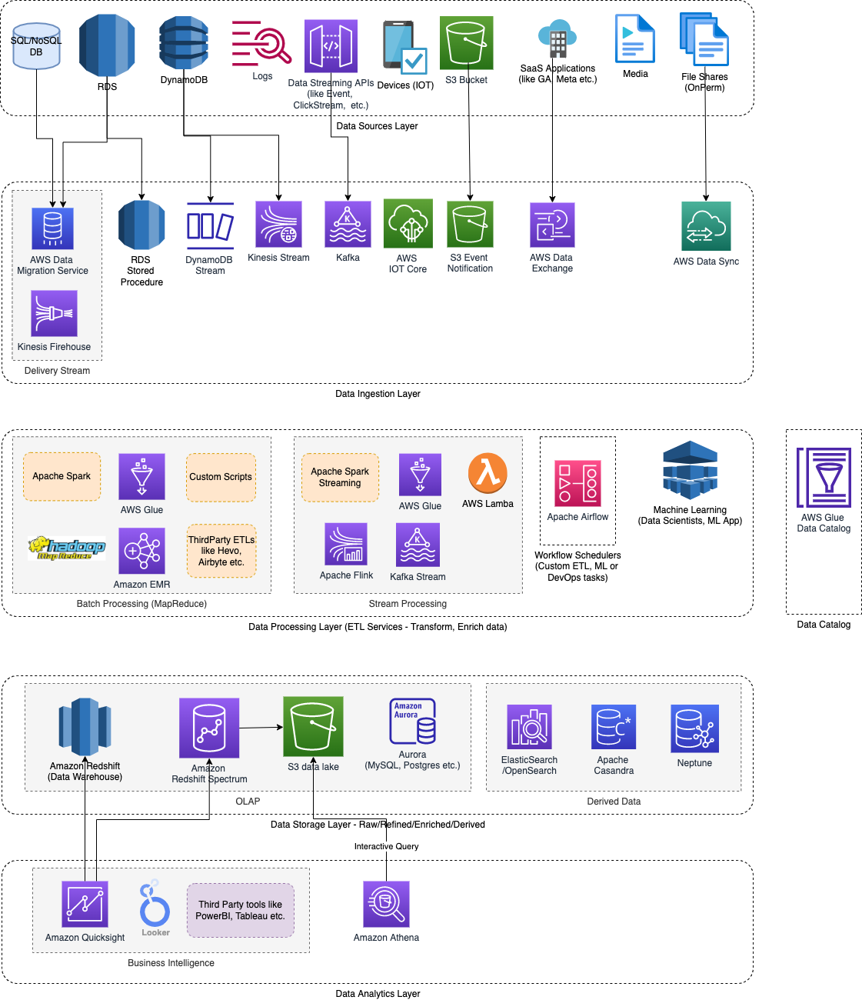

# Amazon RedShift
- [Amazon RedShift](https://aws.amazon.com/redshift/) is a [data warehouse service](../../../../6_BigDataServices/StorageDBs/DataWarehouses/Readme.md) in AWS.
- [Amazon Redshift]() is not designed for continuous ingestion of data in real time.

# Features

| Feature                      | Remarks                                                                                                                                                                                                                           |
|------------------------------|-----------------------------------------------------------------------------------------------------------------------------------------------------------------------------------------------------------------------------------|
| Amazon Redshift & PostgresQL | [Amazon Redshift]() and [PostgreSQL](../../../../3_DatabaseServices/7_SQL-Databases/Readme.md) have a number of important differences that you must be aware of as you design and develop your data warehouse applications. |
| Redshift Spectrum            | [Amazon Redshift Spectrum](AmazonRedshiftSpectrum.md) can be used to perform in-place querying of data assets in an [Amazon S3-based data lake](../DataLakes/S3DataLake.md).                             |

# General Use Cases

| Use Case                               |
|----------------------------------------|
| Improve financial and demand forecasts |
| Collaborate and share data             |
| Optimize your business intelligence    |
| Increase developer productivity        |

# Data Analytics on Redshift

| Tool              | Description                                                                                                                                            |
|-------------------|--------------------------------------------------------------------------------------------------------------------------------------------------------|
| SQL based queries | The SQL language consists of commands that you use to create and manipulate database objects, run queries, load tables, and modify the data in tables. |
| Third-party tools | Looker, Tableau etc.                                                                                                                                   |