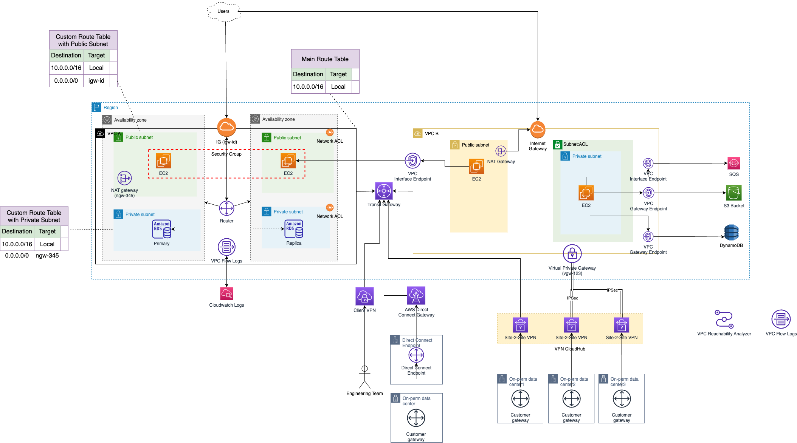

# Route tables
- [A route table](https://docs.aws.amazon.com/vpc/latest/userguide/VPC_Route_Tables.html) contains a set of rules, called [routes](https://docs.aws.amazon.com/vpc/latest/userguide/VPC_Route_Tables.html), that determine where network traffic from [your subnet or gateway](../../../1_NetworkingAndContentDelivery/3_NetworkFoundationsVPC/InternetGateway.md) is directed. 
- When the [CIDR blocks for route table](https://docs.aws.amazon.com/vpc/latest/userguide/VPC_Route_Tables.html) entries overlap, the more specific (smaller range) CIDR block takes priority.

# Applicable AWS Services

| Terminology                 | AWS Service                                                                                                               | Remarks                                                                                                                                                                                   |
|-----------------------------|---------------------------------------------------------------------------------------------------------------------------|-------------------------------------------------------------------------------------------------------------------------------------------------------------------------------------------|
| Main route table            | [VPC](../../../1_NetworkingAndContentDelivery/3_NetworkFoundationsVPC/Readme.md)                                          | The route table that automatically comes with your VPC.  - It controls the routing for all subnets that are not explicitly associated with any other route table.                     |
| Subnet route table          | [Subnet](../../../1_NetworkingAndContentDelivery/3_NetworkFoundationsVPC/Subnets.md)                                      | A route table that's associated with a subnet. - A subnet is implicitly associated with the main route table if it is not explicitly associated with a particular route table. |
| Gateway route table         | [Internet Gateway or Virtual Gateway](../../../1_NetworkingAndContentDelivery/3_NetworkFoundationsVPC/InternetGateway.md) | A route table that's associated with an [internet gateway or virtual private gateway](../../../1_NetworkingAndContentDelivery/3_NetworkFoundationsVPC/InternetGateway.md).                |
| Transit gateway route table | [Transit gateway](https://docs.aws.amazon.com/vpc/latest/tgw/tgw-route-tables.html)                                       | A route table that's associated with a [transit gateway](https://docs.aws.amazon.com/vpc/latest/tgw/tgw-route-tables.html)                                                                |

# Concepts

| Concept                 | Description                                                                                                                                                                                                                          |
|-------------------------|--------------------------------------------------------------------------------------------------------------------------------------------------------------------------------------------------------------------------------------|
| Route table association | The association between a route table and a subnet, internet gateway, or virtual private gateway. - A resource can only be associated with one route table at a time.                                                            |
| Destination             | The [range of IP addresses](../../../../3_SystemGlossaries/Networking/IPAddressRanges.md) where you want traffic to go (destination CIDR).  - For example, an external corporate network with the CIDR 172.16.0.0/12. |
| Target                  | The gateway, network interface, or connection through which to send the destination traffic.  - For example, an [internet gateway](../../../1_NetworkingAndContentDelivery/3_NetworkFoundationsVPC/InternetGateway.md).          |