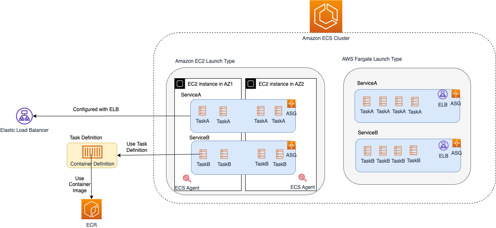

# Amazon ECS - Containers as a Service
- [Amazon ECS](https://aws.amazon.com/ecs/) is a [highly scalable](../../../6_DatabaseServices/Glossaries/ScalabilityDB.md) and [fast container orchestration/management service](../../../9_ContainerOrchestrationServices/Readme.md).
- You can use it to run, stop, and manage containers on a cluster.
- Amazon ECS reduces the burden of setting up network, compute and security configurations, and managing scalability. 
- Up to 5,000 tasks/instances per cluster, can be launched in ECS.

# Various Components

| Term                                                                                                             | Similarity with Kubernates                                                                                               | Remarks                                                                                                                                                                                                                                                                                                                                                                                        |
|------------------------------------------------------------------------------------------------------------------|--------------------------------------------------------------------------------------------------------------------------|------------------------------------------------------------------------------------------------------------------------------------------------------------------------------------------------------------------------------------------------------------------------------------------------------------------------------------------------------------------------------------------------|
| :star: [Container Definition](#container-definition)                                                             | -                                                                                                                        | Nothing but container image & container level settings.                                                                                                                                                                                                                                                                                                                                        |
| Container Instance                                                                                               | [Worker node in Kubernates](../../../9_ContainerOrchestrationServices/Kubernates.md)               | An [EC2 instance](../../3_ComputeServices/AmazonEC2/Readme.md) with the ECS agent installed and configured is called a container instance.                                                                                                                                                                                                                                                     |
| :star: [Task Definition](Task.md)                                                                                | [Pod Configuration file in Kubernates](../../../9_ContainerOrchestrationServices/Kubernates.md)    | A blueprint for our application and describes one or more containers through attributes. - A task definition is similar to a blueprint that describes the resources you need to run a container, such as CPU, memory, ports, images, storage, and networking information.                                                                                                                  |
| :star: [Task](Task.md)                                                                                           | [Pods in Kubernates](../../../9_ContainerOrchestrationServices/Kubernates.md)                      | A task is the instantiation of task definition in the cluster.  - Tasks don't share the underlying kernel, CPU resources, memory resources or elastic network interface with another task.                                                                                                                                                                                                 |
| :star: [Service](Service/Readme.md)                                                                              | Every microservice should be represented as Service in ECS.                                                              | A service allows us to run and maintain a specified number (the desired count) of simultaneous tasks in an ECS cluster, configure load balancer, service discovery etc.                                                                                                                                                                                                                        |
| [Service Auto Scaling](Service/ServiceAutoScaling.md)                                                            | [Horizontal Pod AutoScaler in Kubernates](../../../9_ContainerOrchestrationServices/Kubernates.md) | To auto-scale the ECS tasks                                                                                                                                                                                                                                                                                                                                                                    |
| [Service Discovery](Service/ServiceDiscovery.md)                                                                 | [Service Discovery in Kubernates](../../../9_ContainerOrchestrationServices/Kubernates.md)         | Service discovery in microservices architecture.                                                                                                                                                                                                                                                                                                                                               |
| [Cluster](https://docs.aws.amazon.com/AmazonECS/latest/developerguide/clusters.html)                             | -                                                                                                                        | An Amazon ECS cluster is a logical grouping of tasks or services. (Prod, Stage, Dev clusters etc.)  - Your tasks and services are run on infrastructure that is registered to a cluster. - A cluster can contain a mix of tasks that are hosted on [Amazon EC2](../../3_ComputeServices/AmazonEC2/Readme.md), [Fargate](../../3_ComputeServices/AWSFargate.md), or external instances. |
| ECS Backplane                                                                                                    | [Control plane in Kubernates](../../../9_ContainerOrchestrationServices/Kubernates.md)             | -                                                                                                                                                                                                                                                                                                                                                                                              |
| [ECS Agent](https://docs.aws.amazon.com/AmazonECS/latest/developerguide/ECS_agent.html)                          | [kubelet in Kubernates](../../../9_ContainerOrchestrationServices/Kubernates.md)                   | The Amazon ECS container agent allows container instances to connect to your cluster. The Amazon ECS container agent is included in the Amazon ECS-optimized AMIs, but you can also install it on any [Amazon EC2 instance](../../3_ComputeServices/AmazonEC2/Readme.md) that supports the Amazon ECS specification.                                                                           |
| [Scheduled Tasks](https://docs.aws.amazon.com/AmazonECS/latest/developerguide/scheduling_tasks.html)             | -                                                                                                                        | Amazon ECS provides a service scheduler for long-running tasks and applications.  - It also provides the ability to run tasks manually for batch jobs or single run tasks.                                                                                                                                                                                                                 |
| [Capacity Provider](https://docs.aws.amazon.com/AmazonECS/latest/developerguide/cluster-capacity-providers.html) | -                                                                                                                        | Amazon ECS capacity providers manage the scaling of infrastructure for tasks in your clusters.                                                                                                                                                                                                                                                                                                 |
| [CloudWatch metrics](https://docs.aws.amazon.com/AmazonECS/latest/developerguide/cloudwatch-metrics.html)        | -                                                                                                                        | You can monitor your Amazon ECS resources using [Amazon CloudWatch](../../8_MonitoringServices/AmazonCloudWatch/Readme.md), which collects and processes raw data from Amazon ECS into readable, near real-time metrics.                                                                                                                                                                       |
| [Daemon Scheduling](https://aws.amazon.com/about-aws/whats-new/2018/06/amazon-ecs-adds-daemon-scheduling/)       | [Daemon set in Kubernates](../../../9_ContainerOrchestrationServices/Kubernates.md)                | A daemon task is a pattern used when building microservices where a task is deployed onto each instance in a cluster to provide common supporting functionality like logging, monitoring, or backups for the tasks running your application code.                                                                                                                                              |

# Container Definition

| Param                                      |
|--------------------------------------------|
| Container Name                             |
| Container Image                            |
| Private Repo / Registry                    |
| Memory Limits                              |
| Port Mappings                              |
| Environment Variables to pass to container |
| Log Configuration                          |

[Read more](https://docs.aws.amazon.com/AmazonECS/latest/APIReference/API_ContainerDefinition.html)

# ECS integration with ELB

- [Read more](https://docs.aws.amazon.com/AmazonECS/latest/userguide/create-load-balancer.html)

# References
- [Containers on AWS Overview: ECS | EKS | Fargate | ECR](https://www.youtube.com/watch?v=AYAh6YDXuho)
- [Application Load Balancer with ECS Fargate](https://stackoverflow.com/questions/64409699/application-load-balancer-with-ecs-fargate)
- [Amazon ECS-optimized AMI](https://docs.aws.amazon.com/AmazonECS/latest/developerguide/ecs-optimized_AMI.html)