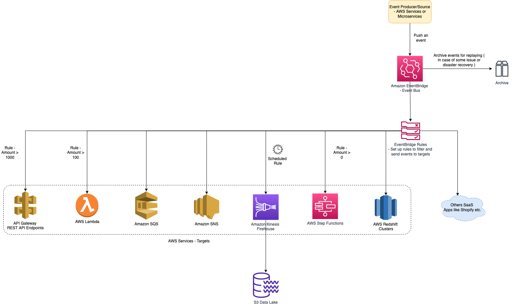

# Amazon EventBridge (formerly called Cloudwatch Events)
- [Amazon EventBridge](https://aws.amazon.com/eventbridge/) is a serverless event bus that lets you receive, filter, transform, route, and deliver events. 
- Using [Amazon EventBridge](), we can build [event-driven applications at scale](../../4_MicroServicesSOA) across AWS, existing systems, or SaaS applications.
- It uses the [Amazon CloudWatch Events API](../8_MonitoringServices/AmazonCloudWatch/Readme.md), but also includes more functionality, like the ability to ingest events from SaaS apps.

# Amazon EventBridge rules
- [An event bridge rule](https://docs.aws.amazon.com/eventbridge/latest/userguide/eb-rules.html) matches incoming events and sends them to targets for processing. 
- A single rule can send an event to multiple targets, which then run in parallel. 
- Rules are based either on an [event pattern](https://docs.aws.amazon.com/eventbridge/latest/userguide/eb-event-patterns.html) or [a schedule]((https://docs.aws.amazon.com/eventbridge/latest/userguide/eb-create-rule-schedule.html)). 
- [An event pattern](https://docs.aws.amazon.com/eventbridge/latest/userguide/eb-event-patterns.html) defines the event structure and the fields that a rule matches. 
- [Rules that are based on a schedule](https://docs.aws.amazon.com/eventbridge/latest/userguide/eb-create-rule-schedule.html) perform an action at regular intervals.

# Available Target Services
- [AWS Lambda](../3_ComputeServices/AWSLambda/Readme.md)
- [Amazon SQS](AmazonSQS/Readme.md)
- [Amazon SNS](AmazonSNS.md)
- [AWS Step Functions](../3_ComputeServices/AWSStepFunctions.md)
- [Amazon Kinesis Data Streams](AmazonKinesis/Readme.md)
- [Amazon Kinesis Data Firehouse](AmazonKinesis/Readme.md)
- [API Gateway](../1_NetworkingAndContentDelivery/2_ApplicationNetworking/AmazonAPIGateway/Readme.md)
- [Amazon Redshift Clusters](../10_BigDataServices/StorageDBs/DataWarehouse/AmazonRedshift.md)
- [SAAS Integrations - Partner Sources](https://aws.amazon.com/eventbridge/integrations/)

# Archives
- For [disaster recovery](../../7_PropertiesDistributedSystem/Reliability/FaultTolerance.md) and auditing purposes event are also set up to be archived. 
- This is very helpful for replaying these events.
- [Guide to archive Amazon EventBridge events & replay those later.](https://docs.aws.amazon.com/eventbridge/latest/userguide/eb-archive-event.html)

# Replays
- To be able to debug the behaviour of the system based for older events, we can use the replays.
- [Replaying archived Amazon EventBridge events](https://docs.aws.amazon.com/eventbridge/latest/userguide/eb-replay-archived-event.html)

# Other Links
- :star: [Amazon EventBridge vs others](../../5_MessageBrokers/KafkaVsRabbitMQVsSQSVsSNS.md)

# References
- [Reducing custom code by using advanced rules in Amazon EventBridge](https://aws.amazon.com/blogs/compute/reducing-custom-code-by-using-advanced-rules-in-amazon-eventbridge/)
- [AWS EventBridge - Write Analytics Detail Events to S3](https://developer.genesys.cloud/blueprints/aws-eventbridge-analytics-detail-events-blueprint/index-tmp)
- [Upgrading to Amazon EventBridge from Amazon CloudWatch Events](https://aws.amazon.com/blogs/compute/upgrading-to-amazon-eventbridge-from-amazon-cloudwatch-events/)