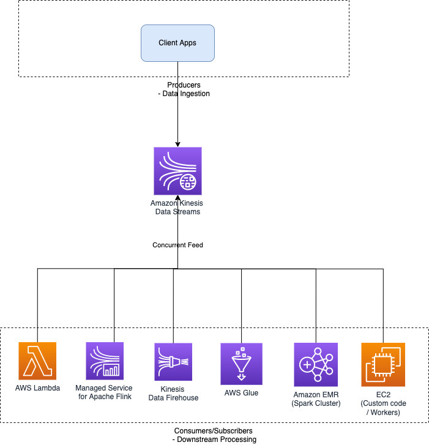

# Amazon Kinesis Data Streams
- [Amazon Kinesis Data Streams](https://aws.amazon.com/kinesis/data-streams/) is the [real-time data streaming service](../../../6_BigDataServices/DataProcessing/Readme.md) in Amazon Kinesis with high scalability and durability.
- [KDS]() can continuously capture gigabytes of data per second from hundreds of thousands of sources & then provide a concurrent feed of the data stream to the downstream applications.
- The data collected is available in milliseconds, enabling real-time analytics.

# Use Cases

| Use Case                                                                                   | Examples                                                                                                                                                                                                                                                                      |
|--------------------------------------------------------------------------------------------|-------------------------------------------------------------------------------------------------------------------------------------------------------------------------------------------------------------------------------------------------------------------------------|
| [Streaming/Real-time data](../../../0_HLDUseCasesProblems/AWS_ClickStreamAnalytics/Readme.md) | Website clickstreams, database event streams, financial transactions, social media feeds, IT logs, and location-tracking events etc.                                                                                                                                          |
| Routing related records to the same record processor (as in streaming MapReduce)           | Counting and aggregation are simpler when all records for a given key are routed to the same record processor.                                                                                                                                                                |
| Ordering of records.                                                                       | You want to transfer log data from the application host to the processing/archival host while maintaining the order of log statements.                                                                                                                                        |
| Ability for multiple applications to consume the same stream concurrently.                 | You have one application that updates a real-time dashboard and another that archives data to [Amazon Redshift](). - You want both applications to consume data from the same stream concurrently and independently.                                                      |
| Ability to consume records in the same order a few hours later.                            | You have a billing application and an audit application that runs a few hours behind the billing application.  - Because [Amazon Kinesis Data Streams]() stores data for up to 365 days, you can run the audit application up to 365 days behind the billing application. |

[Read more](https://docs.aws.amazon.com/streams/latest/dev/key-concepts.html)

# Features

| Feature                                                                                                                           | Remarks                                                                                                                                                                                                                                                                                                                                                                                                                                                                                                                                                                                                                          |
|-----------------------------------------------------------------------------------------------------------------------------------|----------------------------------------------------------------------------------------------------------------------------------------------------------------------------------------------------------------------------------------------------------------------------------------------------------------------------------------------------------------------------------------------------------------------------------------------------------------------------------------------------------------------------------------------------------------------------------------------------------------------------------|
| :star: [Comparison between Various Message Brokers](../../../4_MessageBrokersEDA/KafkaVsRabbitMQVsSQSVsSNS.md) | [Amazon Kinesis Data Steams](https://shastri-shankar9.medium.com/apache-kafka-vs-amazon-kinesis-b55821c7f51f) is a managed alternative to [Apache Kafka](../../../4_MessageBrokersEDA/Kafka/Readme.md).                                                                                                                                                                                                                                                                                                                                                                                                       |
| [Amazon Kinesis Client Library (KCL)](KinesisClientLibrary.md)                                                                    |                                                                                                                                                                                                                                                                                                                                                                                                                                                                                                                                                                                                                                  |
| Maintain order of records                                                                                                         |                                                                                                                                                                                                                                                                                                                                                                                                                                                                                                                                                                                                                                  |
| Reply records                                                                                                                     | It provides ordering of records, as well as the ability to read and/or replay records in the same order to multiple Amazon Kinesis Applications.                                                                                                                                                                                                                                                                                                                                                                                                                                                                                 |
| [Resharding a Stream](https://docs.aws.amazon.com/streams/latest/dev/kinesis-using-sdk-java-resharding.html)                      | With resharding, you can increase the number of shards in your stream to adapt to changes in the rate of data flow. - When you reshard, data records that were flowing to the existing shards are re-routed to new shards based on key values. - For example - If [your Lambda function](../../3_ComputeServices/AWSLambda/Readme.md) is not processing records in a timely manner, you will see the [IteratorAge metric](https://repost.aws/knowledge-center/lambda-iterator-age) increase on [your Lambda](../../3_ComputeServices/AWSLambda/Readme.md) dashboard, and this might indicate that you need to "reshard." |
| [Quotas and Limits](https://docs.aws.amazon.com/streams/latest/dev/service-sizes-and-limits.html)                                 | The default shard quota is 500 shards per AWS account for main AWS regions (US East (N. Virginia), US West (Oregon), and Europe (Ireland)).  - For other regions, max limit is 200 shards per AWS account.                                                                                                                                                                                                                                                                                                                                                                                                                   |
| Batch messages                                                                                                                    | To reduce overhead and increase throughput, the application must batch records and implement parallel HTTP requests.  - This will increase the efficiency overall and ensure you are optimally using the shards.                                                                                                                                                                                                                                                                                                                                                                                                             |
| [Enhanced Fanout](https://aws.amazon.com/blogs/aws/kds-enhanced-fanout/)                                                          | You should use enhanced fan-out if you have multiple consumers retrieving data from a stream in parallel.                                                                                                                                                                                                                                                                                                                                                                                                                                                                                                                        |
| [Amazon DynamoDB as config store](../../6_DatabaseServices/AmazonDynamoDB/Readme.md)                                              | [Amazon DynamoDB](../../6_DatabaseServices/AmazonDynamoDB/Readme.md) is used as a Configuration store in [Amazon Kinesis data stream]().                                                                                                                                                                                                                                                                                                                                                                                                                                                                                         |

# AWS - Stream-Processing Using Glue & S3
    

# Terminologies Comparison with Kafka

| Purpose                           | :star: [Kafka](../../../4_MessageBrokersEDA/Kafka/Readme.md) | [Amazon Kinesis Data Streams]() |
|-----------------------------------|-----------------------------------------------------------|---------------------------------|
| Categorize events streams         | Topics                                                    | Streams                         |
| Increase scalability of streaming | Partitions                                                | Shards                          |
| To sequence the records           | Partition Key                                             | Partition Key/ID                |