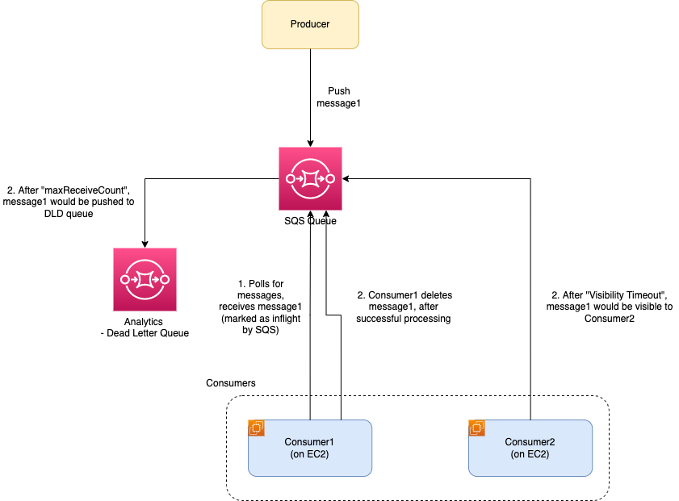

# Amazon SQS (Simple Queue Service)
- [Amazon SQS (Simple Queue Service)](https://aws.amazon.com/sqs/) is a fully managed message queuing service that enables you to [decouple and scale microservices](../../../4_MicroServicesSOA/Readme.md), [distributed systems](../../../7_SystemGlossaries/Readme.md), and [serverless applications](../../AWS-Serverless-Architecture.md).

# Key Features

| Feature                                                                                                                                   | Descriptions                                                                                                                                                                                                                                                                                                                                                                                                                                                                                                                |
|-------------------------------------------------------------------------------------------------------------------------------------------|-----------------------------------------------------------------------------------------------------------------------------------------------------------------------------------------------------------------------------------------------------------------------------------------------------------------------------------------------------------------------------------------------------------------------------------------------------------------------------------------------------------------------------|
| star: [Amazon SQS vs others](../../../5_MessageBrokers/KafkaVsRabbitMQVsSQSVsSNS.md)                                | [Amazon SQS (Simple Queue Service)](https://aws.amazon.com/sqs/) is a fully managed message queuing service that enables you to [decouple and scale microservices](../../../4_MicroServicesSOA/Readme.md), [distributed systems](../../../7_SystemGlossaries/Readme.md), and [serverless applications](../../AWS-Serverless-Architecture.md)                                                                                                                                    |
| Highly Available                                                                                                                          | [Amazon SQS]() is [highly available](../../../7_SystemGlossaries/Reliability/HighAvailability.md), by default.                                                                                                                                                                                                                                                                                                                                                                                        |
| [Short & long polling](ShortLongPoling.md)                                                                                                | [Amazon SQS](https://aws.amazon.com/sqs/faqs/) provides short polling and long polling to receive messages from a queue.                                                                                                                                                                                                                                                                                                                                                                                                    |
| [Visibility Timeout](https://docs.aws.amazon.com/AWSSimpleQueueService/latest/SQSDeveloperGuide/sqs-visibility-timeout.html)              | [Visibility timeout](https://docs.aws.amazon.com/AWSSimpleQueueService/latest/SQSDeveloperGuide/sqs-visibility-timeout.html) is a period during which Amazon SQS prevents other consumers from receiving and processing a given message.                                                                                                                                                                                                                                                                                    |
| At-least-Once delivery                                                                                                                    | Unlike a [publish-subscribe system](../../../5_MessageBrokers/Readme.md), a single message should be delivered to a single consumer, even when there are a lot of consumers running concurrently (also known as the [competing consumers pattern](https://www.conceptdraw.com/examples/message-queue)).                                                                                                                                                                                               |
| [Dead-Letter Queue](https://docs.aws.amazon.com/AWSSimpleQueueService/latest/SQSDeveloperGuide/sqs-dead-letter-queues.html)               | [Amazon SQS]() supports [dead-letter queues (DLQ)](https://docs.aws.amazon.com/AWSSimpleQueueService/latest/SQSDeveloperGuide/sqs-dead-letter-queues.html), which other queues (source queues) can target for messages that can't be processed (consumed) successfully. - These messages can be replayed/re-drive.  - After [maxReceiveCount](https://docs.aws.amazon.com/AWSSimpleQueueService/latest/SQSDeveloperGuide/sqs-dead-letter-queues.html), message would be pushed in the configured dead letter queue. |
| In-flight Messages Limit                                                                                                                  | 120,000 for a standard queue, 20,000 for a FIFO queue. - [Messages are inflight](https://aws.amazon.com/premiumsupport/knowledge-center/sqs-message-backlog/) after they have been received from the queue by a consuming component, but have not yet been deleted from the queue.                                                                                                                                                                                                                                      |
| Message payload limit                                                                                                                     | Max message payload can be 256KB in SQS queue.                                                                                                                                                                                                                                                                                                                                                                                                                                                                              |
| [Batch Actions](https://docs.aws.amazon.com/AWSSimpleQueueService/latest/SQSDeveloperGuide/sqs-batch-api-actions.html)                    | Max 10 batches (i.e. max 10 messages per operation)                                                                                                                                                                                                                                                                                                                                                                                                                                                                         |
| [GroupID / MessageGroupId](https://docs.aws.amazon.com/AWSSimpleQueueService/latest/SQSDeveloperGuide/using-messagegroupid-property.html) | [MessageGroupId](https://docs.aws.amazon.com/AWSSimpleQueueService/latest/APIReference/API_SendMessage.html) is the tag that specifies that a message belongs to a specific message group.  - Messages that belong to the same message group are always processed one by one, in a strict order relative to the message group (however, messages that belong to different message groups might be processed out of order).                                                                                              |
| [Delay queues](https://docs.aws.amazon.com/AWSSimpleQueueService/latest/SQSDeveloperGuide/sqs-delay-queues.html)                          | [Delay queues](https://docs.aws.amazon.com/AWSSimpleQueueService/latest/SQSDeveloperGuide/sqs-delay-queues.html) let you postpone the delivery of new messages to consumers for a number of seconds (known as [message timer](https://docs.aws.amazon.com/AWSSimpleQueueService/latest/SQSDeveloperGuide/sqs-message-timers.html)), for example, when your consumer application needs additional time to process messages. - The maximum delay can be 15 minutes.                                                       |
| Priority of work                                                                                                                          | Use separate queues to provide prioritization of work.                                                                                                                                                                                                                                                                                                                                                                                                                                                                      |
| [Temporary Queues](https://aws.amazon.com/blogs/compute/simple-two-way-messaging-using-the-amazon-sqs-temporary-queue-client/)            | The [Temporary Queue client](https://docs.aws.amazon.com/AWSSimpleQueueService/latest/SQSDeveloperGuide/sqs-temporary-queues.html) maps multiple temporary queues—application-managed queues created on demand for a particular process—onto a single Amazon SQS queue automatically. - Virtual queues let you multiplex many low-traffic queues onto a single SQS queue, helpful for [request-response message pattern](../../../5_MessageBrokers/Glossaries/PointToPointModel.md).        |

# SQS Queue types - Standard vs FIFO

|                                                   | :star: [Standard Queues](https://docs.aws.amazon.com/AWSSimpleQueueService/latest/SQSDeveloperGuide/standard-queues.html)   | [SQS FIFO queues](https://docs.aws.amazon.com/AWSSimpleQueueService/latest/SQSDeveloperGuide/FIFO-queues.html)                                                                                                                                                                                                                                                                                |
|---------------------------------------------------|-----------------------------------------------------------------------------------------------------------------------------|-----------------------------------------------------------------------------------------------------------------------------------------------------------------------------------------------------------------------------------------------------------------------------------------------------------------------------------------------------------------------------------------------|
| Throughput                                        | Unlimited Throughput                                                                                                        | High Throughput  - [Up to 300 receive events/API calls per second, without batching](https://docs.aws.amazon.com/AWSSimpleQueueService/latest/SQSDeveloperGuide/high-throughput-fifo.html).  - [Up to 3000 messages per second, with batching (i.e. with 10 allowed batches)](https://docs.aws.amazon.com/AWSSimpleQueueService/latest/SQSDeveloperGuide/sqs-batch-api-actions.html). |
| Delivery                                          | At-Least-Once Delivery                                                                                                      | [Exactly-Once Processing](https://docs.aws.amazon.com/AWSSimpleQueueService/latest/SQSDeveloperGuide/FIFO-queues-exactly-once-processing.html)                                                                                                                                                                                                                                                |
| Ordering                                          | Best-Effort Ordering                                                                                                        | [First-In-First-Out Delivery](https://docs.aws.amazon.com/AWSSimpleQueueService/latest/SQSDeveloperGuide/FIFO-queues-message-order.html)                                                                                                                                                                                                                                                      |
| Use Cases                                         | Decouple live user requests from intensive background work, example - let users upload media while resizing or encoding it. | Ensure that user-entered commands are executed in the right order. - Display the correct product price by sending price modifications in the right order. - Prevent a student from enrolling in a course before registering for an account.                                                                                                                                           |
| Naming Convention (80-character queue name limit) | No convention                                                                                                               | The name of a FIFO queue must end with the `.fifo suffix`.                                                                                                                                                                                                                                                                                                                                      |

Note 
- You can't convert an existing standard queue into a FIFO queue. 
- To make the move, you must either create a new FIFO queue for your application or delete your existing standard queue and recreate it as a FIFO queue.

# Amazon SQS Dead-letter queue

# Amazon SQS delay queues

# References
- [Amazon's SQS performance and latency](https://softwaremill.com/amazon-sqs-performance-latency/)
- [SQS vs SNS vs Amazon MQ - Comparison - AWS Certification Cheat Sheet](https://cloud.in28minutes.com/aws-certification-sqs-vs-sns-vs-amazon-mq)
- [Solving Complex Ordering Challenges with Amazon SQS FIFO Queues](https://aws.amazon.com/blogs/compute/solving-complex-ordering-challenges-with-amazon-sqs-fifo-queues/)