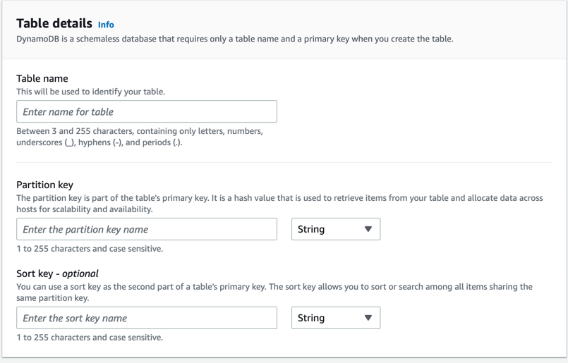

# Partitions and data distribution
- [Amazon DynamoDB](https://aws.amazon.com/blogs/database/choosing-the-right-dynamodb-partition-key/) scales [horizontally (using data partition/sharding)](../../../6_DatabaseServices/Glossaries/PartioningSharding.md) and can seamlessly scale a single table over hundreds of servers.
- DynamoDB is [schemaless](https://aws.amazon.com/blogs/database/should-your-dynamodb-table-be-normalized-or-denormalized/): When you create a table in DynamoDB, you specify only the primary key attributes, such as partition key or partition key and sort key. You do not define any other attributes in advance.

# Key Concepts

| Concept       | Description                                                                                                                                                                                                                                                 |
|---------------|-------------------------------------------------------------------------------------------------------------------------------------------------------------------------------------------------------------------------------------------------------------|
| Partition     | A partition is an allocation of storage for a table, backed by [solid state drives (SSDs)](https://www.techtarget.com/searchstorage/definition/SSD-solid-state-drive) and automatically replicated across multiple Availability Zones within an AWS Region. |
| Partition key | DynamoDB uses the value of the [partition key](https://aws.amazon.com/blogs/database/choosing-the-right-dynamodb-partition-key/) as input to an internal hash function.  - Hence it must be specified in both read and write operations.                |
| Primary Key   | When you create a table, in addition to the table name, you must specify the primary key of the table.  - The primary key uniquely identifies each item in the table, so that no two items can have the same key.                                       |

# Types of primary key

| Primary Key type           | Description                                                                                                                                                                                                                                                                                                                                              |
|----------------------------|----------------------------------------------------------------------------------------------------------------------------------------------------------------------------------------------------------------------------------------------------------------------------------------------------------------------------------------------------------|
| Partition key only         | We can only use partition key as primary key (must be specified in both read and write operations).                                                                                                                                                                                                                                                      |
| Partition key and sort key | Referred to as a [composite primary key](https://docs.aws.amazon.com/amazondynamodb/latest/developerguide/HowItWorks.CoreComponents.html), this type of key is composed of two attributes. - All items with the same partition key value are stored together, in sorted order by sort key value. - This helps in querying items more efficiently. |

# Key Stats

| Stat                     | Value              |
|--------------------------|--------------------|
| Partition size limit     | 10 GB              |
| Partition capacity limit | 3000 RCU, 1000 WCU |

# Choosing the Right DynamoDB Partition Key

[Read more](https://aws.amazon.com/blogs/database/choosing-the-right-dynamodb-partition-key/)

# Recommendations for partition keys

| Recommendation                                                                                                                                                                        | Description                                                                                                                                                                                                                                                                                      |
|---------------------------------------------------------------------------------------------------------------------------------------------------------------------------------------|--------------------------------------------------------------------------------------------------------------------------------------------------------------------------------------------------------------------------------------------------------------------------------------------------|
| Use high-cardinality attributes                                                                                                                                                       | These are attributes that have distinct values for each item, like emailid, employee_no, customerid, sessionid, orderid, and so on.                                                                                                                                                              |
| Use composite attributes                                                                                                                                                              | Try to combine more than one attribute to form a unique key, if that meets your access pattern.  - For example, consider an orders table with `customerid#productid#countrycode` as the partition key and `order_date` as the sort key, where the symbol # is used to split different field. |
| Cache the popular items                                                                                                                                                               | Cache the popular items when there is a high volume of read traffic using [Amazon DynamoDB Accelerator (DAX)](DynamoDBAccelerator.md).                                                                                                                                                           |
| Add [random numbers or digits](https://docs.aws.amazon.com/amazondynamodb/latest/developerguide/bp-partition-key-sharding.html) from a predetermined range for write-heavy use cases. | A randomizing strategy in partition key, can greatly improve write throughput. But it’s difficult to read a specific item because you don’t know which suffix value was used when writing the item.                                                                                              |
| Keep related data together                                                                                                                                                            | Instead of distributing related data items across multiple tables, you should keep related items in your NoSQL system as close together as possible.                                                                                                                                             |

# Anti-patterns for partition keys

| Anti-pattern                                                                                              | Remarks                                                                                                                                                                |
|-----------------------------------------------------------------------------------------------------------|------------------------------------------------------------------------------------------------------------------------------------------------------------------------|
| Use sequences or unique IDs generated by the DB engine as the partition key                               | Since sequences are not usually used for accessing the data (in most cases), hence it can lead to performance issues.                                                  |
| Using low-cardinality attributes like `Product_SKU` as the partition key and `Order_Date` as the sort key | This might lead to hot partition issues i.e. If one product is more popular, then the reads and writes for that partition key are high resulting in throttling issues. |

# References
- [Choosing the Right DynamoDB Partition Key](https://aws.amazon.com/blogs/database/choosing-the-right-dynamodb-partition-key/)
- [Best practices for designing and using partition keys effectively](https://docs.aws.amazon.com/amazondynamodb/latest/developerguide/bp-partition-key-design.html#bp-partition-key-partitions-adaptive)
- [NoSQL design for DynamoDB](https://docs.aws.amazon.com/amazondynamodb/latest/developerguide/bp-general-nosql-design.html)
- [Choosing the right number of shards for your large-scale Amazon DynamoDB table](https://aws.amazon.com/blogs/database/choosing-the-right-number-of-shards-for-your-large-scale-amazon-dynamodb-table/)
- [A Deep Dive into DynamoDB Partitions](https://shinesolutions.com/2016/06/27/a-deep-dive-into-dynamodb-partitions/)
- [Everything you need to know about DynamoDB Partitions](https://www.alexdebrie.com/posts/dynamodb-partitions/)