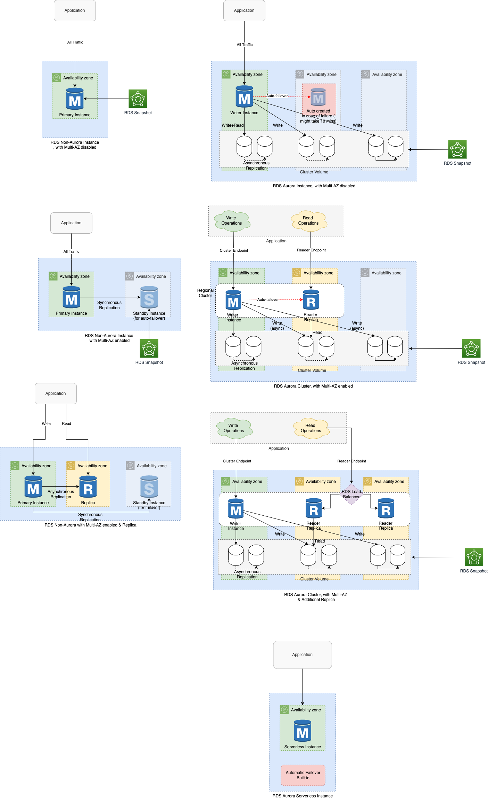

# Amazon RDS Multi-AZ instance deployment
- When [you provision a Multi-AZ DB instance](https://aws.amazon.com/rds/features/multi-az/), Amazon RDS automatically creates a primary DB instance and synchronously replicates the data to an [invisible standby instance in a different Availability Zone](https://stackoverflow.com/questions/58779115/difference-between-multi-az-deployment-and-read-replica-verison-multi-az-depl).
- In case of an infrastructure failure, Amazon RDS performs an automatic failover to the standby DB instance.
- Since the endpoint for your DB instance remains the same after a failover, your application can resume database operation without the need for manual administrative intervention.

# Features

| Feature                                                                             | Remarks                                                                                                                                                                                                                                                                              |
|-------------------------------------------------------------------------------------|--------------------------------------------------------------------------------------------------------------------------------------------------------------------------------------------------------------------------------------------------------------------------------------|
| Automatic fail over                                                                 | Support high availability for your application with automatic database failover that completes as quickly as 60 seconds with zero data loss and no manual intervention.                                                                                                              |
| Protect database performance                                                        | Avoid suspending I/O activity on your primary during backup by backing up from your standby instance.                                                                                                                                                                                |
| Enhance durability                                                                  | Use Amazon RDS Multi-AZ synchronous replication technologies to keep data on your standby database instance up to date with the primary.                                                                                                                                             |
| Increase availability                                                               | Enhance availability by deploying a standby instance in a second AZ, and achieve fault tolerance in the event of an AZ or database instance failure.                                                                                                                                 |
| Reduce impact of maintenance event (OS update)                                      | In case of Operating System updates, first it applies to standby, then standby promoted to primary & finally updates apply to old primary which then becomes new standby.                                                                                                            |
| Entire Multi-AZ deployment shutdown during DB engine upgrade                        | When you modify the database engine for your DB instance in a Multi-AZ deployment, then Amazon RDS upgrades both the primary and standby DB instances at the same time.  - In this case, the database engine for the entire Multi-AZ deployment is shut down during the upgrade. |

# References
- [Amazon RDS High Availability](https://aws.amazon.com/rds/ha/)
- [Why does AWS RDS Aurora have the option of "Multi-AZ Deployment" when it does replication across different zones already by default?](https://stackoverflow.com/questions/31976527/why-does-aws-rds-aurora-have-the-option-of-multi-az-deployment-when-it-does-re)
- [Multi-AZ DB cluster deployments](https://docs.aws.amazon.com/AmazonRDS/latest/UserGuide/multi-az-db-clusters-concepts.html)