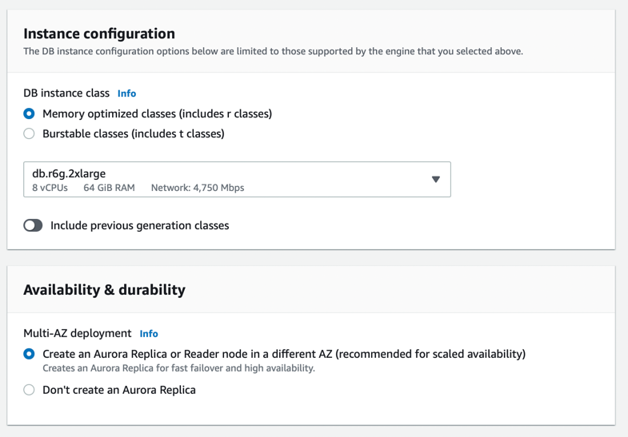

# RDS Deployment Options for Non-Aurora engines

|                                         | Description                                                                     |
|-----------------------------------------|---------------------------------------------------------------------------------|
| Single-AZ instance                      | 1 Primary                                                                       |
| [Multi-AZ instance](MultiAZInstance.md) | 1 Primary + 1 standby instance in another AZ (not available for reads)          |
| Multi-AZ cluster                        | 1 Primary + 2 readable instances in other AZs with semi-synchronous replication |

[Read more](https://aws.amazon.com/blogs/database/choose-the-right-amazon-rds-deployment-option-single-az-instance-multi-az-instance-or-multi-az-database-cluster/)

## AWS Console Screenshot

# RDS Aurora - Multi-AZ Deployment

