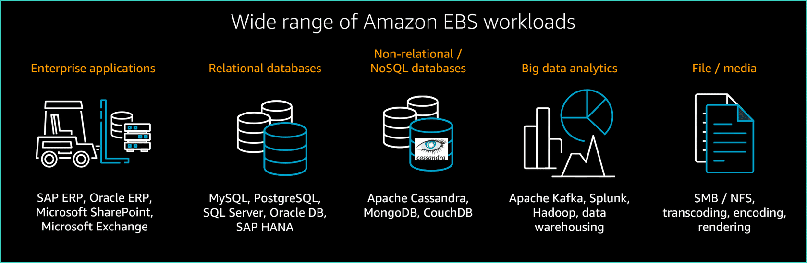

# Amazon Elastic Block Store (EBS)
- [Amazon Elastic Block Store (Amazon EBS)](https://aws.amazon.com/ebs/) is an easy-to-use, scalable, high-performance block-storage service designed for [Amazon Elastic Compute Cloud (Amazon EC2)](../../../3_ComputeServices/AmazonEC2/Readme.md).

# Amazon EBS use cases

| Use Case                          | Description                                                                                                                                                                                                                                                                                                                                                                                                                                                                                                                                   |
|-----------------------------------|-----------------------------------------------------------------------------------------------------------------------------------------------------------------------------------------------------------------------------------------------------------------------------------------------------------------------------------------------------------------------------------------------------------------------------------------------------------------------------------------------------------------------------------------------|
| :star: Databases                  | A storage layer for databases (like [Casandra](../../../../3_DatabaseServices/11_WideColumn-Databases/ApacheCasandra.md), [MongoDB](../../../../3_DatabaseServices/10_Document-Databases/MongoDB/Readme.md), [Kafka](../../../../4_MessageBrokersEDA/Kafka/Readme.md), [Hadoop](../../../../6_BigDataServices/ETLServices/BatchProcessing/ApacheHadoop/Readme.md) etc.) running on [Amazon EC2](../../../3_ComputeServices/AmazonEC2/Readme.md) that rely on transactional reads and writes. |
| Operating systems                 | Boot/root volumes to store an operating system.  - The root device for an instance launched from an [Amazon Machine Image (AMI)]() is typically an Amazon EBS volume.                                                                                                                                                                                                                                                                                                                   |
| Enterprise applications           | Amazon EBS provides reliable block storage to run business-critical applications.                                                                                                                                                                                                                                                                                                                                                                                                                                                             |
| Throughput-intensive applications | Applications that perform long, continuous reads and writes.                                                                                                                                                                                                                                                                                                                                                                                                                                                                                  |
| Life-&-Shift                      | Lift and shift, self-managed database migrations are best suited for Amazon EBS.  - The EBS volumes are similar to running the application on dedicated servers on premises.                                                                                                                                                                                                                                                                                                                                                              |

# Amazon EBS benefits

| Benefit                                                                | Description                                                                                                                                                                    |
|------------------------------------------------------------------------|--------------------------------------------------------------------------------------------------------------------------------------------------------------------------------|
| :star: Performance for any workload                                    | Amazon EBS architecture is built for mission critical applications.  - It delivers the right performance for the most demanding workloads.                                 |
| High availability                                                      | When you create an EBS volume, it is automatically replicated in its Availability Zone to prevent data loss from single points of failure.                                     |
| Data persistence                                                       | The storage persists even when your instance doesn't.                                                                                                                          |
| Data encryption                                                        | All EBS volumes support encryption.                                                                                                                                            |
| Flexibility                                                            | EBS volumes support on-the-fly changes.  - You can modify volume type, volume size, and input/output operations per second (IOPS) capacity without stopping your instance. |
| Backups through [EBS Snapshots](../../../12_Backup&DR/EBSSnapshots.md) | Amazon EBS provides the ability to create backups of any EBS volume, through [snapshots](../../../12_Backup&DR/EBSSnapshots.md).                                               |

# Features

| Feature                                                                                               | Remarks                                                                                                                                                                                                                                                                                                                                                                                                                                                                                                                                                        |
|-------------------------------------------------------------------------------------------------------|----------------------------------------------------------------------------------------------------------------------------------------------------------------------------------------------------------------------------------------------------------------------------------------------------------------------------------------------------------------------------------------------------------------------------------------------------------------------------------------------------------------------------------------------------------------|
| [Volume Types](EBSVolumeOptions.md)                                                                   | EBS provides different volume types like gp3, io2 etc.                                                                                                                                                                                                                                                                                                                                                                                                                                                                                                         |
| [Availability Zone as scope](../../../AWS-Global-Architecture-Region-AZ.md)                           | [Amazon EC2 instances](../../../3_ComputeServices/AmazonEC2/Readme.md) and Amazon EBS volumes must be in the [same Availability Zone](../../../AWS-Global-Architecture-Region-AZ.md).                                                                                                                                                                                                                                                                                                                                                                          |
| [Encryption at rest](https://docs.aws.amazon.com/AWSEC2/latest/UserGuide/EBSEncryption.html)          | When you create an encrypted EBS volume and attach it to a supported instance type, data stored at rest on the volume, data moving between the volume and the [instance](../../../3_ComputeServices/AmazonEC2/Readme.md), snapshots created from the volume and volumes created from those [snapshots](../../../12_Backup&DR/EBSSnapshots.md) are all encrypted.  - It uses [AWS Key Management Service (AWS KMS) customer master keys (CMK)](../../../2c_SecurityServices/1_DataProtectionServices/AWSKMS.md) when creating encrypted volumes and [snapshots](../../../12_Backup&DR/EBSSnapshots.md). |
| Capacity Planning                                                                                     | To determine the minimum provisioned capacity to support your desired sustained IOPS, you divide the sustained IOPS by the IOPS-to-volume capacity ratio.                                                                                                                                                                                                                                                                                                                                                                                                      |
| [AWS Compute Optimizer](../../../8_ObservabilityLogsServices/AWSComputeOptimizer.md)                         | Use [AWS Compute Optimizer](../../../8_ObservabilityLogsServices/AWSComputeOptimizer.md) for recommendations in Amazon EBS volumes                                                                                                                                                                                                                                                                                                                                                                                                                                    |
| [Multi-Attach EBS Volume](https://docs.aws.amazon.com/AWSEC2/latest/UserGuide/ebs-volumes-multi.html) | [Multi-Attach](https://docs.aws.amazon.com/AWSEC2/latest/UserGuide/ebs-volumes-multi.html) is supported exclusively on [Provisioned IOPS SSD (io1 or io2)](https://aws.amazon.com/ebs/volume-types/) volumes & [Nitro EC2 instances (linux based)](../../../3_ComputeServices/AmazonEC2/Readme.md).                                                                                                                                                                                                                                                            |

# RAID Configurations on Linux

|          | RAID 0                                                      | RAID 1                                 |
|----------|-------------------------------------------------------------|----------------------------------------|
| Use Case | When I/O performance is more important than fault tolerance | When fault tolerance is more important |

[Read more](https://docs.aws.amazon.com/AWSEC2/latest/UserGuide/raid-config.html)

# Cost Optimization Tips

| Tip                                                         | Description                                                                                                                                   |
|-------------------------------------------------------------|-----------------------------------------------------------------------------------------------------------------------------------------------|
| Delete inactive or unattached EBS volumes when appropriate. | -                                                                                                                                             |
| Avoid provisioning EBS volumes larger than required.        | AWS recommends that you start small and increase the volume sizes as required over time unless the application requires a static volume size. |
| Avoid over-sizing provisioned performance options.          | -                                                                                                                                             |
| Use newer volume types when appropriate.                    | Newer volume types either offer lower base pricing or the capability to provision less capacity and still meet your performance goals.        |
| Use lower-cost volume types when appropriate.               | The [pricing is much lower for gp3 volumes than for io1 or io2 volumes](EBSVolumeOptions.md) for both capacity and provisioned IOPS.          |

# Multi-Attach Architecture

