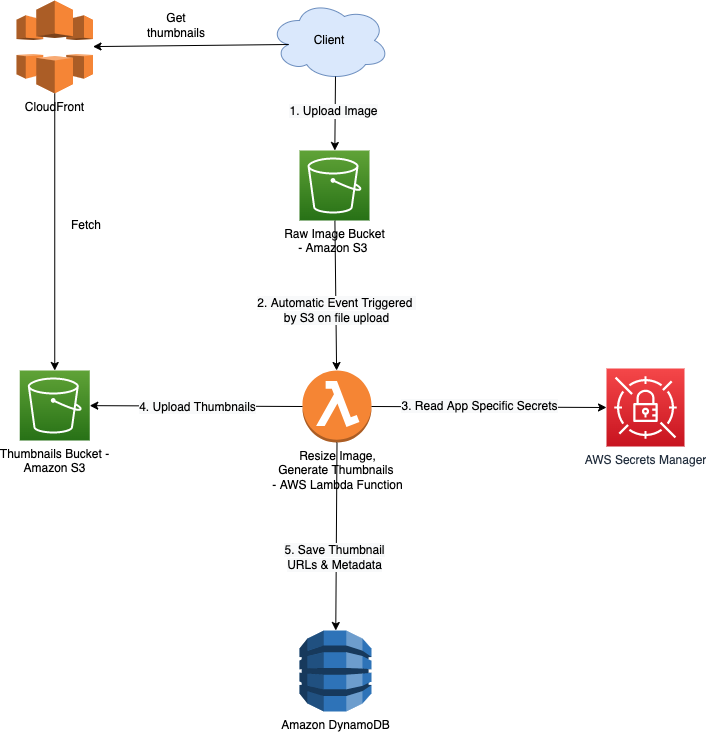

# Amazon Simple Storage Service (S3)
- [Amazon S3](https://aws.amazon.com/s3/) is an object store (flat-structure), meaning it is a higher layer data storage system, essentially [it is a database "blob" storage](https://www.techopedia.com/definition/32166/blob-storage), storing data in an underlying simple database as an object.
- It's designed for [WRITE once READ many access i.e. append-only data structure](../../../3_DatabaseServices/5_DataStructuresUsedInDB/AppendOnlyProperty.md), perfect for [Static content](../../../7_PropertiesDistributedSystem/CDNs/StaticContent.md).
- It's [distributed](../../../7_PropertiesDistributedSystem/Readme.md) and offers a very high level of redundancy i.e. [data is stored in 3 AZs within a specific region](../../AWS-Global-Architecture-Region-AZ.md).

# Use cases

| Use Case                                                                                                                    | Description                                                                                                                                                                                                                                                                                     |
|-----------------------------------------------------------------------------------------------------------------------------|-------------------------------------------------------------------------------------------------------------------------------------------------------------------------------------------------------------------------------------------------------------------------------------------------|
| [Static websites](StaticWebsiteHosting.md)                                                                                  | You can configure your S3 bucket to host a static website of HTML, CSS, and client-side scripts.                                                                                                                                                                                                |
| [Static content](../../../7_PropertiesDistributedSystem/CDNs/StaticContent.md)                            | Because of the limitless scaling, the support for large files, and the fact that you access any object over the web at any time, Amazon S3 is the perfect place to store static content.                                                                                                        |
| [Backup and storage](../../12_Backup&DR)                                                                                    | [Amazon S3]() is a natural place to back up files (example [RDS Snapshots](../../12_Backup&DR/RDSSnapshot.md), [EBS snapshots](../../12_Backup&DR/EBSSnapshots.md) etc.) because it is highly redundant.                                                                                        |
| Media hosting                                                                                                               | Because you can store unlimited objects, and each individual object can be up to 5 TBs, Amazon S3 is an ideal location to host video, photo, and music uploads.                                                                                                                                 |
| [Data lakes](../../10_BigDataServices/StorageDBs/DataLakes/S3DataLake.md)                                                 | [Amazon S3](https://docs.aws.amazon.com/whitepapers/latest/building-data-lakes/amazon-s3-data-lake-storage-platform.html) is an optimal foundation for a [data lake](../../../6_BigDataServices/StorageDBs/Glossaries/DataLake.md) because of its virtually unlimited scalability. |
| [Data Catalog](https://docs.aws.amazon.com/whitepapers/latest/building-data-lakes/data-cataloging.html)                     | [Amazon S3]() can be used for the data catalog use case.                                                                                                                                                                                                                                        |
| Software delivery                                                                                                           | You can use Amazon S3 to host your software applications that customers can download.                                                                                                                                                                                                           |
| [Swiggy - Capturing CDC using S3 data lake](../../../1_TechStacks/SwiggyTechStack.md) |
| [ClickStream analytics using S3 on AWS](../../../0_HLDUseCasesProblems/AWS_ClickStreamAnalytics/Readme.md)                     |                                                                                                                                                                                                                                                                                                 |

# Key Features of S3

| Feature                                                                                                                                                      | Remarks                                                                                                                                                                                                                                                                                                                                                                                                                                                         |
|--------------------------------------------------------------------------------------------------------------------------------------------------------------|-----------------------------------------------------------------------------------------------------------------------------------------------------------------------------------------------------------------------------------------------------------------------------------------------------------------------------------------------------------------------------------------------------------------------------------------------------------------|
| :star: [S3 vs Others](../S3vsEBSvsEFS.md)                                                                                                                    | [Amazon S3](https://aws.amazon.com/s3/) is an object store (flat-structure), meaning it is a higher layer data storage system, essentially [it is a database "blob" storage](https://www.techopedia.com/definition/32166/blob-storage), storing data in an underlying simple database as an object.                                                                                                                                                             |
| [Buckets](S3Bucket.md)                                                                                                                                       | Buckets are permanent containers that hold objects.                                                                                                                                                                                                                                                                                                                                                                                                             |
| [Storage Classes & Lifecycle](S3StorageClassesAndLifecycle.md)                                                                                               | Amazon S3 offers a range of [storage classes](https://aws.amazon.com/s3/storage-classes/) that you can choose from based on the data access, resiliency, and cost requirements of your workloads.                                                                                                                                                                                                                                                               |
| [Highly durable](../../../3_DatabaseServices/1_ACIDTransactions/Durability.md)                                                                   | Amazon S3 is highly durable.                                                                                                                                                                                                                                                                                                                                                                                                                                    |
| [Infinitely scalable](../../../3_DatabaseServices/3_ScalabilityTechniques/Readme.md)                                                        | Application can achieve [at least 3,500 PUT/COPY/POST/DELETE or 5,500 GET/HEAD requests per second per prefix](https://docs.aws.amazon.com/AmazonS3/latest/userguide/optimizing-performance.html) in a bucket.                                                                                                                                                                                                                                                  |
| [Object Versioning](Versioning.md)                                                                                                                           | [Versioning](https://docs.aws.amazon.com/AmazonS3/latest/userguide/Versioning.html) is a means of keeping multiple variants of an object in the same bucket.                                                                                                                                                                                                                                                                                                    |
| [Object Lock](ObjectLock.md)                                                                                                                                 | With [S3 Object Lock](https://docs.aws.amazon.com/AmazonS3/latest/userguide/object-lock.html), you can store objects using a [write-once-read-many (WORM) model](../../../3_DatabaseServices/5_DataStructuresUsedInDB/AppendOnlyProperty.md).                                                                                                                                                                                                        |
| [Object Limit - Up to 5TB](https://aws.amazon.com/blogs/aws/amazon-s3-object-size-limit/)                                                                    | When uploading data via the AWS Management Console, the maximum file that you can upload is 160GB.  - To upload a file larger than 160 GB, use the AWS CLI, AWS SDK, or Amazon S3 REST API.                                                                                                                                                                                                                                                                 |
| [S3 Notification](S3Notification.md)                                                                                                                         | [Amazon S3]() can publish event notification messages to a destination ([Lambda](../../3_ComputeServices/AWSLambda), [SQS](../../5_MessageBrokerServices/AmazonSQS/Readme.md), [SNS](../../5_MessageBrokerServices/AmazonSNS.md) etc.) on new object upload.                                                                                                                                                                                                    |
| [Multipart Upload](https://docs.aws.amazon.com/AmazonS3/latest/userguide/mpuoverview.html)                                                                   | [Multipart upload](https://docs.aws.amazon.com/AmazonS3/latest/userguide/mpuoverview.html) allows you to upload a single object as a set of parts.  - Each part is a contiguous portion of the object's data.  - You can upload these object parts independently and in any order.                                                                                                                                                                      |
| [Object Expiration](https://aws.amazon.com/blogs/aws/amazon-s3-object-expiration/)                                                                           | [Object Expiration](https://aws.amazon.com/blogs/aws/amazon-s3-object-expiration/) function allows you to define rules to schedule the removal of your objects after a pre-defined time period. - The rules are specified in the [Lifecycle Configuration policy](S3StorageClassesAndLifecycle.md) that you apply to a bucket.                                                                                                                              |
| :+1: [Strong data consistency model](https://aws.amazon.com/s3/consistency/)                                                                                 | After a successful write of a new object or overwrite of an existing object, any subsequent read request immediately receives the latest version of the object.  - Amazon S3 also provides strong consistency for list operations, so after a write, you can immediately perform a listing of the objects in a bucket with any changes reflected.                                                                                                           |
| [S3 Transfer Acceleration](../../1_NetworkingAndContentDelivery/1_EdgeNetworking/S3TransferAcceleration.md)                                                  | It can speed up content transfers to and from Amazon S3 by as much as 50-500% for long-distance transfer of larger objects.                                                                                                                                                                                                                                                                                                                                     |
| [Cross-Region Replication (CRR)](https://docs.aws.amazon.com/AmazonS3/latest/userguide/replication-config-for-kms-objects.html)                              | [Cross-Region replication](https://docs.aws.amazon.com/AmazonS3/latest/userguide/replication-config-for-kms-objects.html) is a bucket-level configuration that enables automatic, asynchronous copying of objects across buckets in different AWS Regions.                                                                                                                                                                                                      |
| [Same-Region Replication (SRR)](https://aws.amazon.com/about-aws/whats-new/2019/09/amazon-s3-introduces-same-region-replication/)                            | [Amazon S3]() supports automatic and asynchronous replication of newly uploaded S3 objects to a destination bucket in the same AWS Region.                                                                                                                                                                                                                                                                                                                      |
| [Batch Replication](https://docs.aws.amazon.com/AmazonS3/latest/userguide/s3-batch-replication-batch.html)                                                   | [S3 Batch Replication](https://docs.aws.amazon.com/AmazonS3/latest/userguide/s3-batch-replication-batch.html) provides you a way to replicate objects that existed before a replication configuration was in place, objects that have previously been replicated, and objects that have failed replication.                                                                                                                                                     |
| [Object Metadata](https://docs.aws.amazon.com/AmazonS3/latest/userguide/UsingMetadata.html)                                                                  | [Object metadata](https://docs.aws.amazon.com/AmazonS3/latest/userguide/UsingMetadata.html) is set of name-value pairs with which you can store information regarding the object.                                                                                                                                                                                                                                                                               |
| [Byte Range Fetch](https://docs.aws.amazon.com/AmazonS3/latest/userguide/optimizing-performance-guidelines.html#optimizing-performance-guidelines-get-range) | Using the Range HTTP header in a GET Object request, you can fetch a byte-range from an object, transferring only the specified portion. - A byte-range request is a perfect way to get the beginning of a file and ensuring we remain efficient during our scan of our S3 bucket.                                                                                                                                                                          |
| [S3 Select](https://docs.aws.amazon.com/AmazonS3/latest/userguide/selecting-content-from-objects.html)                                                       | With [Amazon S3 Select](https://docs.aws.amazon.com/AmazonS3/latest/userguide/selecting-content-from-objects.html), you can use simple structured query language (SQL) statements to filter the contents of an Amazon S3 object and retrieve just the subset of data that you need.  - By using Amazon S3 Select to filter this data, you can reduce the amount of data that Amazon S3 transfers, which reduces the cost and latency to retrieve this data. |
| Transfer Charges                                                                                                                                             | There are no S3 data transfer charges when data is transferred in from the internet.                                                                                                                                                                                                                                                                                                                                                                            |

## Cross-Region Supported

# :star: Real world use cases of Amazon S3

## :star: Modern Data Architecture 

[Read more](../../../6_BigDataServices/Readme.md)

## :star: Amazon S3 + Amazon CloudFront: A Match Made in the Cloud
- Instead of [directly accessing the S3 resource](https://aws.amazon.com/blogs/networking-and-content-delivery/amazon-s3-amazon-cloudfront-a-match-made-in-the-cloud/), we should use [CloudFront distribution](../../1_NetworkingAndContentDelivery/1_EdgeNetworking/AmazonCloudFront.md) in the middle (which acts as a [CDN](../../../7_PropertiesDistributedSystem/CDNs/CDNs.md))

## Upload Image using Amazon S3 and Lambda

[Read more](../../../0_HLDUseCasesProblems/AWS_DesignUploadImageLambdaS3/Readme.md)

# Useful Tools

| Tool                                                                                                                               | Description                                                                                                                                                                                                                                                                                                                                                            |
|------------------------------------------------------------------------------------------------------------------------------------|------------------------------------------------------------------------------------------------------------------------------------------------------------------------------------------------------------------------------------------------------------------------------------------------------------------------------------------------------------------------|
| :star: [Amazon S3 Storage Lens](S3StorageLens.md)                                                                                  | It helps in organization-wide visibility into Object Storage.                                                                                                                                                                                                                                                                                                          |
| [Analyse data using Amazon Athena](../../10_BigDataServices/DataAnalytics/AmazonAthena.md)                                       | [Amazon Athena](../../10_BigDataServices/DataAnalytics/AmazonAthena.md) is a serverless, interactive analytics service built on open-source frameworks, supporting open-table and file formats.                                                                                                                                                                      |
| [Analyse data using Amazon QuickSight](../../10_BigDataServices/DataAnalytics/AmazonQuickSight.md)                               | [Amazon QuickSight](../../10_BigDataServices/DataAnalytics/AmazonQuickSight.md) powers data-driven organizations with unified business intelligence (BI) at hyperscale.                                                                                                                                                                                              |
| [Amazon S3 analytics – Storage Class Analysis](https://docs.aws.amazon.com/AmazonS3/latest/userguide/analytics-storage-class.html) | By using Amazon S3 analytics Storage Class Analysis you can analyze storage access patterns to help you decide when to transition the right data to the right [storage class](S3StorageClassesAndLifecycle.md). - It helps to determine when to transition less frequently accessed STANDARD storage to the STANDARD_IA (IA, for infrequent access) storage class. |
| [Amazon S3 inventory](https://docs.aws.amazon.com/AmazonS3/latest/userguide/storage-inventory.html)                                | Amazon S3 inventory is one of the tools Amazon S3 provides to help manage your storage. You can use it to audit and report on the replication and encryption status of your objects for business, compliance, and regulatory needs.                                                                                                                                    |
| [Amazon S3 Server access logging](https://docs.aws.amazon.com/AmazonS3/latest/userguide/ServerLogs.html)                           | Amazon S3 Server access logging provides detailed records for the requests that are made to a bucket.                                                                                                                                                                                                                                                                  |

# S3 CLI
- It's a best practice to use [aws s3 commands](https://docs.aws.amazon.com/cli/latest/reference/s3/) for multipart uploads and downloads, because these [aws s3 commands automatically perform multipart uploading and downloading based on the file size](https://repost.aws/knowledge-center/s3-multipart-upload-cli).

| Name                 | Command                            | Remarks                                                                                                                                                                                                                                  |
|----------------------|------------------------------------|------------------------------------------------------------------------------------------------------------------------------------------------------------------------------------------------------------------------------------------|
| Copy file            | aws s3 cp                          | In this command, you use the aws s3 cp command to copy the whale.jpg file from the client local machine in c:\sourcefiles to the demo-oceanlife bucket.                                                                                  |
| List files           | aws s3 ls                          | List all files in S3                                                                                                                                                                                                                     |
| List files in bucket | aws s3 ls *bucketname*             | List all files in S3 bucket                                                                                                                                                                                                              |
| Sync folder          | aws s3 sync <source> <destination> | The aws S3 sync command uses the CopyObject APIs to copy objects between S3 buckets.  - The sync command lists the source and target buckets to identify objects that are in the source bucket but that aren't in the target bucket. |
| Move file            | aws s3 mv                          | Move S3 file from one bucket to another.                                                                                                                                                                                                 |

[Read more](https://docs.aws.amazon.com/cli/latest/reference/s3/)

# References
- [Append data to an S3 object](https://stackoverflow.com/questions/41783903/append-data-to-an-s3-object)