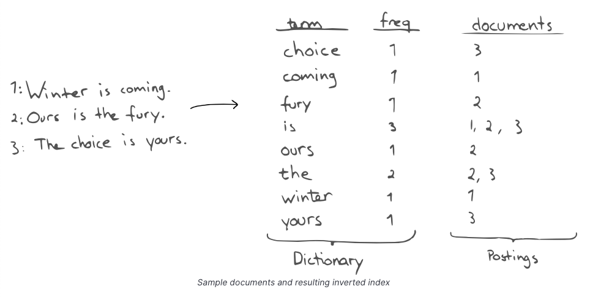

# Inverted Index
- The inverted index maps `terms` to `documents` (and possibly positions in the documents) containing the term.
- Using inverted indexes, [Search-DBs](../9_Search-Databases/Readme.md) internally & efficiently finds documents with given term prefixes.

# Example
- Find all documents, starting with `c`.
  
