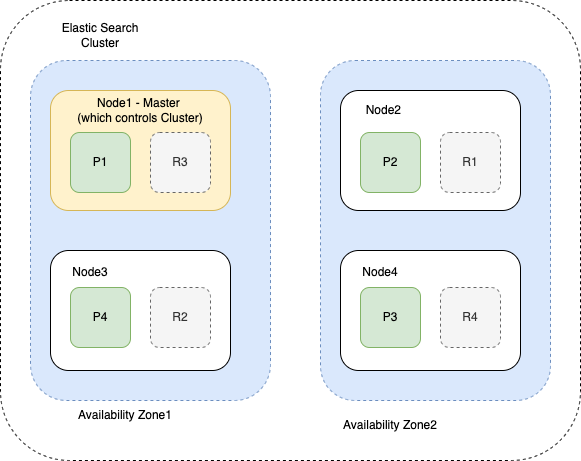

# Introduction
- [ElasticSearch](https://www.elastic.co/elasticsearch/) is a distributed, [RESTful modern search](../../../8_APIProtocols/REST.md) and analytics engine based on [Apache Lucene](../Readme.md).
- [ElasticSearch]() can be deployed using [Amazon OpenSearch](../../../2_AWSServices/6_DatabaseServices/Search-Databases/AmazonOpenSearch.md) service, on [AWS](../../../2_AWSServices).

# :star: Real world use cases of ElasticSearch
- [Food Ordering - HLD Design](../../../0_HLDUseCasesProblems/FoodOrderingZomatoSwiggy/Readme.md)
- [Uber Driver Allocation - HLD Design](../../../0_HLDUseCasesProblems/DriverAllocationUberGoJek/Readme.md)
- [Logging Solution in Distributed Systems - HLD Design](../../../0_HLDUseCasesProblems/ObervabilityLoggingSolution/LoggingFileAggregation/Readme.md)
- [Flight Booking Search - HLD Design](../../../0_HLDUseCasesProblems/FlightBookingSearchMakeMyTrip/Readme.md)
- [Grab - Search Index Optimization](../../../1_TechStacks/Grab/SearchIndexing.md)
- [Shopify: Powering the search for better help documentation using Elastic Site Search](../../../1_TechStacks/ShopifyTechStack.md)

# :star: General Use Cases of Search-Indexes
- [Search - Full-text, Partial etc.](https://www.elastic.co/guide/en/elasticsearch/reference/current/full-text-queries.html)
- [Search - Fuzzy Query](https://www.elastic.co/guide/en/elasticsearch/reference/current/query-dsl-fuzzy-query.html)
- [Logs-analysis](../../../12_ObservabilityLogsServices/ELK.md)
- [Dashboard, Visualize data, Metrics etc.](../../../12_ObservabilityLogsServices/ELK.md)
- [Security, SIEM with ELK](../../../12_ObservabilityLogsServices/ELK.md)

# Key Features of ElasticSearch

| Feature             | Remarks                                                                                                                                                                                                                                                        |
|---------------------|----------------------------------------------------------------------------------------------------------------------------------------------------------------------------------------------------------------------------------------------------------------|
| Near-time search    | Elasticsearch has near real-time search - document changes are not visible to search immediately, but will become visible within this timeframe. [Read more](https://www.elastic.co/guide/en/elasticsearch/reference/current/near-real-time.html)              |
| REST API interface  | We can interact with ElasticSearch through [REST APIs](RESTAPIs.md).                                                                                                                                                                                           |
| GraphQL support     | ElasticSearch also supports [GraphQL](GraphQLSupport.md) in its APIs.                                                                                                                                                                                          |
| Default Config      | An Elasticsearch index has **5 shards** and **1 replica** by default.                                                                                                                                                                                          |
| Mapping             | [Mapping](Mapping.md) is the process of defining how a document, and the fields it contains, are stored and indexed.                                                                                                                                           |
| Sample Search Query | [Read more](samples/SampleSearchQuery.md)                                                                                                                                                                                                                      |
| Ingest Node         | Ingest node is used for pre-process documents before the actual document indexing happens.  - It helps to intercepts bulk and index requests.                                                                                                              |
| Data Storage        | Settings, index mapping, alternative cluster states, and other metadata are saved to Elasticsearch files outside the [Lucene](../Readme.md) environment. This is to prevent excessive disk I/O.                                                                |
| Elastic Stack       | For data analysis, it operates alongside Kibana, and Logstash to form the [ELK stack](../../../12_ObservabilityLogsServices/ELK.md). - [ElasticSearch data streaming](../../Others/StreamDBs/ElasticSearchStreams.md) is used for the logs.                |
| Data Streaming      | [A data stream](../../Others/StreamDBs/ElasticSearchStreams.md) lets you store [append-only time series data (like logs) across multiple indices](../../5_DataStructuresUsedInDB/AppendOnlyProperty.md) while giving you a single named resource for requests. |
| Pricing             | [Read more](https://www.elastic.co/pricing/)                                                                                                                                                                                                                   |
| Auto Scaling        | Auto-expand indices based on search queries. [Read more](https://www.elastic.co/guide/en/elasticsearch/reference/current/index-modules.html).                                                                                                                  |

# Data types supported

| Data Type                                                                 |
|---------------------------------------------------------------------------|
| Textual                                                                   |
| Numerical                                                                 |
| [GeoSpatial (geo-point, geo-shape data types etc.)](GeoSpatialSupport.md) |
| Unstructured etc.                                                         |

# ElasticSearch Cluster

[Read more](Cluster.md)

# Tools
- [Head Browser Plugin](https://chromewebstore.google.com/detail/multi-elasticsearch-head/cpmmilfkofbeimbmgiclohpodggeheim?hl=en&pli=1)

# References
- [ElasticSearch from the Bottom Up](https://www.elastic.co/blog/found-elasticsearch-from-the-bottom-up)
- [ElasticSearch Interview Questions - JavaPoint](https://www.javatpoint.com/elasticsearch-interview-questions)
- [What We Learned Using Elasticsearch as a Time Series Database](https://medium.com/thousandeyes-engineering/what-we-learned-using-elasticsearch-as-a-time-series-database-bdbde38cdb64)