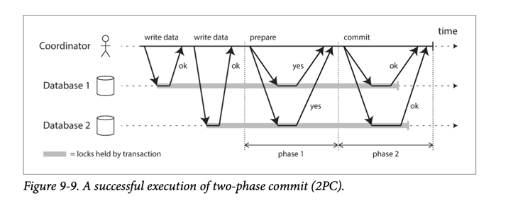

# Atomicity
- [Atomicity](https://www.geeksforgeeks.org/acid-properties-in-dbms/) is a feature of databases systems dictating where a transaction must be `all-or-nothing`.
- That is, the transaction must either fully happen, or not happen at all. It must not complete partially.
- Each transaction is considered as one unit and either runs to completion or is not executed at all.
- In database systems, atomicity is the [ACID property](Readme.md).
- The ability to abort a transaction on error and have all writes from that transaction discarded is the defining feature of [ACID atomicity](Readme.md).

It involves the following two operations.
- [Abort](https://www.geeksforgeeks.org/acid-properties-in-dbms/) - If a transaction aborts, changes made to the database are not visible.
- [Commit](https://www.geeksforgeeks.org/acid-properties-in-dbms/) - If a transaction commits, changes made are visible.

# Two Phase Commit

# Examples Use Cases

| Use Case                                                    |
|-------------------------------------------------------------|
| [Redis Transaction Lock](../../In-Memory-DB/Redis/Readme.md) |

