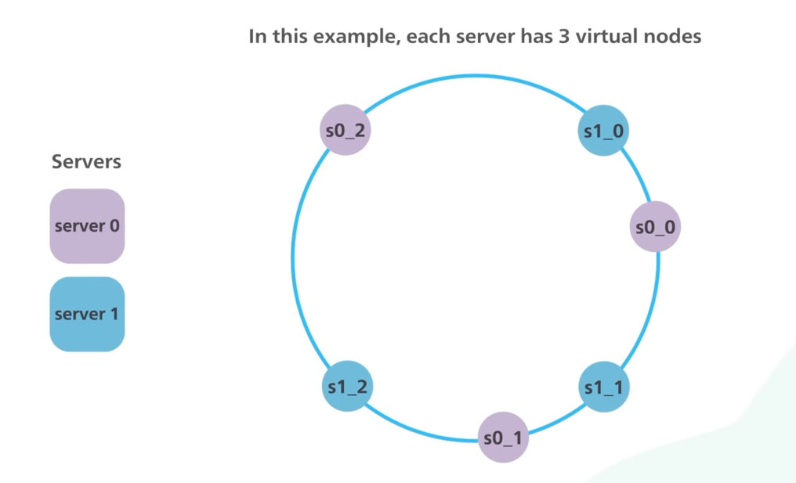

# Consistent Hashing

# References
- [A Guide to Consistent Hashing](https://www.toptal.com/big-data/consistent-hashing)
- [ByteByteGo - Consistent Hashing | Algorithms You Should Know #1](https://www.youtube.com/watch?v=UF9Iqmg94tk)   